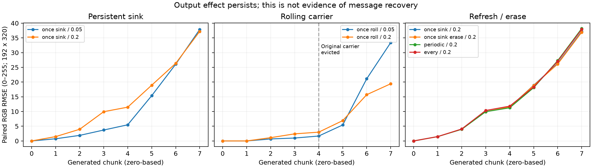
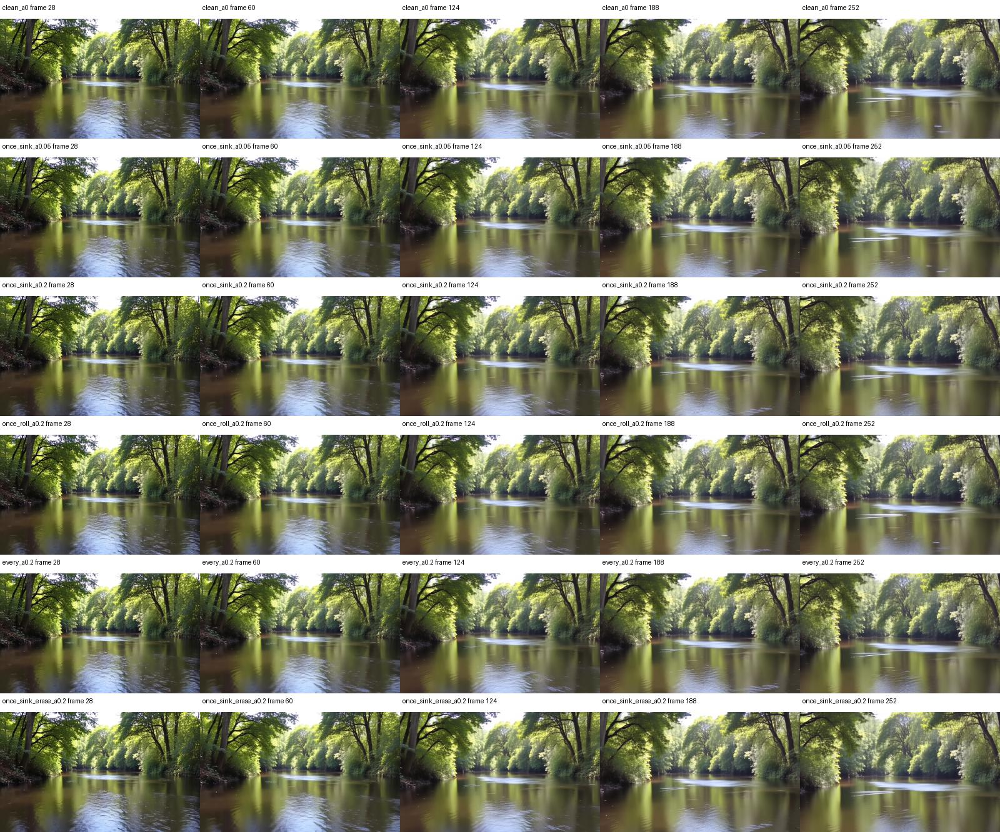
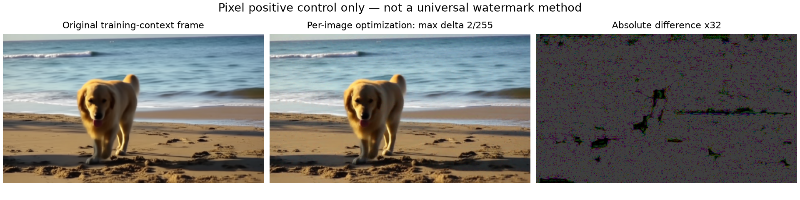
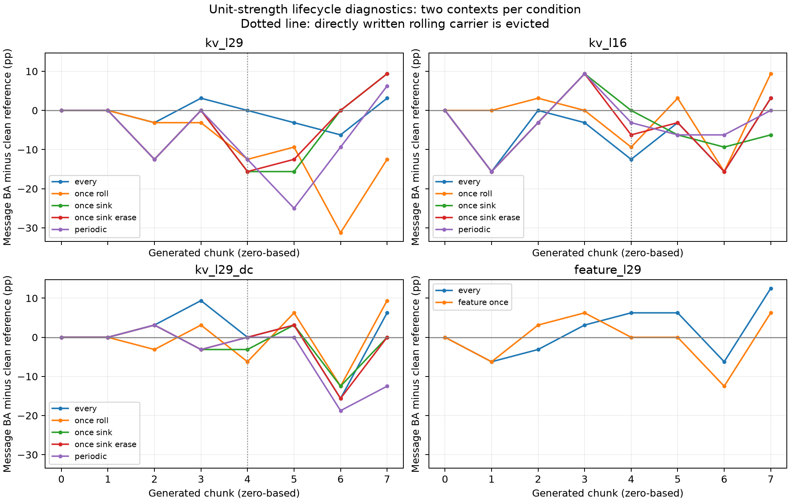
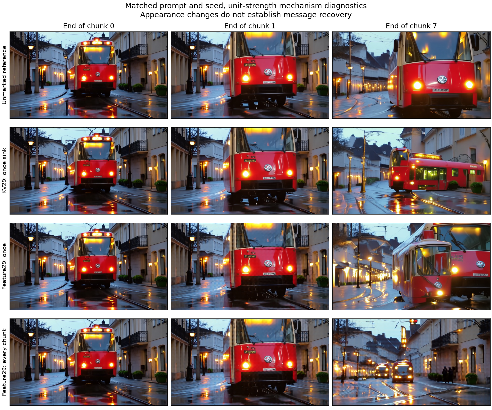
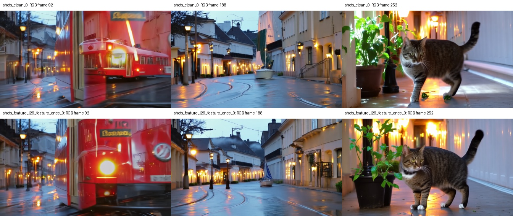

# KV状态水印：机制、共享写入与自由生成实验

实验日期：2026-10-02。第一轮机制与独立读出实验，以及第二轮四组共享写入器训练、136条件自由生成、原生质量与实际编码提取已完成。结论与未验证的后续方向分开报告。

**本轮仍未建立可用的盲message通道。** 第二轮68个非零写入条件的整段完整恢复为0，固定局部候选也未出现正确的16-bit消息。三个KV变体在validation校准中均选择零写入；feature的未压缩测试BA50.78%，实际编码/时序处理后为49.61%–51.17%。状态扰动确实持续影响画面，但这与可恢复消息的保持不同。第一轮的配对oracle仅是消息痕迹诊断，不是盲恢复；两轮证据分别列于下文。

## 1. 写入位置与控制变量

LongLive 2.0 5B，固定commit `6b36d20ec6f7958d29d11a704dfa64611a9f2572`，BF16、原生4步UniPC、704×1280、24fps。每块8个latent；cache容量32latent；保留8latent全局sink。初始噪声、模型权重、K与VAE不改。仅在clean recache前向完成后修改层16/20/24/28的新历史V。

16-bit消息映射到16个非DC二维DCT空间码，每个码使用固定正交通道方向；叠加后的扰动按当前V的RMS归一化，强度α=0.05或0.2。写入器尚未训练，没有新增ECC或同步标识。固定映射提供一个可解释探针，不代表充分优化的KV水印。

真实cache的roll-and-insert与direct-insert调用被跟踪，记录显式注入槽位何时保留/覆盖/淘汰。原始载体消失后，新历史可能仍受其影响；槽位跟踪只标注直接写入，不把未知的间接传播当成已知水印位。

## 2. 10个配对机制条件

同一river prompt、seed4101、同一消息，64latent对应253RGB帧，8chunk。clean重复作为确定性对照。其余条件为单次sink、单次rolling、周期刷新、逐块刷新以及恢复原sink值。

| 条件 | 写入时机 | 载体情况 | 第2块RMSE | 第8块RMSE |
| --- | --- | --- | ---: | ---: |
| clean_repeat_a0 | 无 | 无 | 0.000 | 0.000 |
| once_sink_a0.05 | chunk0后，α=.05 | 全程保留 | 0.739 | 37.860 |
| once_sink_a0.2 | chunk0后，α=.2 | 全程保留 | 1.473 | 37.201 |
| once_roll_a0.05 | chunk1后，α=.05 | chunk4被淘汰 | 0.000 | 33.400 |
| once_roll_a0.2 | chunk1后，α=.2 | chunk4被淘汰 | 0.000 | 19.417 |
| periodic_a0.2 | chunk0/3/6后 | 周期写新槽位 | 1.473 | 38.189 |
| every_a0.2 | 每块后 | 写入所有新槽位 | 1.473 | 37.908 |
| once_sink_erase_a0.2 | chunk0后；chunk3后恢复原V | 原sink扰动被去除 | 1.473 | 36.925 |

表中RMSE是与相同seed的clean逐像素差异，按192×320缩小观测计算，不是原生画质指标；长时内容相位/相机轨迹偏离会抬高数值。两次clean完全一致；所有条件首块完全一致；rolling单次写入的前两块完全一致，符合因果顺序。

抽检未见明显块状破坏，但后期画面轨迹不同；需要完整消息提取与独立质量指标才可判断价值。只有一个prompt/seed的机制探针，不给出普遍概率结论。

## 3. 独立读出实验协议

194条新数据：96训练、24验证（新seed）、64测试（4个未见场景与新seed），另10条无水印负例。每个正例组在同prompt/seed下生成两条互补随机16-bit消息，配对不跨split，保证同一内容不能预测唯一message。写入模式为once_sink、α=.2；每条16latent/61RGB帧。

读取端只接收像素。已比较DCT特征ridge与小型CNN，以验证集选择参数后评估测试集。另做配对差分oracle，明确其需要同seed的互补消息视频，仅用于诊断信息是否留下稳定可读痕迹，不能当成盲提取。

预设像素攻击：截去前13帧、每4帧删1帧、插入13帧无水印自然视频、倒放、H.264 CRF35、中心裁剪。先报告clean完整message率和BA；若clean不成立，攻击结果不支持鲁棒水印主张。初轮存储192×320像素，原生latent保留，不能宣称已完成原生分辨率全流程鲁棒性。

### 3.1 已完成的独立消息提取结果

| 读出器/协议 | 训练BA | 验证BA | 测试BA | 测试完整message |
| --- | ---: | ---: | ---: | ---: |
| 像素DCT ridge，验证选择时间差分 | 99.93% | 52.34% | 51.76% | 0/64 |
| 小CNN，验证选择step100 | 50.00% | 50.00% | 50.00% | 0/64 |
| 同seed互补消息差分oracle | — | 用于选alpha | 67.19% | 1/32 pairs |
| oracle训练标签打乱对照 | — | 沿用alpha | 52.73% | 0/32 pairs |

盲ridge的高训练分数没有泛化；CNN没有学到有效读出。oracle结果表明部分可读消息痕迹存在，但并未提供只凭一条待测视频的恢复方法。该对照是信息诊断，不能作为部署性能。测试集只有4个新场景、32个独立seed的互补pair，不把64条互补视频当成64个完全独立场景。

| 像素ridge攻击 | BA | 完整message |
| --- | ---: | ---: |
| 截去前13帧 | 50.29% | 0/64 |
| 每4帧删1帧 | 51.37% | 0/64 |
| 第37帧前插入13帧无水印自然视频 | 50.78% | 0/64 |
| 倒放 | 48.83% | 0/64 |
| H.264 CRF35 | 51.17% | 0/64 |
| 中心裁剪约10%边缘后resize | 51.56% | 0/64 |

clean已没有完整恢复，不能把攻击后仍接近50%称为鲁棒。无水印输入也会被这些未设拒绝规则的读出器输出16-bit候选；10条负例不足以建立低FPR声明。

### 3.2 可学习KV通道的单样本检查

冻结生成器、VAE及Stable Signature的公开48-bit图像读出器（取前16维），仅优化一层49,152个KV方向系数。这里使用的是Stable Signature，未使用Video Signature。像素消息梯度能回传到KV，但这是单prompt、单seed、单message的容量诊断，不能证明随机message泛化。

原代理使用timestep250的单步flow与前2个、空间16×16 latent的新鲜VAE解码；loss为message BCE + 100×RGB MSE。强度上限通过tanh约束各分量，和前面固定编码的RMS强度不是同一度量。三个原代理各优化128步；新增native-context分支保留真实前8个latent的VAE历史，并在全分辨率解码后取固定256×256区域、前4帧计算loss，优化64步。所有优化均冻结主模型与VAE。

| 单样本代理 | 初始正确bits | 最终正确bits | 最终扰动RMS / V RMS | 峰值显存GiB |
| --- | ---: | ---: | ---: | ---: |
| layer16_amp02 | 7/16 | 8/16 | 0.137 | 60.41 |
| layer29_amp02 | 7/16 | 8/16 | 0.106 | 46.85 |
| layer29_amp10 | 7/16 | 12/16 | 0.566 | 46.85 |
| native_layer29_amp10 | 8/16 | 10/16 | 0.446 | 69.17 |

优化损失的像素只覆盖局部区域。全图读出稀释局部信号是预期风险；局部crop的位置已固定，不能把依赖已知区域的恢复说成任意位置盲恢复。显存为这些单样本训练诊断的峰值，不是推理overhead。

### 3.3 接回原生四步生成

将学到的系数在首个clean recache后写入一次，再执行未经修改的原生四步采样和带缓存VAE解码。source为训练prompt/seed，另有一个新seed、一个新场景；均有相同噪声与消息对应的clean对照。下表统一对第29帧之后聚合，这是已知warmup的通道诊断；未知边界主任务仍以独立像素读出结果为准。

| 完整rollout | 原生全图正确bits | 原生固定crop正确bits | 下一块前4帧crop |
| --- | ---: | ---: | ---: |
| clean_source | 8/16 | 9/16 | 9/16 |
| layer16_amp02 | 9/16 | 10/16 | 9/16 |
| layer29_amp02 | 8/16 | 10/16 | 9/16 |
| layer29_amp10 | 8/16 | 11/16 | 9/16 |
| native_layer29_amp10 | 8/16 | 11/16 | 11/16 |
| native_new_scene_marked | 7/16 | 12/16 | 13/16 |
| native_new_seed_marked | 8/16 | 8/16 | 8/16 |
| new_scene_clean | 7/16 | 13/16 | 14/16 |
| new_scene_marked | 7/16 | 11/16 | 12/16 |
| new_seed_clean | 8/16 | 8/16 | 8/16 |
| new_seed_marked | 8/16 | 8/16 | 8/16 |

原代理强写入（layer29/amp1）的训练消息从7/16到12/16；实际下一块的fresh-crop代理解码可达13/16，但原生cached VAE的固定crop整块仅7/16，clean对照为6/16。整段suffix全图与clean均8/16；新seed没有一致提升，新场景crop甚至比clean低。因此不能用代理loss或单个窗口BA宣称水印成功。

真实VAE历史分支：训练区域从8/16到10/16。接回四步采样后，原场景下一块前4帧crop为11/16（clean 9/16）；原场景、新seed、新场景的suffix全图分别为8、8、7/16，对应clean为8、8、7/16。这是单例训练的三个迁移诊断，未建立随机message泛化。真实VAE历史只是修正了代理的一部分；单步flow与真实四步采样仍不一致。

## 4. 从结果修正研究方向

**跨块影响成立，稳定的盲message通道尚未成立。** 原始注入槽位被淘汰后输出仍改变，可能只是语义/运动轨迹的因果延续；目前没有证据证明被继承的是可恢复的message。固定随机方向更容易造成内容相关扰动，独立读出器的高训练分数不能弥补泛化失败。

继续做KV方向时，核心应是学习并维护一个可读的状态子空间：在多个prompt、seed和随机message上训练小型写入器，跨真实四步采样及带历史的VAE约束输出；比较持续刷新、停止刷新、原载体淘汰后三种机制。训练用多chunk截断反传时，必须再做更长自由rollout，检验误差积累。当前证据不足以跳到鲁棒攻击优化。

值得并列验证的流式机制包括：依据cache淘汰和局部读出置信度调节刷新的在线控制；镜头切换时的状态继承/重置；以短局部片段为单位的自同步编码。KV只是一种状态载体。若收益来自每块重新注入，需要与同规模逐块feature adapter及相同同步协议的VideoSeal匹配payload、画质和延迟进行比较。

本轮没有完成KV量化、video edit、多镜头消息继承、随机位置接受/拒绝标定或独立质量评估；没有据此声称优于后处理。

## 5. 可复现记录

- [逐条件/逐chunk数值](streaming_feasibility_evidence/kv_state/probe/probe_effects.json)，各条件目录保存消息、强度、seed、noise hash、运行耗时与cache事件。
- [独立读出结果](streaming_feasibility_evidence/kv_state/pixel_reader/results.json)、[CNN结果](streaming_feasibility_evidence/kv_state/neural_reader/results.json)、[实际rollout与配对检查](streaming_feasibility_evidence/kv_state/optimized_rollout/analysis.json)。原始预测、优化系数与训练轨迹均保存于相邻目录。
- H20源数据：`/data/workspace/hardenyu/StreamingMark/results/longlive2/kv_state`；完整原生latent与缩小像素、预览视频保留远端。
- 有效复现代码与固定计划整理到本地`work/kv_state`；服务器运行文件为`/data/workspace/hardenyu/StreamingMark/scripts/kv_*.py`。骨干依赖原项目LongLive环境、模型及`longlive2_utils.py`，训练日志为`cache/kv_state/logs/`。
- 主要运行入口：`kv_state_probe.py --plan <plan> --output <absolute-dir> --shard N --shards 4`生成机制/独立数据；`kv_pixel_reader.py`、`kv_neural_reader.py`完成读出；`kv_gradient_probe.py --output <absolute-dir> --steps 128 --layer 29 --amplitude 1`运行原代理，加`--native-context --steps 64`运行真实VAE历史分支；`kv_optimized_rollout.py --plan <plan>`验证真实采样。各脚本其他必要参数以`--help`和已存计划为准。
- 图表与部分原生帧已实际查看。HTML可生成并核对链接结构；浏览器工具禁止访问本地file URL，本轮未完成HTML视觉复查。

## 6. 第二轮探索：真实四步采样与共享消息写入器

第二轮已完成四组共享写入器训练、validation强度校准、136条件自由rollout、122条件原生质量与64条短视频的实际编码读出。阶段验证与最终测试分开报告。

### 6.1 修正训练与推理链路

进一步核对发现两个数值差异：官方按chunk数批量编码prompt，单独编码会改变BF16结果；官方Triton RoPE/adaLN在反传时自动回退，也会造成训练/推理差异。匹配prompt批量与cross-attention重置后，无梯度四步重放与官方next-chunk latent逐值一致。正式训练和验证统一使用非fused路径，零写入时有梯度/无梯度latent也逐值一致，RGB MSE为0。默认fused路径作为单独迁移条件。第一轮代理失效不能全部归因于VAE上下文。

冻结LongLive、VAE与Stable Signature图像读出器，优化16-bit×64空间modes×3072通道的共享写入器，共3,145,728参数。四组为最后层历史V、中间层历史V、最后层历史V含DC模式，以及同参数量的当前chunk feature写入对照。这里使用的Stable Signature不是用户排除的Video Signature。

每组完成48次互补消息pair更新，12个训练context、6个验证context和8个未见测试context；每个pair固定内容与噪声，使用互补随机消息。反传覆盖实际四步UniPC；保留真实VAE历史，但在选定4帧监督区间之前截断VAE梯度。监督位置轮换。每12次更新验证，checkpoint与强度仅依据validation选择。

### 6.2 已保存的阶段验证

| 写入器 | 已同步验证step | Bit accuracy | 完整消息 | 原生RGB MSE | 满足预设1e-4限值 |
| --- | ---: | ---: | ---: | ---: | --- |
| kv_l29 | 48 | 50.00% | 0/12 | 1.46e-05 | 是 |
| feature_l29 | 48 | 51.04% | 0/12 | 0.00132 | 否 |
| kv_l16 | 48 | 48.96% | 0/12 | 0.000164 | 否 |
| kv_l29_dc | 48 | 50.00% | 0/12 | 1.45e-05 | 是 |

表格列出各组训练末step48的验证结果，选中的checkpoint与推理强度见下表。当前未建立可靠消息通道；更大的像素误差不能作为同画质优势。

已完成的强度校准如下。仅在validation上选择，测试集不参与。

| 写入器 | 选中step | 强度 | 校准BA | 原生RGB MSE |
| --- | ---: | ---: | ---: | ---: |
| feature_l29 | 12 | 0.25 | 51.04% | 5.87e-05 |
| kv_l16 | 24 | 0 | 50.00% | 0 |
| kv_l29 | 24 | 0 | 50.00% | 0 |
| kv_l29_dc | 12 | 0 | 50.00% | 0 |

强度0表示当前写入器在预设画质约束下未超过无标记基线；该组短视频及加速迁移输出不视为已嵌入水印。非零unit强度的长流与多镜头条件仍保留作机制诊断。

### 6.3 冻结读出器的像素正对照

在一个训练场景的同一256×448帧上，为4条消息分别优化像素100步，沿用同一冻结读出器与BCE+100MSE目标。该实验只检查读出目标是否可优化，不是通用后处理器、VideoSeal复现或泛化评测。

| 每像素扰动上限 | 浮点完整消息 | 8-bit完整消息 | 8-bit RGB MSE范围 |
| --- | ---: | ---: | ---: |
| 4/255 | 4/4 | 4/4 | 0.00017–0.000183 |
| 2/255 | 4/4 | 4/4 | 5.23e-05–5.46e-05 |

这一对照排除了“冻结读出器在该帧上完全不可优化”的解释，但不能证明KV理论容量不足，也没有验证跨场景或攻击鲁棒性。当前生成状态写入的参数化、优化与跨内容一致性仍是待解决问题。

### 6.4 固定的评测协议

136条件包括短视频独立消息、超过32-latent缓存窗口的8-chunk生成、三镜头切换与默认加速算子迁移。8 chunks对应约10.5秒，不能称作小时级长流。比较单次sink/rolling写入、逐块/周期刷新及恢复原sink；三镜头内保持同一message，尚不测试不同用户消息交接。

短视频与加速迁移采用验证集画质约束下的校准强度；长流/多镜头使用unit强度作机制诊断，不参与同画质排名。主读出基于保存后的8-bit像素，浮点输出单列；并完成原生704×1280 H.264 CRF23/35及压缩后删帧、前缀截断。固定32帧/stride8候选窗口不使用真实切点，但尚无接受/拒绝标定。

复现代码与固定计划：`work/kv_state_followup`。原始结果：`outputs/streaming_feasibility_evidence/kv_state_followup`；完整像素与latent保留H20 `results/longlive2/kv_state_followup`。

- [2/255像素正对照完整轨迹](streaming_feasibility_evidence/kv_state_followup/pixel_capacity_control_linf2/results.json)
- [4/255像素正对照完整轨迹](streaming_feasibility_evidence/kv_state_followup/pixel_capacity_control/results.json)
- [rolling载体淘汰功能核验](streaming_feasibility_evidence/kv_state_followup/evaluation_smoke/behavior_checks.json)

### 6.5 自由生成与实际编码视频：完整评测

136个预定条件全部完成，包含14个共享clean条件；122个处理条件均完成原生RGB配对质量核对，64条短视频进一步从704×1280 H.264文件读回并提取消息。下列主读出使用保存后的8-bit像素，测试集没有参与checkpoint或强度选择。

| 写入器 | 强度 | 短视频BA | 完整消息 | 对应clean BA | 写入后原生RGB MSE |
| --- | ---: | ---: | ---: | ---: | ---: |
| feature_l29 | 0.25 | 50.78% | 0/16 | 50.00% | 0.00014 |
| kv_l16 | 0 | 50.00% | 0/16 | 50.00% | 0 |
| kv_l29 | 0 | 50.00% | 0/16 | 50.00% | 0 |
| kv_l29_dc | 0 | 50.00% | 0/16 | 50.00% | 0 |

强度0的输出是无标记基线。每个模型16条短视频由8个未见context的互补消息pair组成，不能把16条都视为独立内容样本。写入后误差排除了未标记前缀；全段误差与浮点诊断另存原始汇总。

feature测试集写入后RGB MSE均值1.40×10⁻⁴，9/16条超过validation使用的1e-4限值。验证集强度校准没有保证未见内容仍满足该约束，不能将本表解读为测试集已匹配画质。

| 写入器 | 实际视频条件 | BA | 完整消息 | 固定候选中出现真消息 |
| --- | --- | ---: | ---: | ---: |
| feature_l29 | native_crf23 | 50.39% | 0/16 | 0/16 |
| feature_l29 | native_crf23_drop25 | 50.78% | 0/16 | 0/16 |
| feature_l29 | native_crf23_prefix13 | 49.61% | 0/16 | 0/16 |
| feature_l29 | native_crf35 | 51.17% | 0/16 | 0/16 |
| kv_l16 | native_crf23 | 50.00% | 0/16 | 0/16 |
| kv_l16 | native_crf23_drop25 | 50.00% | 0/16 | 0/16 |
| kv_l16 | native_crf23_prefix13 | 50.00% | 0/16 | 0/16 |
| kv_l16 | native_crf35 | 50.00% | 0/16 | 0/16 |
| kv_l29 | native_crf23 | 50.00% | 0/16 | 0/16 |
| kv_l29 | native_crf23_drop25 | 50.00% | 0/16 | 0/16 |
| kv_l29 | native_crf23_prefix13 | 50.00% | 0/16 | 0/16 |
| kv_l29 | native_crf35 | 50.00% | 0/16 | 0/16 |
| kv_l29_dc | native_crf23 | 50.00% | 0/16 | 0/16 |
| kv_l29_dc | native_crf23_drop25 | 50.00% | 0/16 | 0/16 |
| kv_l29_dc | native_crf23_prefix13 | 50.00% | 0/16 | 0/16 |
| kv_l29_dc | native_crf35 | 50.00% | 0/16 | 0/16 |

drop25每4帧删1帧；prefix13截去前13帧，两者均作用于CRF23读回视频。固定候选只依据观测长度产生，没有真实切点输入；候选中出现真消息不等同于已可靠识别，因为没有接受/拒绝标定。

### 6.6 状态生命周期、镜头切换与加速算子迁移

长流和三镜头使用非零unit强度，每条件仅2个context，是机制诊断，不是同画质排名。图中比较相同message在处理视频与clean上的BA，避免把内容本身导致的读出偏差当成写入收益。载体淘汰后输出改变，仍不能单凭轨迹分叉证明消息被继承。

强度1是训练后pattern的乘数，不是100%的张量RMS扰动。实际BF16写入事件记录显示，三个KV变体的非零扰动/V RMS约2.5%–4.6%；feature的unit强度约3.2%–4.3%，校准0.25强度约0.54%–1.34%。这些是不同内部张量上的相对幅度，不能直接当等像素失真；但可排除写入全部被BF16量化为零的解释。

[全部实际写入幅度统计](streaming_feasibility_evidence/kv_state_followup/observed_write_strengths.json)。

以上固定展示第一个长流context的chunk0、1、7末帧。首块相同，末段出现明显内容轨迹分叉；它解释了为何配对像素误差会放大，不能单凭这些图判定消息恢复或独立感知质量。

| 场景 | 写入器 | 策略 | 强度 | BA | 完整消息 | clean BA | 写入后RGB MSE |
| --- | --- | --- | ---: | ---: | ---: | ---: | ---: |
| long | feature_l29 | every | 1 | 56.25% | 0/2 | 56.25% | 0.0611 |
| long | feature_l29 | feature_once | 1 | 56.25% | 0/2 | 56.25% | 0.0601 |
| long | kv_l16 | every | 1 | 56.25% | 0/2 | 56.25% | 0.0478 |
| long | kv_l16 | once_roll | 1 | 50.00% | 0/2 | 56.25% | 0.0398 |
| long | kv_l16 | once_sink | 1 | 50.00% | 0/2 | 56.25% | 0.0429 |
| long | kv_l16 | once_sink_erase | 1 | 50.00% | 0/2 | 56.25% | 0.0426 |
| long | kv_l16 | periodic | 1 | 56.25% | 0/2 | 56.25% | 0.0423 |
| long | kv_l29 | every | 1 | 50.00% | 0/2 | 56.25% | 0.0423 |
| long | kv_l29 | once_roll | 1 | 46.88% | 0/2 | 56.25% | 0.0364 |
| long | kv_l29 | once_sink | 1 | 50.00% | 0/2 | 56.25% | 0.0489 |
| long | kv_l29 | once_sink_erase | 1 | 46.88% | 0/2 | 56.25% | 0.0489 |
| long | kv_l29 | periodic | 1 | 43.75% | 0/2 | 56.25% | 0.0491 |
| long | kv_l29_dc | every | 1 | 53.12% | 0/2 | 56.25% | 0.0445 |
| long | kv_l29_dc | once_roll | 1 | 56.25% | 0/2 | 56.25% | 0.029 |
| long | kv_l29_dc | once_sink | 1 | 53.12% | 0/2 | 56.25% | 0.0419 |
| long | kv_l29_dc | once_sink_erase | 1 | 53.12% | 0/2 | 56.25% | 0.0412 |
| long | kv_l29_dc | periodic | 1 | 53.12% | 0/2 | 56.25% | 0.0422 |
| optimized | feature_l29 | feature_once | 0.25 | 53.12% | 0/2 | 53.12% | 0.000255 |
| optimized | kv_l16 | once_sink | 0 | 53.12% | 0/2 | 53.12% | 0 |
| optimized | kv_l29 | once_sink | 0 | 53.12% | 0/2 | 53.12% | 0 |
| optimized | kv_l29_dc | once_sink | 0 | 53.12% | 0/2 | 53.12% | 0 |
| shots | feature_l29 | every | 1 | 56.25% | 0/2 | 46.88% | 0.034 |
| shots | feature_l29 | feature_once | 1 | 56.25% | 0/2 | 46.88% | 0.0338 |
| shots | kv_l16 | once_sink | 1 | 50.00% | 0/2 | 46.88% | 0.0231 |
| shots | kv_l16 | refresh_after_cut | 1 | 46.88% | 0/2 | 46.88% | 0.0232 |
| shots | kv_l29 | once_sink | 1 | 50.00% | 0/2 | 46.88% | 0.0249 |
| shots | kv_l29 | refresh_after_cut | 1 | 50.00% | 0/2 | 46.88% | 0.0253 |
| shots | kv_l29_dc | once_sink | 1 | 53.12% | 0/2 | 46.88% | 0.0254 |
| shots | kv_l29_dc | refresh_after_cut | 1 | 59.38% | 0/2 | 46.88% | 0.0257 |

optimized使用默认fused算子和validation选定强度。三镜头共用同一message，并未测试不同消息交接。8个chunk为约10.5秒，只检验跨cache窗口，不代表小时级稳定性。运行时间和峰值显存已记录，但包含挂钩、并行负载等因素，不作为独立overhead基准。

这里的多镜头条件是三段prompt与两次原生shot-sink切换，不保证视觉上形成三段干净镜头。抽检第一个context时，clean与feature once的第二段都保留街景并出现帆船，第三段才切换到猫；因此该例的场景残留不能归因于水印。它仍可检查原生状态切换后的消息行为，但不能替代独立镜头硬拼接实验。

训练只进行了48次pair更新，冻结读出器来自图像水印，写入器不以当前内容为输入；因此本轮约束的是这一具体参数化和预算下的可行性，不能据此认定所有KV水印不可能。训练使用归档的真实生成prefix，跨实际四步next-chunk采样反传；VAE历史数值保留，但前段梯度截断。自由rollout的prefix重新生成，二者须明确区分。

[完整逐条件汇总与质量数据](streaming_feasibility_evidence/kv_state_followup/evaluation/summary.json)。每个条件目录保存原始logits、候选、消息与配置；完整像素、latent和原生编码视频保留在H20。

### 6.7 复现入口与依赖

使用H20 StreamingMark现有环境与固定LongLive commit，代码位于`work/kv_state_followup`，远端运行副本位于`scripts`。共享运行适配器为`work/kv_state/longlive2_utils.py`。`learning_plan.json`引用第一轮reader_data中的生成prefix，完整latent保留远端；不能只复制小型logits归档就重新训练。

训练入口为`kv_stream_multitrain.py --plan <learning_plan> --output <absolute-dir> --kind kv --layer 29 --steps 48`。KV16改layer16，DC组另加`--include-dc`，feature组改`--kind feature --layer 29`；其余超参数见各组configuration.json。先运行`kv_stream_calibrate.py --checkpoint <selected.pt> --output <absolute-dir>`，再以固定evaluation_plan运行`kv_stream_evaluate.py --model <model>`。各入口的路径必须在远端有效。

生成完成后依次运行`kv_stream_native_quality.py`与`kv_stream_serialized_readout.py`；前者重新从latent解码原生RGB并编码短视频，后者直接读编码文件。随后运行`analyze_stream_learning.py`核对配对与缓存事件，最后运行`summarize_stream_learning.py`聚合。这些生成后入口使用已存计划和结果目录；完整参数以各脚本`--help`为准。

[本轮实际运行环境版本](streaming_feasibility_evidence/kv_state_followup/runtime_versions.json)。报告生成入口为`work/kv_state/render_kv_report.py`，最终图表由归档的summary.json生成。

## 7. 由第二轮证据决定下一步

本轮把真实四步采样、因果VAE历史、互补随机消息训练和独立内容测试接通，并实测了缓存保留/淘汰、停止刷新、原生状态切换及实际视频编码。它是一轮机制与可学习性探索；是否形成可用水印，应依据上面的完整message与画质结果判断，不能依据梯度非零或视频出现变化。

四个模型的短视频主测试共完整恢复0/64条消息。feature去掉未标记前缀后BA仍为50%，浮点全段也仅51.171875%；其失败不能只归因于前缀稀释或视频编码。三个KV变体的非零写入在validation校准中没有胜过零写入，也不能把后续50%的零写入结果当成非零水印测试。

优先解决局部可读通道，再研究状态传播。当前训练只监督下一chunk，未直接优化消息向新历史cache的继承；停止刷新或载体淘汰后的性能不能被解释为已充分训练的记忆能力。单帧像素正对照说明冻结读出器在该帧上可优化，却不能保证同一目标可由受限的KV空间在多个内容上实现。

下一步最有依据的改动，是在现有真实采样链路上比较内容条件化的小型writer与联合训练的像素reader，并继续保留同参数量feature对照。先以独立prompt/seed/message验证下一chunk的完整恢复与实际编码画质约束。它能区分当前固定图像读出目标/写入参数化的限制，与KV通道本身的限制；本轮没有做过这项联合训练。

局部通道成立后，再训练跨cache更新的消息保持：显式监督后续chunk，并在停止外部message重注入、原载体淘汰之后检查恢复。持续读取固定sink、信息进入新cache、每块重新写message是三种不同机制。只有证明后两种机制之间的实际收益与成本差异，才能把贡献落在流式状态维护上。

未知边界的自同步、依据局部恢复情况调节刷新、跨镜头状态交接仍值得研究，但目前不是已验证的优势。尤其不能把原生prompt切换等同干净镜头拼接，也不能把固定候选包含正确答案当成可靠的消息选择。当前结果不支持宣称优于VideoSeal等后处理水印。
