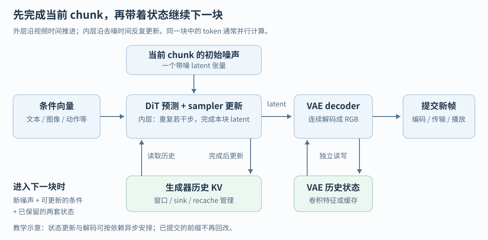
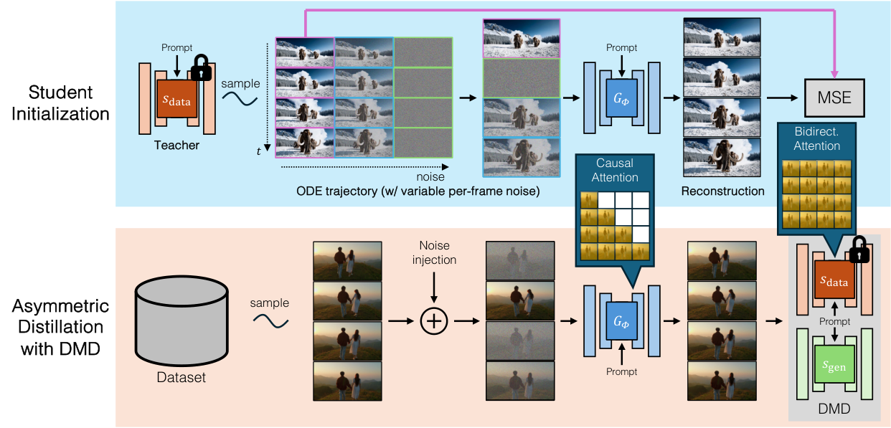
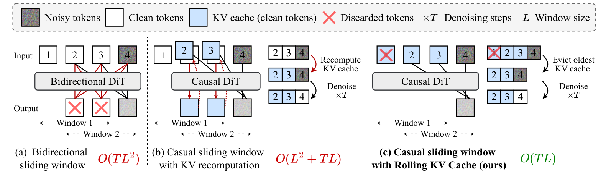
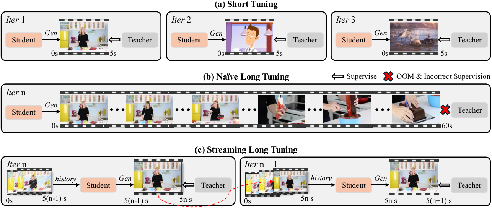
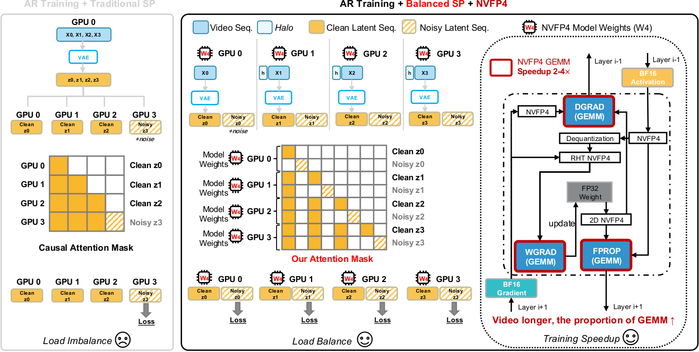
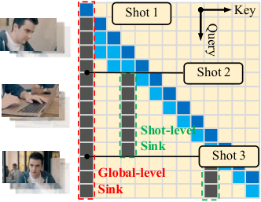
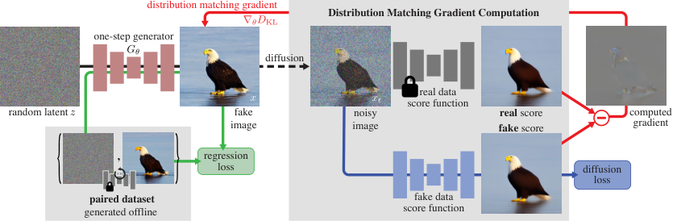
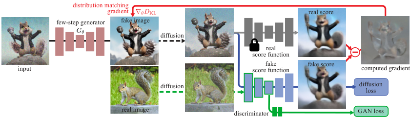
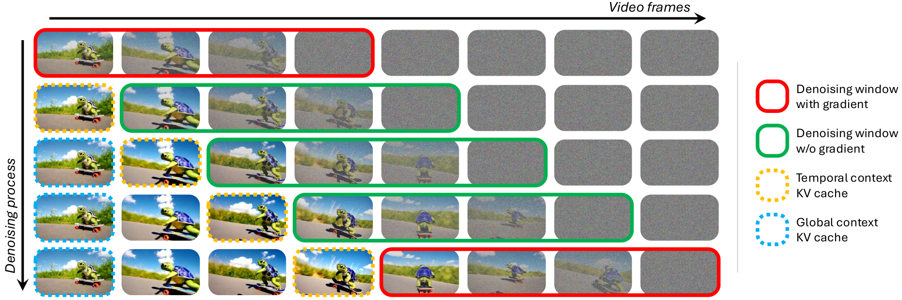
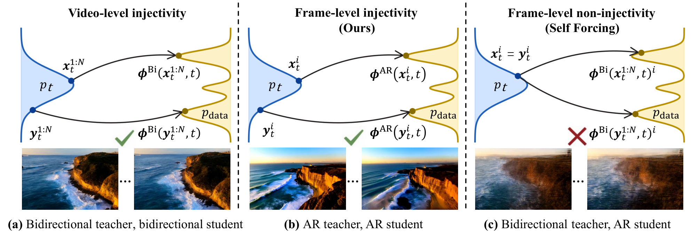

# 流式视频生成：从基础原理到模型架构与水印研究

基础文献核实日期：2026-09-27；研究方向与LongLive状态路径更新：2026-10-02（第13节）。范围为学术论文、预印本及有方法细节的 technical report。本文整理 20 篇生成、解码或系统研究，并分析 10 篇水印及相邻方法；作者、单位、发表状态、项目、代码、模型和数据入口见 [文献资源附录](streaming_literature_resources.md)，机器可读版本见 [资源目录](streaming_literature_catalog.json)。

入门内容更新于2026-10-02；重点论文精读更新于2026-10-03。本文假设读者了解基本神经网络，但没有视频生成背景：先解释视频在模型中如何表示、生成如何进行，再比较不同流式路线。第0节和第3节适合连续阅读；第4节按研究问题组织论文；第6–13节将这些机制连接到水印。第14节提供术语速查与自测；[第15节](#paper-readings)逐篇讲透7篇重点论文，包含机制、训练与推理、关键实验和对本项目的启发。[第16节](#forcing-reading-path)按照截图串起七篇Forcing相关文献，并新增Rolling Forcing、Causal Forcing及DMD／DMD2精读。目前共30篇专题文献、7篇基础读物，资源见文献附录。

正文区分原论文证据、代码事实、已测结果和研究假设。项目已有LongLive 2.0基线实验，见[移植报告](accepted_watermark_reproduction.md)与[未知边界拼接报告](splice_insertion_experiment.md)；KV状态写入也已完成两轮探索，但尚未建立可靠的message恢复通道，见[实验报告](kv_state_experiment.html)。本次更新是解释与综述扩充，没有新增模型实验。

## 0. 入门：一段视频是怎样从噪声生成出来的

### 0.1 先建立全流程，不急着记论文名字

设想输入一句话：“一只猫沿窗台向右走，镜头缓慢跟随。”生成系统需要决定猫的外观、位置、运动、背景和相机变化，并让相邻帧保持连贯。它不是从数据库找一段视频，也通常不是先写出完整的三维场景再渲染，而是学习视频数据的统计规律，再根据条件采样一个可能的视频。

以本文重点讨论的latent视频生成系统为例，推理经过以下模块：

1. **条件编码器**把prompt转成向量；图像、音频、动作等条件可以有各自的编码路径。
2. **初始噪声**提供随机起点。同一个prompt配不同噪声，可以产生不同外观和运动。
3. **生成主干与采样器**反复更新带噪latent，逐渐得到可解码的视频表示。
4. **VAE decoder**把latent转换为RGB帧。
5. **视频编码与输出**把RGB帧压成H.264等码流，保存、传输或播放。

流式系统在这条链路上增加了一个外层循环：先完成一小段，保留历史状态，再继续下一小段。生成器和解码器可能各有自己的历史缓存。



图为教学示意，不代表某一论文的精确线程调度。图中“decoder”有两种完全不同的含义：**VAE decoder是神经网络，负责latent到RGB；播放器里的视频解码器负责压缩码流到RGB。** 二者之间还可能有水印嵌入与颜色空间转换。

### 0.2 RGB、latent、token、chunk分别是什么

**RGB视频**可以看成一组按时间排列的彩色图像。忽略batch，一种常见写法是“帧数T × 3个颜色通道 × 高H × 宽W”；代码也可能把通道放在别的位置。一个512×896的视频帧有约138万个颜色数值，几十帧一起处理成本很高。

**Latent**是压缩后的连续特征网格。编码器E把训练视频x压成z，解码器D尝试恢复x。这里的压缩是有损的，latent通道也不再直接表示红、绿、蓝。

$$
z=E(x),\qquad \widehat{x}=D(z),\qquad \widehat{x}\approx x.
$$

生成时通常从噪声直接采样z，再调用D；不需要先存在一段目标视频。视频文献常将这类压缩模块统称为VAE，具体模型的正则项和结构各不相同。Latent diffusion的基础思想来自在预训练autoencoder表示中进行生成，而不是在高维像素上直接完成全部采样。[LDM原文](https://arxiv.org/abs/2112.10752)

**Token**是Transformer处理的单位。视频DiT通常把latent切成小patch，投影成向量，每个向量成为一个token。这里的token经常是连续向量，不是词表中的整数编号；不要把“token化”自动理解为LLM式离散采样。

**Chunk**是一次推进的视频时间块，包含若干latent帧及其空间token。一个chunk不是一个token，也不一定只对应一张RGB图。

用一个**人为设定的尺寸算例**说明层级关系，以下不是LongLive的固定配置：

| 阶段 | 假设或尺寸 | 你应该读出的信息 |
| --- | --- | --- |
| RGB输入 | 81帧，512×896，3通道 | 播放器最终展示的画面 |
| VAE压缩 | 空间每边8倍；时间首帧单独处理、其后4帧一组；16通道 | latent为21×16×64×112 |
| DiT patchify | 每个latent帧按2×2空间patch切分，不再压缩时间 | 每帧32×56＝1,792个token |
| 全片段 | 21个latent帧 | 合计37,632个token，attention可能很昂贵 |
| 4个latent帧一个chunk | 第一块含特殊首帧 | 第一块对应13帧RGB，后续完整块通常各16帧；具体映射依VAE实现 |

这解释了为什么论文中的“生成4帧”必须追问是RGB帧还是latent帧。视频长度也可能要求满足特定倍数或padding规则。

### 0.3 Diffusion：训练时学什么，推理时做什么

可以把diffusion直观理解为：让模型学会在不同噪声强度下，判断如何把被扰乱的数据往合理视频方向修正。训练时有真实视频；推理时只有随机起点和条件。二者不能混为一谈。

以下是常见的噪声预测教学形式，z是干净latent，ε是标准高斯噪声，s是噪声水平，c是文本等条件：

$$
z_s=\alpha_s z+\sigma_s\epsilon,\qquad
\mathcal L_{\mathrm{noise}}=\mathbb E\left[\left\|\epsilon_\theta(z_s,s,c)-\epsilon\right\|_2^2\right].
$$

训练时随机抽s，把真实latent加噪，再让网络预测加入的噪声。α、σ决定数据与噪声的混合比例。网络也可以预测干净数据或其他等价参数化，不能仅凭变量叫“noise_pred”就认定所有模型使用同一目标。

推理时从高噪声出发，反复调用训练好的网络，由**scheduler/sampler**决定下一次latent如何更新。网络提供预测；采样器决定走多远、是否再加噪、下一步用什么噪声水平。“去噪”描述生成过程，不意味着模型在恢复某一段预先藏在噪声中的真实视频。[DDPM原文](https://arxiv.org/abs/2006.11239)

**训练的一次梯度更新不等于推理的一次去噪步。** 训练通常随机抽一个或若干噪声位置来学习；生成完整样本时才沿采样路径前进。Few-step蒸馏等训练方案会有额外rollout，后文单独解释。

### 0.4 Flow matching与diffusion是什么关系

Flow matching学习一个随“生成进度”变化的速度场，让噪声分布连续移动到数据分布。用一个简单的直线路径作教学例子：τ＝0是噪声，τ＝1是数据。

$$
z_\tau=(1-\tau)\epsilon+\tau z,\qquad
\mathcal L_{\mathrm{FM}}=\mathbb E\left[\left\|v_\theta(z_\tau,\tau,c)-(z-\epsilon)\right\|_2^2\right].
$$

网络学习的是当前位置该往哪个方向移动。生成时对速度场进行数值积分；最简单的一步Euler近似是：

$$
z_{\tau+\Delta\tau}\approx z_\tau+\Delta\tau\,v_\theta(z_\tau,\tau,c).
$$

这是帮助理解的特例，不是所有flow模型或求解器的完整公式；有些代码还采用相反的时间方向。条件路径是直线，也不意味着学到的边缘生成轨迹一定是直线，更不保证一次大步就能生成高质量视频。[Flow Matching原文](https://arxiv.org/abs/2210.02747)

入门时先把diffusion与flow看作两种学习“噪声如何变成数据”的方法。它们都可以配Transformer，都可以离线或按块生成，也都可能需要多次网络调用。**Flow matching不是流式生成里的“流式”**：前者描述概率分布的连续变换，后者描述视频何时能够输出。

### 0.5 DiT是网络架构，sampler是运行它的方法

DiT是Diffusion Transformer：以Transformer处理带噪latent的patch tokens，并结合噪声水平及条件，输出用于更新latent的预测。原始DiT研究的是图像；视频模型进一步处理时间维及其位置关系。[DiT原文](https://arxiv.org/abs/2212.09748)

典型block含attention、逐token的MLP、归一化与残差连接。条件可以通过cross-attention或调制归一化等机制进入，具体视频架构会组合不同设计。记住以下职责就能阅读大多数架构图：

| 组件 | 负责什么 | 不能由它单独决定什么 |
| --- | --- | --- |
| VAE | RGB与latent之间转换 | 生成主干是否能看未来 |
| DiT / denoiser | 根据噪声状态和条件给出预测 | 实际用几步采样、何时输出 |
| Sampler / scheduler | 决定每一步更新及噪声日程 | 模型有没有学会长时间保持一致性 |
| Attention mask | 决定哪些token可以交换信息 | 是否已实现像素流式解码与传输 |
| Distillation | 用训练把昂贵生成过程压到较少调用 | KV显存是否随时间无限增长 |

CFG（classifier-free guidance）则是一种条件引导方式：组合有条件与无条件预测来增强条件影响。某些实现因此增加网络计算；蒸馏模型也可能吸收部分引导行为。对照速度时要核对实际调用，不能只比较表面上的“4 steps”。

### 0.6 最容易混淆的三个时间

**视频时间**是猫在第几秒走到哪里；**采样时间**是同一段latent从多噪到少噪的进度；**墙钟时间**是GPU实际花了多久。论文经常都用t表示，阅读时最好主动改成不同符号。

| 时间 | 本文示例记号 | 一个例子 |
| --- | --- | --- |
| 视频位置 | k，chunk编号 | 第3块，对应视频中的某一小段 |
| 去噪/flow进度 | s或τ | 第3块目前完成4次采样更新中的第2次 |
| 真实耗时 | 秒 / 毫秒 | 上述网络调用在GPU上花了80 ms |

假设生成3个chunk，每块做4次去噪。顺序AR方案先完成第一列，再处理第二列：

```text
                 chunk A     chunk B     chunk C
初始噪声             A4           B4           C4
第1次更新            A3           B3           C3
第2次更新            A2           B2           C2
第3次更新            A1           B1           C1
第4次更新            A0           B0           C0
最终输出              ↓            ↓            ↓
```

上面的下标只是示意去噪阶段，不是视频帧号。顺序AR至少包含12次chunk级去噪调用，可能另外需要recache或CFG计算；离线模型则可能做4次覆盖A、B、C的全片段调用，每次更大。滚动buffer方案沿对角方向推进多个不同噪声阶段，详见第4节。**不能仅比较调用次数来判断哪种更快。**

### 0.7 Attention与KV cache：保存的是特征，不是视频文件

在一层attention里，输入特征通过不同投影得到Q、K、V。直观上，Q表示当前token需要找什么信息，K用于计算匹配程度，V提供要汇入的内容：

$$
\operatorname{Attention}(Q,K,V)=\operatorname{softmax}\!\left(\frac{QK^\top}{\sqrt d}+B\right)V.
$$

d是每个head的key维度。B是加法mask：允许连接的位置为0，被禁止的位置为负无穷；softmax后禁止位置权重为0。第3节的M则是0/1可见性矩阵，不能直接把这两种mask表示混用。[Transformer原文§3.2](https://arxiv.org/html/1706.03762v7#S3.SS2)

Self-attention让同一组视频token彼此交换信息；典型cross-attention则用视频特征作为query，读取文本等条件的key/value。Multi-head表示并行学习多组这样的读取关系；多层Transformer再反复加工特征。因此缓存通常要按层保存，不是整套模型只存一对K/V。视频的因果mask限制视频位置之间的连接，不意味着必须屏蔽完整的、已知的文本条件。

生成下一块时，历史内容仍需被读取。如果历史在该模型和缓存方案下的表示已经固定，就可以保留各层的K/V，避免每次重新计算整段历史；当前块的Q/K/V仍要计算。Attention仍需读取缓存，所以“缓存了历史”不代表历史计算成本为零。

KV cache不是原始RGB、不是VAE latent本身，也不是可直接打开播放的视频。它是一组分布在多个层和head上的特征张量，受到历史输入、位置、条件及构建时噪声水平影响。因而“拿到视频就能完全重建KV”不是默认成立的前提。

### 0.8 Causal究竟限制谁看谁

离线模型可以让猫的早期位置参考尚未生成完的后期位置，从而联合协调完整动作；严格因果模型在输出早期部分时不能依赖尚未到来的未来视频条件。**但因果性可以按chunk定义，不一定按RGB帧定义。**

考虑A、B、C三个chunk。下面每行是正在更新的块，每列是可读取的块：

| 查询块 → 读取块 | A | B | C |
| --- | --- | --- | --- |
| A | 允许 | 禁止 | 禁止 |
| B | 允许 | 允许 | 禁止 |
| C | 允许 | 允许 | 允许 |

每个“允许”格内部可以是密集的空间/时间attention。这就是block-causal：A内部的帧可以一起协商；A不能看B、C。相比frame-causal，它有更大的块内并行空间，也通常需要等整个块完成才能提交。

换成causal mask只规定信息流，并不能自动让原来的双向模型工作良好；模型需要适配训练，缓存、采样和解码也必须配合。原来利用未来上下文的能力不会在改mask后自动变成可靠的历史预测能力。

### 0.9 为什么autoregressive与diffusion能够同时出现

Autoregressive（AR，自回归）说明时间块之间怎样分解概率：下一块依赖过去。Diffusion或flow说明下一块的条件分布怎样被采样。它们回答不同层次的问题。

类比写文章：外层按段落继续写，内层不是逐字采样，而是反复修改当前段的草稿。对视频来说，外层推进chunk，内层对连续latent去噪。这个类比只解释两个循环，不意味着已提交的历史还可以任意修改。

因此，Self Forcing、LongLive这类AR diffusion不能直接套用依赖next-token词表概率的LLM水印。它们的“下一项”是一个高维连续视频块，而不是从有限词表中选出的一个词。

### 0.10 训练与推理为什么会不一致

训练时，如果模型总是看到真实视频的历史，上一块的猫总是完整、位置准确；推理时，上一块是自己画出来的，可能尾巴有误差、相机有漂移。下一块继续基于这些误差生成，偏差可能逐渐放大。这就是这里的**exposure bias**。

Teacher forcing（TF）给模型真实历史；self-rollout让模型在训练中也接收自己生成的历史。Self Forcing把后者用于视频生成训练，并采用视频级分布监督。训练中的teacher forcing与蒸馏中的teacher model不是同一个“teacher”：前者是一种历史输入方式，后者是指导student学习的模型。[Self Forcing原文](https://arxiv.org/abs/2506.08009)

Few-step distillation的另一个任务，是让student用较少采样步实现原来需要很多步的生成能力。它与exposure bias有关联，但并不等价：少步模型仍可能长期漂移，见过自身历史的模型也不一定已经足够快。

### 0.11 “无限生成”与“实时生成”分别承诺了什么

论文中的infinite或unbounded经常表示程序不必预先指定有限的总长度，且活动状态大小受控。它不保证身份永远不变、物理状态永远正确，或能够保留全部历史。有限窗口外的信息可能遗失；sink和检索记忆是不同的补救方式。

实时也至少有两个维度。假设目标播放24 FPS，一块输出16帧，相当于约0.667秒视频：若系统每0.5秒交付一块，持续吞吐够用；但如果冷启动要等5秒，第一块仍来得很晚。如果平均速度够用、偶尔一块卡住很久，还可能产生播放停顿。

**TTFF**通常指首次可用帧的等待时间，**TTFC**指首次可用chunk，但各论文可能使用不同起止点；**FPS**通常是单位真实时间产出的RGB帧数。另一个关键指标是控制到响应的延迟：按下“左转”以后，用户多久看到画面转向。生成器前面若已排队了很多未来帧，FPS再高也可能响应迟缓。

### 0.12 这一套基础与水印的直接联系

我们的目标是：验证者只有可能被压缩、剪辑、删帧的视频，仍能读回嵌入的bit message。这个目标比判断“是不是AI生成”更具体，也不等同于查明用户身份。

| 写入位置 | 信号怎样到达画面 | 验证时的关键问题 |
| --- | --- | --- |
| 初始噪声 | 随当前块采样影响latent和RGB | 能否从观测视频恢复足够的原始噪声信息？ |
| 生成特征或KV状态 | 改变当前输出，也可能改变后继生成状态 | 改变是否承载特定message，是否能在新内容上被像素reader识别？ |
| VAE decoder | 在latent转RGB时形成水印 | 连续解码的状态、边界与替换decoder会怎样影响恢复？ |
| RGB后处理 | 对已解码画面施加编码扰动 | 扰动经过压缩、编辑及未知边界拼接以后是否仍可读？ |

**生成端知道的信息不等于验证端可用的信息。** 内部chunk编号、原始prompt、噪声seed、KV cache和真实剪辑边界，除非威胁模型明确允许，都不能偷偷交给reader。只在原位置、原长度、原状态下可恢复的码，不等于适合任意截取的视频。

后面的阅读可以分三次：第一次读第0、2、3节建立模型；第二次读第4、5节理解论文和性能；第三次读第6–13节思考水印。公式先看输入输出与符号含义，不必在第一遍推导训练目标。

## 1. 核心判断

**流式视频生成已经形成清晰的技术体系；专门适配这一生成过程的水印仍有研究空间，但“现有水印都不能用”不成立。** 最重要的变化是：视频从一个整体采样对象，变成依赖历史状态、持续接收控制、逐块提交输出的过程。

目前最值得关注的是 **causal / block-causal DiT + few-step diffusion / flow matching + KV cache + streaming decoder**。CausVid 打通双向模型到 causal student 的蒸馏；Self Forcing 改善生成历史带来的 exposure bias；LongLive 处理长时间运行和提示切换；Causal Forcing / ++、Causal-rCM 进一步改进初始化和 1–2 步生成。另一条路线使用滚动去噪 buffer，FIFO-Diffusion、MAGI-1、StreamDiT 是理解它的重要入口；这些路线会交叉，不能只按论文名字分类。[CausVid](https://arxiv.org/abs/2412.07772)、[Self Forcing](https://arxiv.org/abs/2506.08009)、[LongLive](https://arxiv.org/abs/2509.22622)、[Causal Forcing++](https://arxiv.org/abs/2605.15141)、[Causal-rCM](https://arxiv.org/abs/2606.25473)

对水印，我的判断按迁移难度排序：

1. **逐帧 / 小窗口后处理水印最容易接入。** Video Seal 已有分块处理代码；真正需要新增的是在线输出、短前缀置信度、持续误报控制和生成系统中的延迟评测。
2. **Decoder 内嵌水印是可比较的部署路线，但不再作为本项目的新方法主线。** 单纯更换为causal VAE仍不足以建立流式特有的贡献。Video Signature保留为用户已有工作的背景，不纳入本项目复现实验。优先探索生成状态的持续承载与更新，见第13节。
3. **初始噪声水印最需要重新设计提取端。** 每个新 chunk 仍可嵌入，但旧模型的反演器不等于 few-step causal student 的逆；历史状态、重加噪、未知动作和丢失前缀都会改变恢复条件。
4. **“autoregressive”不代表可以直接使用 LLM token 水印。** 本文主流模型在时间上自回归，在每个 chunk 内仍生成连续 latent；没有天然的离散词表和 next-token logits。

本轮未找到针对这一 **causal / autoregressive 视频生成过程**提出并评测水印的直接专用公开论文。因此可以称为**学术蓝海候选**。但通用视频水印、传统 streaming watermark 和 AR 图像水印都构成已有基础，不能把“流式视频水印”整个大类说成空白。

## 2. “流式”究竟指什么

至少要区分以下五种性质。论文标题中的 streaming，可能只满足其中一部分。

| 性质 | 判断问题 | 与水印的关系 |
| --- | --- | --- |
| 连续输出 | 能否在整段视频结束前提交已经确定的帧？ | 嵌入器不能等完整视频才决定已输出帧的水印 |
| 时间因果性 | 当前输出是否依赖未来生成块或未来控制？因果粒度是一帧还是一个 chunk？ | 决定水印是否需要未来信息、检测至少要缓存多少帧 |
| 长时间运行 | 状态是否有界？是否能超出训练时长而不持续退化？ | 需要处理计数器、密钥周期、缓存切换、误差累积 |
| 实时性 | 生成吞吐是否达到播放帧率，同时延迟足够低？ | 加水印后的整体系统仍须满足播放和交互预算 |
| 在线交互 | 新 prompt、动作或音频到达后，多久改变输出？ | 生成条件持续变化；检测端未必知道这些条件 |

**长视频不一定实时；高 FPS 不一定低延迟；causal VAE 不一定意味着 causal denoiser；分块文件处理不一定已经实现在线验证。** 例如，原版 CausVid 的 9.4 FPS 是流式输出成绩，但低于其 12 FPS 目标播放率；Self Forcing 的 frame-wise 版本降低首帧延迟，同时吞吐低于 chunk-wise 版本。[CausVid §5](https://arxiv.org/html/2412.07772v4)、[Self Forcing Table 1](https://arxiv.org/html/2506.08009v2)

还要区分 **从文本/图像持续生成新视频**与**转换实时摄像头输入**。Live2Diff 属于后者：输入帧不断到达，模型进行风格或外观转换，不能将其结果直接当作开放域 T2V 的性能。[Live2Diff](https://arxiv.org/abs/2407.08701)

## 3. 从非流式到流式：到底改了哪些架构

### 3.1 非流式基线：整段 latent 共同去噪

典型离线 latent video diffusion 先为完整片段建立 latent 张量，再反复调用 denoiser。用 k 表示视频时间块、s 表示噪声/采样时间，这两个轴必须分开：

$$
z^{(s-1)}_{1:K}=F_\theta(z^{(s)}_{1:K},s,c).
$$

使用全时空双向 attention 时，当前块的更新可以依赖未来块的中间 latent。一次去噪并不“生成一帧”，而是修改整个片段；大多数帧在最后一步以前都不能作为最终结果提交。即便 decoder 本身是 causal 的，也没有改变 denoiser 需要整段输入的事实。

此处描述的是常见全片段扩散基线，并非断言所有非流式模型必须双向、必须用统一噪声或不能分块解码。**输出策略、attention 结构、训练噪声分布和 decoder 是可分别改变的模块。**

### 3.2 因果 AR diffusion：外层按时间推进，内层去噪

典型流式模型按块建立条件分布：

$$
p_\theta(z_{1:K}\mid c_{1:K})=\prod_{k=1}^{K}p_\theta(z_k\mid z_{<k},c_{\leq k}).
$$

每个条件分布由一个 diffusion / flow / consistency sampler 实现。操作顺序是：生成当前块 → 保存历史状态 → 解码并提交 → 开始下一块；系统也可以让解码与下一块去噪重叠。

**Block-causal attention** 允许当前 chunk 内双向交互，但禁止当前块看到未来 chunk。若 b(i) 表示 token i 所属的视频块，则允许访问的条件是：

$$
M_{ij}=\mathbf{1}[b(j)\leq b(i)].
$$

这不等于像 LLM 一样逐个空间 token 生成：同一块中的空间 token 往往并行去噪。Chunk 越小，通常越快响应新控制，但并行度更低、调用更频繁；这解释了低首帧延迟与高吞吐为什么可能冲突。[CausVid §4.1](https://arxiv.org/html/2412.07772v4)、[Self Forcing §3.1](https://arxiv.org/html/2506.08009v2)

### 3.3 KV cache 保存什么，比“有没有 cache”更重要

历史块不会再受未来块影响时，才能复用其特征。但 diffusion 模型的特征还取决于噪声水平、prompt、位置编码和控制输入。

| 缓存方案 | 代表 | 具体含义 | 水印提取为什么受影响 |
| --- | --- | --- | --- |
| 每层、每个 denoising step 各一份缓存 | Live2Diff | 不同噪声水平的历史特征分开保存 | 反演只恢复干净历史像素，未必恢复每一步的缓存 |
| 生成后重新前向，写入历史缓存 | CausVid / Self Forcing | 当前块完成后，在约定 context timestep 下重建其 K/V | 验证端需要匹配历史、context timestep 和状态更新规则 |
| Rolling window | Self Forcing | 淘汰旧条目，让计算与显存不随总长度增长 | 截断视频的首个可见块没有原始历史状态 |
| Local window + frame sink / recache | LongLive | 保留少量远期锚点；prompt 切换时刷新语义状态 | 相同局部画面未必对应相同生成条件 |
| Noisy-context cache | Diagonal Distillation | 后续块利用带噪历史条件 | 干净帧不是全部必要的条件信息 |

Live2Diff 的多噪声缓存见 §3.4；CausVid Algorithm 2 明确在当前块完成后重做前向更新 cache；LongLive 的 recache 是为避免旧 prompt 的语义一直残留在历史特征中。[Live2Diff](https://arxiv.org/html/2407.08701v1)、[CausVid](https://arxiv.org/html/2412.07772v4)、[LongLive](https://arxiv.org/html/2509.22622v2)、[Diagonal Distillation](https://arxiv.org/html/2603.09488v2)

### 3.4 Streaming decoder 是第二个独立的因果系统

从 latent 到像素的解码也需要状态。可写成：

$$
(x_k,h_k^D)=D_\phi(z_k,h_{k-1}^D).
$$

这里 hᴰ 是 decoder 的卷积特征或 attention cache，**不是 denoiser 的 KV cache**。典型 causal 3D VAE 在时间维有压缩：一帧 latent 往往对应多帧像素，而首帧可能单独编码。因此论文的 frame-wise 有时是 latent-frame-wise，不能自动解释成每次只输出一帧 RGB。

三个常见部署选择是：原版 causal VAE 分块解码、tiny / pruned VAE 加速、专门训练的 streaming decoder。FlashDecoder 用纯 Transformer、固定窗口 rolling KV、时间上采样和 PixelShuffle；第一帧 latent 的处理与后续帧不同。它说明 decoder 可以成为实时生成瓶颈，也说明“把水印写在 decoder 里”必须考虑部署时 decoder 被替换的情况。[FlashDecoder §3](https://arxiv.org/html/2607.14898v1)

### 3.5 架构差异汇总


| 维度 | 典型离线全片段 diffusion | Causal AR diffusion |
| --- | --- | --- |
| 采样单元 | 整段视频 | 下一帧 latent 或下一 chunk |
| 时间 attention | 片段内双向 | 跨块因果，块内可双向 |
| 噪声时间 | 常用全片段统一 s | 当前块采样；历史为干净或指定噪声状态 |
| 结果可修改范围 | 去噪期间整个片段都可更新 | 已提交前缀不可再修改 |
| 长视频状态 | 片段长度受显存 / 训练窗口约束 | 缓存、窗口、sink 或检索记忆管理 |
| 误差模式 | 整段联合协调，但成本高 | 自生成历史引起 exposure bias 与长期漂移 |
| 控制输入 | 通常在一次调用中预先给定 | 可在块边界不断更新 |
| 水印机会 | 一次性全片段编码、聚合检测 | 分块编码、状态同步、前缀检测和持续决策 |

### 3.6 沿着一个chunk走一遍：什么时候读cache，什么时候写cache

下面以“已经生成两块，现在生成第三块”为例，解释一种**clean-context cache方案**。不同模型可能缓存不同噪声状态，本例不能替代具体实现。

1. 历史块A、B已经完成，它们对应的各层历史K/V已存好。第三块C还没有内容，先初始化它自己的带噪latent。
2. 对C做第一步去噪。当前C的token产生Q/K/V，attention读取A、B的历史K/V及当前块允许访问的token；网络预测用于更新C。
3. 对更新后的C继续去噪。C的内容改变，当前特征通常需要重算；历史A、B在约定的cache方案下可复用。**不能把C第一步的noisy K/V直接当作它最终的历史表示。**
4. C采样完成，运行一次历史构建前向，在约定的context noise level下生成准备供未来读取的K/V。这就是这里的clean-context cache update；它有计算成本。
5. 将C送入有历史状态的VAE decoder，得到新RGB帧；把C的K/V并入历史缓存，按容量策略淘汰旧项。
6. 已完成RGB可以交给水印后处理、编码与播放；下一块D开始。解码和生成D可并行，但需要保证各自状态依赖正确。

```text
生成器状态 G = 空；解码器状态 D = 空
对每一个即将生成的 chunk：
    取得当前允许使用的文本 / 图像 / 动作条件
    z = 当前 chunk 的初始噪声
    对当前 sampler 的各个采样步：
        prediction = DiT(z, 噪声水平, 条件, 历史状态 G)
        z = sampler_update(z, prediction)
    G = 按模型约定，用完成的 z 更新历史；管理窗口和 sink
    rgb, D = streaming_decode(z, D)
    提交 rgb；后续生成不能回改它
```

这是说明依赖关系的伪代码，不是可直接执行的LongLive脚本；它省略CFG、中间重加噪、位置更新和异步队列。尤其要注意：有的入口虽然逐块生成latent，却在循环结束后才统一解码。这种入口不能直接作为像素实时输出的证据，源码例子见第11节。

### 3.7 Rolling window、sink与recache是三个不同操作

**Rolling window决定忘掉什么。** 假设普通历史容量只有3块，生成D时能读A、B、C；D完成后历史变成B、C、D。A的直接KV载体已经移出。A可能曾影响B、C的内容，但不代表A的全部信息已经被它们保留。

**Sink决定额外保留什么。** 可以另留一个早期锚点S，后续总能读取“S＋最近3块”。它有助于提供长期参照，但不是完整历史的压缩数据库。给旧帧贴上sink标签，也不会自动让模型学会利用它；训练和attention配置必须支持这种模式。

**Recache决定如何重建历史特征。** 一种使用场景是prompt改变之后，对保留的历史latent按新条件重新前向。像素本身没有重写，历史特征却可能改变。因此“原来写入KV的扰动”可能被重建覆盖，而“已经通过latent形成的影响”是否留下是另一个问题。不同论文对recache的命名和时机并不完全一致，必须看实际调用。

对水印来说，可以把生命周期写成：写入→被读取→进入输出→构建新历史→窗口淘汰或recache→再次读取。在哪一步信号消失，就对应哪一个研究问题；不能将所有失败统称为“流式不鲁棒”。

### 3.8 为什么有KV cache仍会缺显存

忽略batch、多噪声副本、量化scale与内存对齐，一个标准缓存的字节数近似为：

$$
\mathrm{KV\ bytes}\approx 2 L N_h H_{kv} d_h b.
$$

2对应K和V；L是层数；Nₕ是保留的历史token数；Hₖᵥ是KV head数；dₕ是每个head的维度；b是每个数占用的字节。以**假设的**30层、10,000个历史token、24个KV head、128维、BF16每数2字节计算，缓存约3.69 GB（约3.43 GiB），尚不含模型权重、当前激活和VAE。

历史长度每增加一倍，这一部分通常也增加一倍。Rolling window限制Nₕ；GQA减少KV head数；量化减少每个数的存储成本；它们作用于不同因子。若按多个denoising step分别保留历史，缓存还会成倍增加。上式是容量估计，不是某个LongLive实测显存值。

同样，水印开销要分开统计：writer/reader参数、额外常驻生成状态、每条视频的密钥或模板档案，以及训练时反传激活。服务器磁盘中档案随视频数量增长，与单次推理GPU显存增长，是两种不同的“线性增长”。

## 4. 论文与 technical report 的技术路线

第一次阅读这一节，可以把每篇论文挂到五个问题上：**如何连续推进？如何减少采样步？训练时看谁生成的历史？长时间保存什么？像素和服务能否跟上？** 这些问题彼此独立，一篇论文可能同时改动几个。下文的箭头表示理解顺序，不等于所有模型严格继承同一套代码。

### 4.1 滚动去噪：FIFO、Diffusion Forcing、MAGI-1、StreamDiT

**FIFO-Diffusion — NeurIPS 2024。** 使用已有短视频 diffusion model，维护噪声从低到高排列的队列；队首完成去噪后弹出，队尾补入新噪声。Latent partitioning 缓解使用异质噪声时的训练推理差异，lookahead denoising 改善上下文利用。它证明了无需重训也能连续扩展，但其队列内有尚未输出的未来帧，不能据此宣称严格逐帧即时响应新控制。对于初始噪声水印，验证对象可能是当时整个活动队列，而非单个已输出帧。[论文](https://arxiv.org/abs/2405.11473)

**Diffusion Forcing — NeurIPS 2024。** 核心是对序列不同位置独立抽取噪声水平，从而统一已知过去、部分带噪上下文和待生成未来。它是一种训练范式，不等同于某个固定 DiT 架构或固定推理日程。原论文采用 causal next-token 模型；后续 DF / DFoT 系统可以采用不同 attention 和 history conditioning。因而“DF 一定双向”与“DF 一定能用同一种 KV cache”都不准确。[论文](https://arxiv.org/abs/2407.01392)、[官方实现的分支说明](https://github.com/buoyancy99/diffusion-forcing)

**MAGI-1 — 2025 technical report，Sand AI。** 是理解大规模 streaming stack 很有价值的报告。其 DiT 采用块内全 attention、跨块 causal attention，配合 GQA、QK-Norm、并行 self/cross-attention 等设计；每块 24 个视频帧，可让多个 chunk 在不同噪声阶段并发推进。VAE 是 Transformer 架构，空间与时间压缩分别为 8×、4×；shortcut distillation 支持更少采样步骤。这里的 block-causal 网络仍可使用“前块未完全结束，后块就启动”的采样流水线，因此它同时属于块因果架构与重叠去噪调度。报告还讨论 TTFC、TPOC、多模型异步服务和多 GPU 并行，不能只摘“实时”两个字。[论文](https://arxiv.org/abs/2505.13211)、[官方代码和配置](https://github.com/SandAI-org/MAGI-1)

**SkyReels-V2 — 2025 technical report，Skywork。** 对视频模型进行多阶段训练，并通过 non-decreasing noise schedules 的 Diffusion Forcing post-training 获得扩展能力。它代表“高质量长视频 / film generation”路线。代码明确区分 DF、普通 T2V、I2V 模型；有 DF 权重不意味着所有版本都满足实时交互约束。[论文](https://arxiv.org/abs/2504.13074)、[模型系列说明](https://github.com/SkyworkAI/SkyReels-V2)

**StreamDiT — CVPR 2026。** 使用 buffered flow matching：每次只完成 buffer 的一部分，剩余部分继续去噪；设计不同 frame partition 以协调一致性和视觉质量。架构将单个 timestep embedding 改为逐帧可变的调制，并使用 window attention；蒸馏匹配分段去噪轨迹。这里的“一次前向输出新帧”是流水线进入稳态后的行为，并不表示每个 frame 自进入 buffer 起只经历一次前向。[论文](https://arxiv.org/abs/2507.03745)、[项目页](https://cumulo-autumn.github.io/StreamDiT/)

### 4.2 Few-step causal AR：CausVid → Self Forcing → Causal Forcing 系列

**CausVid — CVPR 2025。** 保留 DiT 主体，改为 block-causal attention；先用 teacher 的 ODE pairs 初始化，再用 asymmetric Distribution Matching Distillation（DMD）将多步双向 teacher 的视频分布蒸馏给 4-step causal student。双向 teacher 在训练时可以评价整个视频，student 在推理时仍只能使用历史。原论文 backbone 与后续公开 Wan 移植版不同，速度和采样步数不可混用。[论文](https://arxiv.org/abs/2412.07772)、[当前模型卡](https://huggingface.co/tianweiy/CausVid)

**Self Forcing — NeurIPS 2025 Spotlight。** 关键贡献在训练分布：训练时也按推理方式进行 autoregressive rollout，后面的块真正接收模型自己生成的前缀，而不是始终接收 ground truth。Few-step sampler、随机截断反向传播和 KV cache 控制训练开销，再用视频级分布损失提供监督。它不是简单把 attention mask 改成三角形；真正修复的是“训练时历史很干净，推理时历史有误差”的差异。[论文](https://arxiv.org/abs/2506.08009)、[官方仓库](https://github.com/guandeh17/Self-Forcing)

**Causal Forcing — ICML 2026；Causal Forcing++ — 2026 technical report。** 原作研究 ODE 初始化的条件错配：双向 teacher 对同一当前 noisy frame 的输出还依赖未来，而 AR student 看不到未来；直接回归可能学到条件平均，无法恢复所要求的 AR conditional flow map。它先得到 AR teacher，再做 causal ODE initialization。++ 将离线整条 ODE 轨迹监督改为 causal consistency distillation 的在线邻近步监督，降低轨迹收集和存储负担，并推进到 frame-wise 1–2-step。**这是蒸馏学习目标的分析，不是“少步模型不可能反演”的定理。** 水印是否可恢复仍要分析实际 sampler。[原作](https://arxiv.org/abs/2602.02214)、[++](https://arxiv.org/abs/2605.15141)、[共享代码与模型](https://github.com/thu-ml/Causal-Forcing)

**Causal-rCM — 2026 technical report。** 将 teacher-forcing consistency model 初始化与 self-forcing DMD refinement 结合：前者强调离线条件覆盖，后者使用自身 rollout 进行分布修正；配套 causal attention mask 的 FlashAttention-2 JVP kernel 支持连续时间 consistency training。它值得关注的原因是把 1–2-step causal generation 做成可复用训练配方。仓库包含更早的 rCM 工作，不能把 rCM 的 ICLR 2026 标识直接赋给 Causal-rCM 这篇新报告。[论文](https://arxiv.org/abs/2606.25473)、[代码](https://github.com/NVlabs/rcm)

### 4.3 长期运行、交互记忆与系统：LongLive、Matrix-Game、StreamDiffusionV2

**LongLive — ICLR 2026。** 基于 causal AR 模型，解决三件事：streaming long tuning 让模型训练时见到长时间的自生成历史；短窗口加 frame sink 保留必要锚点；KV recache 在 prompt 变化时用新语义刷新历史特征。对水印最有价值的是，它提供了真实的“状态切换”事件：prompt 边界、recache、窗口淘汰和 sink 存续。[论文](https://arxiv.org/abs/2509.22622)

**LongLive-2.0 — 2026 technical report。** 基于 Wan2.2-TI2V-5B，联合设计 teacher-forcing 的 sequence parallelism、NVFP4 训练/推理、KV 量化、异步 streaming VAE，以及多镜头的全局 / 局部 sink。其直接 AR tuning 流程不依赖原来复杂的 ODE initialization + short tuning + long tuning 链，但公开仓库仍有 DMD LoRA 蒸馏阶段，用于 few-step 加速；不能解读成“完全不用 DMD”。对水印而言，量化、轻量 VAE 和异步任务调度均应成为部署实验条件。[论文](https://arxiv.org/abs/2605.18739)、[训练流程](https://github.com/NVlabs/LongLive)

**Matrix-Game 2.0 / 3.0 — 2025 / 2026 technical reports。** 2.0 将键盘与鼠标动作注入 Wan 系 DiT，以 causal distillation 和 self-forcing rollout 支持交互；动作条件进入生成状态，检测端可能拿不到。3.0 增加基于 camera pose / 视野重叠的历史记忆检索，把 memory latent、近期历史和当前 noisy latent 一起建模，并加入 error buffer、分段蒸馏和 MG-LightVAE。此时“条件”不再只是最近几帧：旧记忆可能被再次检索，因此水印不能只按最近窗口假定可重建全部状态。[2.0](https://arxiv.org/abs/2508.13009)、[3.0](https://arxiv.org/abs/2604.08995)

**StreamDiffusionV2 — MLSys 2026。** 重点是系统：SLO-aware batching、按 denoising steps / network stages 分配流水线、rolling cache 与 sink / RoPE 刷新、motion-aware noise control。它说明一个 streaming model 到稳定直播系统之间，还有调度、抖动、队列积压和多 GPU 服务的问题。水印额外耗时必须放进这条完整路径评估，单独报告 watermark network 的 FPS 不足以证明能上线实时运行。[论文](https://arxiv.org/abs/2511.07399)、[官方项目页](https://streamdiffusionv2.github.io/)

### 4.4 近期补充：不是所有新“forcing”都在解决同一问题

**Diagonal Distillation — ICLR 2026。** 前面块分配更多步骤，后面块利用已经建立的外观上下文减少步骤；训练和推理同时使用带噪历史条件，并加入 flow distribution matching。其 noisy cache 与 Self Forcing 的 clean-context cache 不同；水印的反演需要匹配实际噪声状态，而非只匹配视频内容。[论文](https://arxiv.org/abs/2603.09488)

**Stream Forcing — 2026-08 预印本。** 将逐帧噪声水平建模为随机过程，让训练分布从独立采样逐渐过渡到符合推理时序结构的配置；研究的是训练覆盖与推理一致性的折中。论文在 UCF-101 上的 FVD 改进是该设定的证据，不是所有开放域流式大模型都已受益的证明。[论文](https://arxiv.org/abs/2608.10439)

**Live2Diff 和 FlashDecoder 分别补足输入侧、输出侧。** 前者帮助理解带真实在线输入的多噪声缓存；后者帮助理解 latent 已经生成、像素仍没来得及输出的瓶颈。做 watermark pipeline 时这两端都不能忽略。

### 4.5 把几个“forcing”和蒸馏名词彻底分开

| 名词 | 主要改变哪一层 | 训练时的关键操作 | 不应误读成 |
| --- | --- | --- | --- |
| Teacher forcing | 历史来源 | 为下一块提供真实历史，常可组织成更并行的训练 | 必须存在一个teacher大模型 |
| Diffusion Forcing | 序列各位置的噪声配置 | 给不同时间位置不同噪声水平，学习多种已知/未知程度 | 一个固定mask、一种固定缓存或必然实时 |
| Self Forcing | 历史来源与rollout监督 | 用自己生成的前缀继续生成，再施加视频级训练信号 | 只把历史加一点随机噪声 |
| Causal Forcing | 少步初始化与条件匹配 | 分析teacher目标与AR student可见条件之间的差异 | 所有causal模型都采用的泛称 |
| DMD | 分布级蒸馏目标 | 借助teacher与生成分布相关的score估计，为student提供分布匹配信号 | 每个seed都必须复刻teacher的同一段视频 |
| Consistency distillation | 采样轨迹上的一致性 | 学习将不同噪声位置一致地映射到相应目标，具体形式依方法而变 | 直接删掉采样步骤就能获得的性质 |

这里的score是带噪数据分布的对数密度对输入的梯度，直观上提供“往哪移动更符合该分布”的信息；它不是一个0到100分的画质评分。读DMD论文时应区分生成student、预训练teacher score模型，以及用于估计当前生成分布的辅助模型，不能把三者统称为同一个denoiser。

为什么不能简单把50步改成4步？采样器原本用很多小步近似一个复杂变换，突然改成大步会引入误差；蒸馏是在重新训练短路径的行为。为什么不能只做蒸馏就解决长视频？因为少步加速没有自动改变历史来源、缓存上限和长期分布漂移。前者沿去噪时间轴压缩计算，后者沿视频时间轴处理反馈问题。[CausVid](https://arxiv.org/abs/2412.07772)、[Self Forcing](https://arxiv.org/abs/2506.08009)、[Causal Forcing](https://arxiv.org/abs/2602.02214)

### 4.6 三条路线的运行方式：顺序、流水线与输入转换

**顺序chunk AR**先完成A，再用A的状态生成B。路径容易理解，提交顺序明确；当前块等待和历史误差是重要成本。CausVid、Self Forcing与LongLive是理解这一路线的入口。

**滚动去噪buffer**同时维护“快完成的A、部分完成的B、刚开始的C”。一次计算之后，A可以输出，B、C继续推进，尾部加入D。这里的并发是多个视频位置处于不同噪声阶段，不必等同多个GPU线程。它可能提高稳态效率，但首次填满流水线需要时间；未来块是否反向影响较早块，取决于mask和调度，不能由“buffer”一词决定。FIFO-Diffusion、MAGI-1和StreamDiT值得对照读。

**在线video-to-video**还有不断到达的真实输入帧。系统对输入进行翻译或风格变化，要同时满足输入到达与生成延迟约束；它与仅凭文本持续创作新视频的数据条件不同。Live2Diff应放在这一任务定义下理解。

| 想解决的问题 | 优先阅读 | 读完应该能回答 |
| --- | --- | --- |
| 为什么视频可以边生成边输出？ | CausVid的架构和推理算法 | 块内与跨块attention怎么组织？ |
| 为什么短片好、长片却漂移？ | Self Forcing的训练过程 | 历史来自数据还是模型？损失监督真实rollout吗？ |
| 窗口满了、prompt变了怎么办？ | LongLive；再读LongLive 2.0 | 旧状态如何淘汰、保留或重建？ |
| 不同噪声阶段能同时处理吗？ | Diffusion Forcing；MAGI-1 / StreamDiT | 网络如何接收逐位置噪声，哪些块已经可以提交？ |
| 1–2步为什么还能生成？ | Causal Forcing / ++；Causal-rCM | teacher提供什么目标，student看得到对应条件吗？ |
| 模型很快但播放仍卡在哪里？ | StreamDiffusionV2；FlashDecoder | 瓶颈在生成、解码、队列还是传输？ |

技术报告尤其值得看完整配置表：主干、VAE、精度、GPU数量、步数和异步方式共同决定结果。把其中一个模块的速度当作整个系统的性能，会误判水印还有多少预算。

以上是技术路线地图。若想真正理解一篇论文为什么这样设计，请继续阅读[第15节的七篇论文精读](#paper-readings)：每篇都从具体失败场景出发，解释方法如何改变生成过程，再用原文实验判断它实际解决到哪一步。

## 5. 性能数字：必须带上测量条件

下表都是作者报告值，未在本机复现。不同论文的 FPS、VAE、分辨率、硬件数和统计区间不同，**不构成统一排行榜**。

| 来源与版本 | 模型 / 分辨率 | 硬件与关键条件 | 作者报告 | 应如何理解 |
| --- | --- | --- | --- | --- |
| CausVid 原论文 Table 3 | 原论文 DiT；640×352 | 单 H100；4-step；含 text encoder、denoiser、VAE | 首次输出约 1.3 s；9.4 FPS | 流式成立；低于 12 FPS 播放目标 |
| Self Forcing Table 1 | Wan1.3B；832×480 | 单 H100；chunk-wise | 0.69 s；17.0 FPS | 相对其 16 FPS 视频设定达到持续播放吞吐 |
| Self Forcing Table 1 | 同系列 frame-wise | 单 H100 | 0.45 s；8.9 FPS | 更低延迟不代表更高吞吐 |
| LongLive Table 1 | 1.3B；832×480 | 单 H100 | 20.7 FPS；展示至 240 s | 长时运行与短片速度是两项证据 |
| DiagDistill §4.1 / Table 1 | Wan1.3B；832×480 | 单 H100；tiny VAE；小窗口 cache | 0.37 s；31.0 FPS | tiny VAE 是重要条件；277.3× 是其相对基线延迟比 |
| StreamDiT §5.4 | 4B；512p | 单 H100；buffer 分块蒸馏 | 16 FPS；稳态一步约 482 ms 输出 8 RGB 帧 | 482 ms 不能直接冒充从冷启动算起的 TTFF |
| LongLive-2.0 Table 3 | 5B；720p；NVFP4；2-step | GB200 180GB；async decoding 另用一张 GPU | 表列 45.7 FPS；64 s 视频 E2E 36.3 s | 表列 FPS 与 E2E 时间不是同一口径；不是单卡端到端 45.7 FPS 的证明 |
| Matrix-Game 3.0 §5.2.3 | 5B；720p | 默认 8 GPU DiT + 1 GPU VAE；量化 / pruning / GPU retrieval | 最高约 40 FPS | 多卡系统成绩，不能转述成单卡性能 |

表中数据分别来自 [CausVid](https://arxiv.org/html/2412.07772v4)、[Self Forcing](https://arxiv.org/html/2506.08009v2)、[LongLive](https://arxiv.org/html/2509.22622v2)、[DiagDistill](https://arxiv.org/html/2603.09488v2)、[StreamDiT](https://arxiv.org/html/2507.03745v4)、[LongLive-2.0](https://arxiv.org/html/2605.18739v2)、[Matrix-Game 3.0](https://arxiv.org/html/2604.08995v2)。

水印实验至少应该同时报告：TTFF、每块输出间隔的 p50/p95/p99、持续吞吐、峰值显存、播放卡顿比例、首次可靠检出时间。串行阶段耗时相加；充分异步时稳态吞吐由最慢阶段主导，但还要考虑 GPU 争用和数据传输。因此“水印自身只用几毫秒”并不能直接证明端到端额外延迟只有几毫秒。

### 5.1 用一次延迟预算算例理解“实时”

仍用每块16帧、24 FPS播放的教学例子。假设一个串行系统每块DiT采样450 ms、recache 80 ms、VAE 60 ms、水印10 ms、编码20 ms，总计620 ms；其理想稳态吞吐约16/0.62＝25.8 FPS。每块播放时长约667 ms，因此平均预算只剩约47 ms。这里所有耗时都是假设，不是本项目实测。

如果VAE及输出阶段能在独立资源上与下一块生成充分重叠，理想输出间隔可能由较慢的阶段决定，例如max(530,90)＝530 ms；实际还受GPU争用、拷贝、排队影响。**首块依然要走完依赖链，不能用稳态间隔替代首块延迟。**

交互响应还要看新条件在哪一步被读取：如果只在chunk开始时锁定prompt，新指令可能要等当前块结束，之后再等新块生成和播放队列。更小chunk或更短队列可能改善响应，却不一定提高吞吐。

### 5.2 质量与速度必须一起解释

FVD是比较生成视频与真实视频特征分布的集合级指标，通常越低越好，但对样本数、特征提取器和视频长度敏感；它不能单独定位某一次镜头切换是否失败。VBench是多维度视频评测，身份、运动、画面质量和条件一致性等应分开观察，不能让一个平均分掩盖具体退化。

PSNR、MSE、LPIPS等配对指标回答“处理视频与参照差多少”；对生成内水印，同一seed下微小状态变化也可能导致后续运动轨迹分叉。因此较大的配对误差既可能来自明显失真，也可能来自另一条看起来合理的生成轨迹。需要同时看独立质量、条件遵循、跨块闪烁和message恢复。对确定像素上的后处理，则配对失真通常更直接。[VBench官方评测说明](https://github.com/Vchitect/VBench)

水印的bit accuracy（BA）与完整message恢复率也不同：16 bit里恢复15 bit的BA是93.75%，但这条message仍然没有完整恢复。只有在独立、同分布的bit错误假设下，整条正确率才可近似写成单bit正确率的16次方；实际错误经常相关，应直接统计整条恢复。

## 6. 现有水印能否迁移：逐方法判断

下表“可行”均指机制判断，除明确注明外，不表示原论文已在 streaming generator 上完成验证。

| 方法 | 原始嵌入 / 提取机制 | 在流式范式下哪里能用 | 原方法直接迁移的主要障碍 |
| --- | --- | --- | --- |
| Video Seal / Pixel Seal | 像素后处理；帧级提取后聚合 | 已解码帧到达即可嵌入，小窗口处理自然成立 | 文件级汇总要改为 prefix decision；传播模式、编码和缓存批次影响延迟 |
| Video Signature | 选择性微调 VAE decoder；图像消息解码器；temporal alignment | 可在 causal decoder 输出路径植入水印，无需 denoiser 反演 | 需重新适配 decoder；覆盖缓存状态和跨块损失；旧权重不能直接换架构 |
| LVMark | latent-video decoder 水印；频率 / 时空特征提取 | 可以对有限窗口解码和提取做适配 | 原有时空窗口、边界处理和聚合未必零 lookahead；需显式给出缓冲延迟 |
| SPDMark | 选择性低秩参数位移；帧级信息与时序恢复 | 生成模块的参数水印可沿用思路 | 新架构参数位置、动态消息、帧组映射需重做；全片段匹配不等于在线匹配 |
| VideoShield | 初始噪声模板；反演恢复；时空篡改定位 | 每个新 chunk 有 fresh noise，可按块编码 | few-step sampler、历史条件和时序对齐改变反演；不能直接用旧 pipeline |
| VideoMark | PRC 噪声水印；Temporal Matching Module | 可生成无限扩展的分块码序列 | 正确恢复 noise 才有可匹配码；还需处理未知偏移、随机切入和会话误报 |
| SIGMark | Global Framewise PRC；SGO 修复 causal VAE 帧组 | 帧组对齐思想与 modern VAE 很相关 | causal VAE 解决的是编解码结构，不代表 denoiser 为 causal；公开提取是有限视频反演 |
| mAVE | 音视频初始噪声绑定；反演后验证跨模态关系 | 可考虑同一时间块联合绑定音视频 | 需要分块对齐、不同模态步数/时钟和历史条件；整段绑定不能直接视为在线协议 |
| Watermarking Autoregressive Image Generation | 改离散 token 采样；重分词后检出；RCC 与同步修复 | 可借鉴于真正离散 token 的视频 AR 模型 | continuous-latent AR diffusion 没有对应 logits；图像 token 的复原问题还会扩展到时序 |

方法原文：[Video Seal](https://arxiv.org/abs/2412.09492)、[Pixel Seal](https://arxiv.org/abs/2512.16874)、[Video Signature](https://arxiv.org/abs/2506.00652)、[LVMark](https://arxiv.org/abs/2412.09122)、[SPDMark](https://arxiv.org/abs/2512.12090)、[VideoShield](https://arxiv.org/abs/2501.14195)、[VideoMark](https://arxiv.org/abs/2504.16359)、[SIGMark](https://arxiv.org/abs/2603.02882)、[mAVE](https://arxiv.org/abs/2603.07090)、[AR image watermark](https://arxiv.org/abs/2506.16349)。

## 7. 为什么初始噪声水印最难直接迁移

### 7.1 嵌入端仍然存在，不应直接判死刑

设每块初始噪声为 εₖ，可由密钥、会话 ID、块序号和消息生成。只要保留 sampler 所要求的噪声统计，**每块独立嵌入原则上可行**，而且不必事先知道最终视频长度。

但“每一维边缘分布是 Gaussian”并不充分：还要考虑整个张量的联合分布，以及与历史块、控制输入的相关性。每块重复同一 noise / code、跨会话复用相同图案，都可能引入生成分布原本没有的结构。动态 payload 与加密设计需要按实际条件分布检查；不能只展示单维 histogram 就宣称完全无损。

### 7.2 旧反演器可能对应的是另一个生成映射

更完整地表示 causal sampler：

$$
z_k=G_\theta(\epsilon_k,\eta_{k,1:S-1};h_{k-1}^G,c_k),
$$

其中 η 表示采样步骤之间可能新加入的随机噪声，hᴳ 是生成器状态。验证端只拿到经过编码、编辑或裁剪的视频，既没有原始 noise，也不一定知道动作、prompt 和 cache。

**代码事实：** Self Forcing 的 `causal_inference.py` 在中间采样步调用 `scheduler.add_noise(..., torch.randn_like(...), ...)`，最后还要重新前向更新历史 cache。因此其输出并非只由“最初那一个 noise tensor + 旧版确定性 DDIM 路径”决定。[固定版本代码，L185–234](https://github.com/guandeh17/Self-Forcing/blob/33593df3e81fa3ec10239271dd2c100facac6de1/pipeline/causal_inference.py#L185)

由此能够推出的是：**直接把原 bidirectional teacher 的 DDIM / ODE inversion 放上去，没有正确性保证。** 不能推出任何水印都必然失效：初始码的部分信号可能仍被保留，也可能训练专门的噪声预测器、使用确定性 sampler，或设计不依赖反演的 detector。应该分别实验。

对于可逆的确定性 conditional flow，已知正确历史和条件时，逐块反演原则上仍可研究。Few-step consistency student 往往是有限步映射，原训练目标通常不保证它保留可精确求逆的结构；**步数少只是风险因素，真正需要检查的是映射、随机性和条件是否匹配。**

### 7.3 历史可以重建，但其误差会进入当前块

Verifier 可能从已观察像素重新 VAE encode，尝试重建历史 cache。然而其输入经历了 VAE 重建、压缩和攻击，重建出的历史 latent 与生成端不同；prompt / action 缺失、KV 量化、sink、recache、记忆检索还会引入其他差异。

可以把误差分成三项：当前块像素到 latent 的误差、生成条件 / cache 重建误差、sampler 反演误差。这样比把所有下降都称为“流式 error accumulation”更可解释，也更容易设计实验。

**不要把所有方法都说成需要原始 prompt。** 例如 SIGMark 的公开提取代码使用空 prompt。它已表明特定离线模型可以在不提供原 prompt 时近似恢复水印；但这并不证明在有动作、长期 cache 和 few-step 重加噪的新模型上同样成立。[SIGMark 提取代码，L350 起](https://github.com/JeremyZhao1998/SIGMark-release/blob/3713243f2e002cb21bbc3da896094d39b2b528c9/main.py#L350)

### 7.4 看不见开头：随机切入比顺序播放更难

观看者可能在直播中途加入，研究数据也可能只保存第 30–35 秒。对逐帧后处理水印，这通常仍是一个普通图像序列；对 conditional inversion，缺失前缀可能意味着丢失整个生成状态。若使用 history window，可尝试缓冲一段 warmup 近似重建；若保留初始 sink 或检索远期 memory，单靠最近窗口未必足够。

另外，VAE 时间压缩的首帧特殊处理、帧率变化和帧丢失会破坏 latent 分组。SIGMark 的 **Segment Group-Ordering（SGO）** 对此提供重要基础，但其原设定的有限帧组恢复，不自动解决无限 stream 的块编号与会话同步。[SIGMark](https://arxiv.org/abs/2603.02882)

### 7.5 公平验证路径

建议把反演型水印至少拆成四种条件测量：正确模型 + 完整条件的 oracle；正确模型 + 重建 cache；未知 prompt/action；缺失前缀 / 随机切入。若 oracle 已失败，应先修 sampler / watermark channel；若只有未知状态失败，研究问题才主要是同步或条件恢复。

## 8. Decoder 内嵌水印：如何接入，以及状态带来的限制

Video Signature 通过选择性微调 decoder，并用 temporal alignment 控制水印引起的运动变化。公开实现先冻结 VAE，再开放 decoder 参数，最后冻结指定敏感模块；训练中的时间项比较水印与无水印视频的帧差。它为流式扩展提供了很直接的起点。[论文](https://arxiv.org/abs/2506.00652)、[参数选择代码](https://github.com/hardenyu21/Video-Signature/blob/9d219c47670c30fdaaccd17b24e7783c976a8c66/src/finetune/train.py#L130)、[时间损失代码](https://github.com/hardenyu21/Video-Signature/blob/9d219c47670c30fdaaccd17b24e7783c976a8c66/src/finetune/train.py#L287)

**为什么它相对容易迁移？** 嵌入发生在 latent 已生成之后，不需要知道 denoiser 用了多少步，也无需对 sampler 求逆。将 decoder 写成带状态的水印映射即可：

$$
(\widetilde{x}_k,\widetilde{h}_k^D)=D_{\phi,m_k}(z_k,\widetilde{h}_{k-1}^D).
$$

但这同时暴露出四个新问题：

- **因果结构必须保留。** 不能为了水印鲁棒性加入依赖未来 chunk 的卷积、attention 或归一化，再仍称其零 lookahead。
- **训练必须覆盖 cache。** 只在独立短 clip 上训练、每段清空 decoder cache，无法证明长时连续解码中的提取率和视觉质量。需要区分 reset state、carry state、随机截断历史以及不同 chunk size。
- **边界也需要 temporal loss。** 在 chunk 内算时间约束会漏掉上一块末帧与当前块首帧。可携带少量过去帧/特征构造跨块损失，不必读取未来。
- **消息变更会改变状态。** 若不同用户/时间块使用不同 payload 或参数 adapter，过去 cache 可能由旧消息生成；切换水印后可能出现污染、延迟或视觉跳变。固定来源 ID 比每块动态 provenance 简单得多。

还应区分两条反馈路径。**若生成器继续使用原始 latent 和自己的 KV cache，decoder 水印不会自动反向污染 denoiser 历史。** 若系统将已经加水印的像素重新编码为下一轮视觉条件，或者保存为以后检索的记忆，水印才进入生成反馈回路。应该检查实际实现，而不是看到“自回归”就断言会放大水印扰动。

Decoder 替换是另一项实际风险。将原始 marked VAE 换成 tiny VAE / MG-LightVAE / FlashDecoder 可能直接绕开水印；服务端受控时可固定部署链路，开放权重场景则需要把替换攻击纳入威胁模型。FlashDecoder 官方仓库本轮仅有论文与说明，**不能直接把它列为已可运行的实验基线**。[FlashDecoder 仓库](https://github.com/mingukkang/FlashDecoder)、[Matrix-Game 3.0](https://arxiv.org/abs/2604.08995)

在本项目中，decoder路线作为机制分析与比较基线；Video Signature是用户已有工作，不纳入待复现实验。当前新方法主线是生成状态中的message承载，目标是鲁棒提取消息，尚不扩展到用户或会话溯源。若将来研究动态payload，仍需单独处理decoder状态切换和同步，不能只靠换一个训练message解决。

## 9. 后处理、token 水印与在线检测

### 9.1 后处理水印是必须击败的强基线

Video Seal 的帧级 embedder 不依赖生成器内部状态。代码支持 repeat、alternate、interpolate 等 temporal propagation：repeat 将某个 key frame 的扰动复用到之后的帧，可以按因果方式执行；interpolate 使用相邻 key frame 的扰动，若其中一个尚未到达，就需要等待或改策略。不能把所有传播模式都视为零未来依赖。[传播实现](https://github.com/facebookresearch/videoseal/blob/870ca7fb33578b90f14c602016b6c2788096226e/videoseal/models/videoseal.py#L81)

其 `inference_streaming.py` 读取小批帧、逐块嵌入并写出，证明分块嵌入路线已有实现；但 detector 将各块结果收集后，在文件结束时求均值返回。把它改成运行中的累计统计并不困难，**改完以后是否能在短前缀保持足够低的误报率，才是需要证据的问题**。[分块代码](https://github.com/facebookresearch/videoseal/blob/870ca7fb33578b90f14c602016b6c2788096226e/inference_streaming.py#L124)

因此，若新论文仅声称“我们把视频切块，然后加水印”，贡献很弱。更有价值的是在同样延迟、画质和总计算预算下，得到更快的可信检出、更稳的随机切入、更好的动态身份切换，或生成过程特有的完整性证据。

### 9.2 Prefix verification：时间越长，不代表阈值可以不变

若每个窗口使用固定误报率 α，并不断重试，即便窗口独立，M 次检测中至少一次误报的概率也为：

$$
P(\text{至少一次误报})=1-(1-\alpha)^M.
$$

例如 α=10⁻⁴，每秒判断一次，持续一小时，在独立近似下约有 30.2% 的概率至少误报一次。这是数学示例，不是任何论文的实测。真实视频窗口高度相关，独立公式不再精确，但仍不能把“单窗口 FPR”冒充“整场会话 FPR”。

可选方案包括：预先定义检查时刻与总时长；使用满足总和约束的 alpha spending；或者构造满足条件有效性的 sequential test / e-process。后两者需要重新论证统计假设，不能仅把相关帧的 detector scores 相乘。重复检测、多个候选密钥、多个时间偏移的搜索都应计入总误报预算。

还应分开报告三个事件：检测到来源水印、正确解码消息、确认顺序/完整性。**每帧都能检出固定水印，不等于能发现删除、重排或跨会话拼接。** 将 session ID、块序号和认证信息绑定到动态 payload 是候选设计，但需解决带宽与重新同步；哈希链在发生丢帧后如何恢复，也是额外协议问题。

### 9.3 Token 水印的迁移边界

Watermarking Autoregressive Image Generation 已把 token-level watermark 引入 AR 图像模型，并发现 reverse cycle-consistency（生成 token 解码后再编码，不能稳定恢复原 token）是核心障碍，通过 tokenizer/decoder 微调和同步层改善。它是重要相邻工作。[论文](https://arxiv.org/abs/2506.16349)、[代码与权重](https://github.com/facebookresearch/wmar)

若视频模型确实生成离散视觉 token，这一路线可以扩展，但还要处理 temporal tokenizer、视频压缩和时序删除。对 Self Forcing / LongLive 这类连续 latent 的 AR diffusion，则没有直接可偏置的离散 token softmax；必须新建连续分布采样水印或使用 noise / decoder 路线。

## 10. 建议如何做一个有判断力的最小实验

### 10.1 先回答四个可证伪的问题

| 问题 | 最小实验 | 什么结果会改变选题判断 |
| --- | --- | --- |
| 后处理是否已经足够？ | 在同一 causal generator 上接 Video Seal / Pixel Seal，测前缀曲线与端到端延迟 | 若满足延迟、画质、检测要求，不能以“现成方法不适用”立题 |
| 噪声水印究竟坏在哪里？ | 先使用正确条件的 oracle，再依次替换为重建 cache、未知条件和截断前缀 | 分离 sampler mismatch、history mismatch 与同步错误 |
| Decoder 水印是否受长状态影响？ | 同一 marked decoder 比较逐块 reset、连续 cache、不同块长、prompt switch | 若退化只在 cache carry 出现，就有明确的训练分布问题 |
| 前缀检测是否有独立贡献？ | 在固定会话级 FPR 下比较累计、滑窗与预设检查点 | 若相同检测质量下显著降低检出时间，才构成在线检测改进 |

### 10.2 Backbones 与基线选择

**当前主基座为用户已选定的LongLive 2.0 5B。** 已有初始噪声、decoder及VideoSeal基线结果；后续先保持现有BF16配置，研究KV写入、sink保留与滚动更新。Self Forcing可作为后续跨模型验证，不重新替换主基座。资源依赖与版本见 [附录](streaming_literature_resources.md)。

基线至少包含后处理方法、decoder 方法和 noise 方法各一类。对迁移后重新训练或更换 sampler 的版本，应清楚标注 adapted baseline；不能让基线使用错误反演器，再据其失败宣称新范式使已有方法失效。

### 10.3 数据、攻击和指标

建议先用 100–200 个 prompt 做 pilot、每个 2 个 seed，分别生成 5 s、30 s、120 s；交互子集加入多次 prompt / action switch。这里是建议预算，**不是现有实验结果**。同时保留独立无水印负样本会话，用于校准误报；很低的 FPR 需要足够多的独立负样本，不能用大量重叠窗口充当独立样本数量。

攻击包括常规重编码、resize / crop，加上流式特有的随机切入、前缀截断、短时 burst frame drop、重复 / 乱序、变帧率、跨会话 splice、sink 丢失、key / payload rotation。若研究传输，明确区分 packet loss 与解码后 frame drop：前者还受 codec 错误隐藏和参考帧传播影响，不能用删 PNG 完全代替。

质量与效率至少记录：VBench 子项或合适的画质指标、跨块闪烁/运动变化、长序列漂移、TTFF 与 p95/p99 block latency、持续 FPS、显存，以及水印检出的 time-to-detection / frames-to-detection、payload accuracy、会话级 FPR、随机切入恢复时间。鲁棒来源识别和篡改定位分别评价。

建议按实际依赖逐步做 ablation：context 长度、chunk size、sampler steps；decoder cache reset / carry；原版 / tiny decoder；固定 / 动态 payload；oracle / 重建生成状态；统一阈值 / 会话级校准。无需一开始跑所有因素的全笛卡尔积。

### 10.4 最值得推进的研究问题

**更新后的优先方向：生成状态承载水印 + 未知边界的局部message恢复。** 首先验证KV/sink中的消息能否跨chunk保留、经历史更新继续传播，以及在随机切入和增删帧后能否从像素直接读出。初始噪声和VAE方法作为比较基线；不以内容检测或用户溯源替代当前message提取目标。具体机制和判据见第13节。

**更高风险方向：state-robust noise watermark。** 设计在 few-step / stochastic causal sampler 下仍可恢复、且不要求完整生成历史的水印。若 oracle 实验已发现信道很弱，需要改变采样器或检测器；如果只在未知历史下失败，则同步、短期状态恢复或条件边缘化更有针对性。

**独立方向：交互会话 provenance。** 除模型来源外，绑定 session、控制阶段和生成顺序，并能在中途加入、丢帧后重新验证。固定水印无法直接提供这种证据，但密码协议也不能代替稳健的视觉传输信道，两部分必须分开验证。

## 11. 代码核对记录与证据边界

2026-09-27基础调研静态阅读了五个官方仓库，固定提交记录见 [code sources](streaming_code_sources.json)。之后已进行模型运行、水印基线和KV写入训练，结果分别保存在独立实验报告；下表只列最初静态代码核对确认的事实，不代表后续工作仍停留在源码分析阶段。

| 仓库与路径 | 实际确认的事实 | 对结论的约束 |
| --- | --- | --- |
| Self-Forcing：`pipeline/causal_inference.py` | 按块去噪；中间步重加噪；完成后更新 cache；此入口在循环结束后统一 `decode_to_pixel(..., use_cache=False)` | 模型的 AR 能力不代表每个脚本都已做到像素实时输出 |
| LongLive 2.0：`pipeline/causal_diffusion_inference.py` | 存在 streaming / async VAE 路径，使用 `cached_decode` 和线程/队列组织解码；此入口也收集输出块 | 能确认分块解码，不能仅凭它证明完整网络服务的实时性 |
| Video-Signature：`src/finetune/train.py` | decoder 参数选择、消息损失、图像损失、时间帧差损失 | 提供迁移起点；未发现本轮代码已完成 modern causal VAE streaming 实验 |
| SIGMark：`main.py` | SGO 处理后 VAE encode，逆 scheduler 反演，再提取；使用有限 `num_frames` 和空 prompt | causal VAE 的适配不能当作 causal generator / prefix verification 的实验证明 |
| videoseal：`inference_streaming.py` | 分块读写与嵌入；检测最后拼接 scores 再均值 | 可做分块基线，但当前脚本不是持续输出显著性判断的 verifier |

对应固定代码：[Self Forcing](https://github.com/guandeh17/Self-Forcing/blob/33593df3e81fa3ec10239271dd2c100facac6de1/pipeline/causal_inference.py)、[LongLive](https://github.com/NVlabs/LongLive/blob/6b36d20ec6f7958d29d11a704dfa64611a9f2572/pipeline/causal_diffusion_inference.py)、[Video Signature](https://github.com/hardenyu21/Video-Signature/blob/9d219c47670c30fdaaccd17b24e7783c976a8c66/src/finetune/train.py)、[SIGMark](https://github.com/JeremyZhao1998/SIGMark-release/blob/3713243f2e002cb21bbc3da896094d39b2b528c9/main.py)、[Video Seal](https://github.com/facebookresearch/videoseal/blob/870ca7fb33578b90f14c602016b6c2788096226e/inference_streaming.py)。

## 12. 学术空白的准确表述与阅读顺序

建议在 proposal 中使用下面的边界表述：

> 现有视频水印已覆盖后处理、生成器参数/decoder 与初始噪声等路线。面向具有持久生成状态、少步随机采样、动态控制和逐块提交输出的 causal autoregressive 视频生成，仍缺少充分验证的专用水印设计与统一评测，尤其是短前缀检出、未知历史条件和长会话误报控制。

这是本轮公开资料检索支持的判断，**不是不存在相关工作的证明**。直接工作认定不要求同时满足上面所有难点：只要针对 causal / autoregressive 视频生成提出并评测水印，就应计入竞争文献。

本轮检索组合包括 streaming / causal / autoregressive video generation 与 watermark / watermarking，以及 Self Forcing / Diffusion Forcing 的交叉检索。排除了仅在社会影响段建议未来加水印、CVF PDF 页眉 watermark、产品可见 logo 和纯生成内容检测。另有成熟的传统 streaming-video watermark 文献，例如 Lin、Podilchuk、Kalker、Delp 关于可伸缩码流与网络传输的研究（Journal of Electronic Imaging，2004；Purdue / Bell Labs / Philips）。它说明“直播传输中的水印”早有历史，不能借新生成模型的出现抹去这些基础。[Purdue 官方记录](https://www.cerias.purdue.edu/apps/reports_and_papers/view/3289)

阅读顺序建议：

1. **Self Forcing → CausVid**：先建立外层 AR、内层 diffusion、缓存和训练推理差异的基本模型。
2. **MAGI-1 → StreamDiT**：理解并发 chunk / rolling buffer 为什么与严格即时因果生成不同。
3. **LongLive → LongLive-2.0 → Matrix-Game 3.0**：理解长期状态、prompt / action 切换、记忆和部署链路。
4. **Causal Forcing / ++ → Causal-rCM**：理解 few-step 初始化为何重要，以及原反演路径为何不能默认沿用。
5. **VideoSeal → VideoShield / SIGMark → LongLive状态更新路径**：结合已完成的基线实验，研究状态承载和局部恢复；Video Signature不列入待测基线。

完整题名、作者、单位、发表状态及官方资源见 [文献资源附录](streaming_literature_resources.md)，含30篇专题文献及7篇基础读物（帖子相关精读补充于2026-10-03）。原文HTML已解析为保留公式和表格的Markdown；基础文献本次重新核对。速度表保留原核实日期和配置，不视为2026-10-02重新复测。已完成的LongLive短视频移植不构成长流或任意切入保证；第13节的状态通道已有负结果，跨backbone与可靠的长期消息保持仍待验证。


## 13. 从流式状态出发的水印方向（2026-10-02）

### 13.1 核心问题：把跨chunk状态当作通信通道

当前目标保持为**攻击后的message提取**，不扩展到用户溯源。相比“在新的位置加水印”，更有研究价值的问题是：能否利用生成器反复读取、更新和淘汰历史的过程，让消息在有界状态内持续表达，并允许验证者从未知起点的短视频恢复？

KV cache不是流式模型独有：它也用于其他自回归推理，离线一次生成的程序也可以内部使用cache。因此不能以“使用KV”本身建立独占性。这里的特殊要求来自持续输出、不能回改已提交帧、有限历史、多镜头状态切换，以及验证者缺失前缀。本文以下为**待验证设计**，不是文献已有结论或新实验结果。

将一个chunk的过程抽象为：

$$
z_t=G_\theta(\epsilon_t,p_t,h_{t-1}),\qquad x_t=D(z_t),\qquad h_t=U(h_{t-1},z_t,p_t).
$$

其中h表示生成器历史状态，而非VAE decoder状态。候选方法学习写入器E，将消息m写入状态更新；读出器R只看受攻击的视频片段，不接收生成KV、原始prompt、真实chunk位置或消息真值。固定部署参数/系统密钥可以预注册。

$$
\widetilde h_t=E_\phi\bigl(U(\widetilde h_{t-1},z_t,p_t),m\bigr),\qquad
\widehat m=R_\psi\bigl(\mathcal A(x_{a:b})\bigr).
$$

这个公式允许每次更新重新写入；它**本身不证明水印依靠记忆传播**。必须再做停止外部消息输入的消融：只在t=0写入，之后由已有状态演化；或每隔若干chunk刷新一次。持续重注入、固定保留同一sink、向新历史传递信息，是三种不同机制。

### 13.2 首选：受约束的KV状态写入与历史传播

LongLive固定代码commit `6b36d20ec6f7958d29d11a704dfa64611a9f2572`中，pipeline第629–656行对生成latent做timestep=0的额外前向，更新clean-context cache；随后第659–664行可把新镜头chunk设为shot sink。模型的`_apply_cache_updates`负责真正的滚动/写入；attention第693–784行组合sink与局部窗口并计算输出。这些是可追踪的介入位置。[pipeline源码](https://github.com/NVlabs/LongLive/blob/6b36d20ec6f7958d29d11a704dfa64611a9f2572/pipeline/causal_diffusion_inference.py#L629-L664)、[attention与状态写入源码](https://github.com/NVlabs/LongLive/blob/6b36d20ec6f7958d29d11a704dfa64611a9f2572/wan_5b/modules/causal_model.py#L693-L784)。

**第一步只改少量层/头的历史V，保留K与位置编码作为对照。** 单层、固定Q/K时，attention输出对V的扰动是：

$$
A_t=\left[\operatorname{softmax}(Q_tK_{\mathrm{all}}^\top/\sqrt d)\right]_{\mathrm{hist}},\qquad
\Delta O_t=A_t\Delta V_{\mathrm{hist}}.
$$

K_all包含历史与当前chunk的key，A_t只取历史列。公式省略当前chunk的未改动项与输出投影；表示局部作用，不代表整个深网线性。V控制读出的内容，K还会改变attention路由和位置关系，因此V-only是较容易解释的起点，不是已证明的最优位置。写入器可用消息条件的低秩映射与门控，在选定历史token上施加范数受限扰动。若对所有token加相同向量，attention权重求和后可能退化为普通输出偏置；不能把这种结果包装为利用了记忆。

**两类载体需要分开：**

- global/shot sink提供保留较久的载体，但占用语义锚点，可能改变身份和场景；独立新增message KV tokens更可控，却类似持续soft prompt，还会增加attention成本。两者都可以做基线，不能凭名称认定创新。
- rolling history里的水印会被淘汰。更强的假设是：它先影响后续latent，再由clean recache把可读的信息写进新历史，让消息在原载体移出后仍然存续。这才需要验证“状态传播”。传播失败时，周期性刷新是可行备选，但必须报告刷新频率与代价。

实现时在每次clean recache完成后，对目标新槽位或状态读出施加幂等变换，避免每个denoising step重复累加扰动；不能只在临时attention张量里修改一次却声称改了持久cache。第一chunk尚无历史时，需明确选择一个未标记的warmup chunk，或初始化专用消息状态。保留原VAE和初始噪声；冻结主模型，仅训练小型写入器及像素message读出器。若截断反向传播，只能证明该训练跨度内的性质，仍需更长rollout验证。

LongLive 2.0的global sink与shot sink、局部窗口组成有限上下文；镜头切换重新绑定shot sink，配置还可能启用clean recache和量化。因此模型提供了适合研究的状态生命周期，但不自动提供鲁棒水印。FP4会抹掉部分小扰动，应在BF16通道成立后单独测试；H20上的实验不能冒充Blackwell原生FP4速度。[技术报告§4.2](https://arxiv.org/html/2605.18739v1#S4.SS2)、[官方部署配置](https://nvlabs.github.io/LongLive/LongLive2/docs/index.html)。

### 13.3 还应考虑哪些角度

| 方向 | 要解决的流式问题 | 具体候选机制 | 主要风险/与KV的关系 |
| --- | --- | --- | --- |
| 局部自同步与流式纠错 | 验证端随机切入、burst drop、插入、多消息拼接 | 短局部单元包含同步线索与message冗余；读出器搜索有限相位，局部解码后做一致性聚合；长payload可探索带可读局部标识的流式纠错 | 同步标识本身也会出错；不能只用生成端chunk计数；同样适用于后处理，应作为公平组件比较 |
| 因果转移/运动残差 | 每块输出依赖上一状态，单帧水印未使用这一关系 | 对历史条件下的运动/特征变化施加消息条件的小偏置，由短序列读出器恢复 | 重采样和video edit可能破坏；时间水印已有长期研究，不能因使用运动就宣称新颖；质量成本可能较高 |
| 在线自适应刷新 | 视频无限延长且不能重写已提交帧，信号强度随内容与状态变化 | 依据已生成片段的提取置信度、运动和cache淘汰事件，调整下一chunk写入强度或刷新周期 | 生成端只看到未受未知攻击的输出，不能保证攻击后可靠；读出探测本身增加延迟，不能隐去计算预算 |

首选组合是**状态通道 + 局部自同步恢复**。前者回答信息如何经生成状态持续写入，后者回答验证者如何在不知道时间轴的情况下读出。只改KV而保留固定长度/绝对位置解码，很可能仍遇到VideoShield的对齐问题。

纠错和同步本身不是流式生成独有贡献：应让VideoSeal/其他载体使用同样的局部编码、同样payload与解码窗口，以判断增益来自新通道还是公共协议。运动方向先作为备选；在线刷新在基本通道成立后再做。

### 13.4 先做什么实验，什么结果才值得继续

先做小payload（例如16/32 bit）的通道可行性实验，消息与prompt独立随机分配，训练/验证/测试在prompt、视频与消息组合上隔离。短clip BCE成功不能代替跨chunk验证。训练读出器使用不同长度、随机起点和不同temporal phase的像素窗口，并逐步加入压缩、插删帧；监督为完整message，不能只优化watermark存在性分类。

| 实验 | 控制方式 | 能回答什么 |
| --- | --- | --- |
| 写一次、持续读 | 固定未来随机数与prompt，比较无写入、单次写入、周期刷新、逐chunk写入；记录后续每块BA与完整message率 | 是否存在可读状态通道，收益是否必须依赖不断外部重注入 |
| 载体退出后追踪 | 分开测试常驻sink和rolling-history注入，生成长度超过实际cache窗口若干轮；跟踪写入位置是否真的被淘汰 | 是反复读原始载体，还是信息进入了新生成历史 |
| 断开状态路径 | 对照有/无cache扰动、清除原载体、仅保留后续历史；同时测clean模型在相同状态操作下的质量 | 避免把普通画质破坏或内容漂移误当成水印传播证据 |
| 随机切入和插删帧 | 读出器只接收观测像素，不按真实边界裁窗；插入位置覆盖开头/中间/多个位置；去除完整对齐前缀 | 避免此前插入成功仅由保留前缀支撑的问题 |
| 跨镜头与消息变更 | 初期以同message跨prompt切换为主，再测mA→mB切换，分别记录旧消息残留与新消息建立时间 | 长期保留既可能有利，也会造成消息串扰 |
| 等预算比较 | 对照无cache carry的同规模逐块特征adapter；VideoSeal共享相同局部编码/接受规则；匹配payload、质量与窗口 | 贡献究竟来自状态机制、模型容量、额外冗余，还是搜索预算 |

主要指标为完整message恢复率、bit accuracy、从任意切入点收集多少观测帧可恢复、错误输出/拒绝率，以及跨块闪烁、内容保持、TTFF、p95 chunk延迟与新增常驻显存。最短可恢复长度是分布上的测量，不承诺任意1帧恢复任意payload。独立负样本标定接受规则，不能用真值挑候选或以纠错成功本身证明低误报。

**继续条件：** 在固定质量/容量预算下，保留历史状态比逐块独立注入带来可重复的局部恢复或刷新成本收益；或能解释并处理cache淘汰、recache后明显出现的失效。若只有不断注入才成功且与普通feature adapter相当，应调整主张，不能仅靠“KV watermark”命名支撑论文。

接收端在成片上删帧不会回溯修改生成端已发生的状态传播；“后续还有水印副本”不等于“被删除信息自动修复”。真正在线生成时的cache删除/重建属于另外一类运行条件，需与发布后视频攻击分别报告。潜在优势是有界状态、短片段可读和低成本刷新，不是天然抗video edit或天然优于后处理。

### 13.5 检索边界与当前状态

2026-10-02补充检索了“video generation watermark KV cache”“watermark autoregressive video”“watermark attention sink”以及arXiv/OpenReview限定查询，并复查已整理的LongLive、LongLive 2.0、Self Forcing、VideoShield、SIGMark机制。此次有限检索没有确认直接以生成KV状态传播为核心、并评测视频message恢复的对应工作；不能由此宣称首个或不存在。attention模块水印、传统时域同步、soft-prompt/feature调制与其他自回归模态均需在正式立题时继续排查。LongLive 2.0是technical report，其方法与资源沿用本报告文献附录，不将其当成已录用水印论文。

本节提出的是可证伪设计。后续已实现KV写入器，并完成机制与独立读出实验：跨chunk因果影响成立，但固定编码的像素ridge测试BA仅51.76%、完整消息0/64；单样本可学习代理的收益也未稳定迁移到原生全图读出。不能把输出轨迹变化当成水印继承。详见下方实验报告。


实验接续（2026-10-02）：KV状态通道的两轮探索已完成，[机制探针与消息读出报告](kv_state_experiment.md)记录配置、结果和待验证方向；本节假设不能当成已验证的优势。

### 13.6 根据首轮结果开展的第二轮探索

已完成四组共享写入器训练：最后层V、中间层V、含DC空间模式的最后层V，以及同参数量的逐块feature对照。冻结LongLive/VAE与Stable Signature图像读出器，使用真实四步UniPC和带历史的VAE；每组48次互补消息pair更新，测试prompt/seed与训练分离。已排除prompt编码批量与fused/eager算子造成的零写入前向差异，但训练跨度仍只有固定prefix后的下一chunk，不能视为已训练跨cache消息继承。

136个自由生成条件及其配对、写入时机、缓存载体检查已完成。64条短视频主测试均没有完整恢复消息：三个KV变体在validation约束下选中了零写入；feature选中0.25强度，未压缩8-bit全段BA50.78%、写入后片段50.0%。另外，68个非零写入条件（包含长流、状态切换与feature条件）在整段聚合与固定局部候选中也均没有完整恢复16-bit消息。不能把载体保留、梯度非零或内容轨迹分叉当成有效水印通道。

feature的16条实际H.264视频在两档压缩、压缩后删帧和截断下均0/16完整恢复；测试集写入后RGB MSE均值1.40×10⁻⁴，9/16超过validation设定的1e-4限值。单帧像素优化正对照在±2/255下却能恢复4/4条消息，8-bit量化后仍成立。这支持继续检查生成状态写入的参数化与冻结读出目标是否匹配，不支持直接认定KV水印不可能。全部122个处理条件的原生质量、64条短视频的实际编码/时序处理读出与总汇总现已完成；三个KV组的编码测试为校准后的零写入对照，不能当非零水印性能。完整数值见[实验报告](kv_state_experiment.html)。

下一步优先验证内容条件化writer与联合训练的像素reader，在局部真实采样链路上先建立独立内容的完整恢复，再训练和检验跨cache更新的消息保持。原生shot-sink切换也应与独立镜头拼接分开：抽检中clean与处理视频都出现过上一场景残留。本轮没有验证自同步接受规则、不同message交接或优于VideoSeal的结论。

## 14. 术语速查、常见疑问与入门阅读路径

### 14.1 读论文时可以随时返回的术语表

| 术语 | 本文中的含义 | 最容易混淆的地方 |
| --- | --- | --- |
| T2V / I2V / V2V | 文本生成视频 / 图像生成视频 / 输入视频转换 | V2V还可能受益于持续到达的真实结构条件 |
| Latent | 压缩后的连续视频特征 | 不是压缩视频文件，也不一定是离散码 |
| Patch / token | Transformer处理的局部特征单元 | 一个token通常不等于一帧 |
| Chunk / block | 一次推进的一段视频时间 | 名称相同，论文中的RGB长度可能不同 |
| Denoiser / DiT | 在给定噪声水平下预测更新方向等量的网络 | 网络架构不等于采样算法 |
| Scheduler / sampler | 管理噪声日程和数值更新的算法 | 不是操作系统中的线程调度器 |
| Diffusion timestep | 噪声或去噪进度 | 不是视频第几帧 |
| Flow matching | 学习概率路径速度场的训练方法 | “flow”不是“视频边生成边播放” |
| Causal / block-causal | 当前只能访问允许的过去；块内可双向 | 不自动保证整个程序在线输出 |
| AR / autoregressive | 下一时间单元以已有历史为条件 | 不限定离散词表或单步生成 |
| KV cache | attention的历史key/value特征 | 不等于VAE内部缓存 |
| Rolling window | 固定容量的近期历史 | 不是完整历史的无损压缩 |
| Sink | 额外保留的长期锚点token或帧 | 不保证承载所有长时信息 |
| Recache | 按指定条件重新构建历史特征 | 原始像素可以不变，cache仍发生变化 |
| RoPE | 用旋转变换引入位置关系的一类编码 | 位置管理变化可能影响缓存复用 |
| GQA | 多个query head共享较少的KV head | 减少KV容量，不等同减少全部计算 |
| Teacher forcing | 训练时给真实历史 | 不等于知识蒸馏 |
| Rollout | 将模型输出继续作为后续生成条件 | 推理状态真实传递，不代表梯度也跨全程传播 |
| Exposure bias | 训练历史与推理历史分布不一致 | 只是长时退化的原因之一 |
| DMD | Distribution Matching Distillation | 目标是分布匹配，不是必然逐样本复刻 |
| Truncated backpropagation | 保留前向历史，截断部分历史梯度 | 前向有历史与训练了长期记忆是两回事 |
| BF16 / FP4 | 不同的数值表示精度 | 较低精度需硬件和量化方案支持，速度收益不是固定倍数 |
| TTFF / TTFC | 首次可用帧 / 块的延迟 | 要核对是否包括编码、加载和预热 |
| Throughput / FPS | 持续产出速率 | 不等于首帧延迟或交互响应 |
| Lookahead | 处理当前输出时使用的未来范围 | 需要等待的未来输入会引入延迟 |
| Payload / message | 水印携带的实际bit内容 | 与检测“水印是否存在”不同 |
| Inversion | 从观测结果近似恢复生成轨迹或噪声 | 不是直接调用VAE encoder就完成 |
| Oracle | 实验中提供实际验证者拿不到的理想信息 | 用于诊断上限，不能冒充真实部署结果 |

### 14.2 八个自测问题

**一段视频逐帧写入MP4，就叫流式生成吗？** 不一定。若模型先生成完整视频，再逐帧写文件，只是输出文件的方式改变。要看第一帧提交时，未来视频是否已经全部生成。

**Causal VAE配双向DiT，会自动得到流式模型吗？** 不会。VAE可以分块解码，DiT却可能仍要整段共同去噪。两套依赖关系需要分别检查。

**4-step模型生成100个chunk，是只调用4次网络吗？** 通常不是。顺序AR每块各采样4步，至少是400次chunk级调用，还可能加recache、CFG等。每次调用处理的数据量也与离线全片段调用不同。

**既然历史KV已经存好，为什么不能存到无限长？** 存储与读取成本仍会随保留token增长。固定窗口让活动状态有界，但会带来遗忘；sink和检索也有各自成本及边界。

**训练中能看到完整视频的teacher，会让student推理时泄漏未来吗？** 不必然。teacher可以在训练中给整体监督，student的推理可见性由自身结构和输入决定；但监督目标与student条件是否匹配，是需要认真处理的学习问题。

**换prompt就等于拼接一个新镜头吗？** 不等于。模型可能延续旧场景，且cache仍带旧语义。原生prompt切换、显式shot-sink切换和独立视频硬拼接，是不同实验。

**视频删帧会不会把生成器的KV也删掉？** 对已经生成的成片删帧，不会回溯改变当时生成状态。删帧攻击影响验证端的可见信息；在线重置生成器cache则是另一类干预。

**KV扰动影响到很远的帧，能不能说明水印成功？** 不能。应在未见过的内容与随机message上，从像素正确恢复message；画面轨迹改变只说明存在因果影响。已有实验正好体现了这个区别。

### 14.3 三遍阅读，每遍有一个具体目标

**第一遍：能画出系统。** 阅读第0节、第2节与第3.1–3.4节；不要求理解每篇论文。自己画出条件、noise、DiT、sampler、VAE、RGB六个模块，并标明生成KV与VAE状态分别在哪里、两个循环沿哪个时间轴推进。

**第二遍：能解释方法差异。** 先读CausVid的推理算法，再读Self Forcing的训练示意和rollout算法，随后读LongLive的窗口、sink和recache。对每篇只回答：它改变了哪个模块，解决哪个失败模式，为此新增了什么成本？之后再读MAGI-1 / StreamDiT，理解重叠去噪；不必一开始把19篇生成相关工作全部读完。

**第三遍：能设计公平实验。** 阅读第5节性能条件、第7节反演困难和第13节状态水印。明确生成者与验证者各知道什么，哪些数据是oracle，哪些实验只证明代码路径，哪些真正证明消息恢复。结合[已完成的KV实验](kv_state_experiment.html)，尝试解释“改变了输出”和“建立了通信通道”为何不同。

基础读物按缺口选择：不懂Q/K/V读Transformer；不懂加噪与采样读DDPM；不懂latent读LDM；不懂patch与生成主干读DiT；不懂速度场读Flow Matching。它们都是基础来源，不能用其图像实验替代流式视频上的实证。作者、单位、发表状态与官方资源统一放在下方文献附录。

<a id="paper-readings"></a>

## 15. 重要论文精读：从生成下一块，到维护长期状态

本节于2026-10-03基于已转换的原文Markdown重读方法、算法和实验，并复查官方项目或论文入口。选这7篇，是因为它们分别回答几个不同的基础问题；不是按排行榜或发表时间排先后。数值均为指定原文版本的作者报告，不是本次复现；发表状态和完整作者名单、代码、模型、数据入口见[资源附录](streaming_literature_resources.md)。以下“对水印的启发”是我们的机制分析，并非这些生成论文已经验证了水印。

**本节读法。** 每篇先给整体问题与结论，随后进入编号精读小节：沿方法图辨认数据来源，拆解公式与符号，用小例子执行算法，再回到消融表检查证据。教学算例、简化伪代码与原文实测数值分别标明；先读CausVid和Self Forcing，再读LongLive两代，最后比较DF、MAGI-1与StreamDiT，可以逐步建立完整的运行图景。

| 建议顺序 | 论文 | 读完要掌握的一个问题 |
| --- | --- | --- |
| 1 | [CausVid](#paper-causvid) | 双向、多步的视频模型如何变成少步、按块输出的模型？ |
| 2 | [Self Forcing](#paper-self-forcing) | 为什么训练时也要用模型自己生成的历史？ |
| 3 | [Diffusion Forcing](#paper-diffusion-forcing) | 为什么不同视频位置可以处于不同噪声水平？ |
| 4 | [LongLive](#paper-longlive) | 如何训练长时运行、处理窗口淘汰和prompt切换？ |
| 5 | [LongLive 2.0](#paper-longlive2) | 如何把长流、多镜头、少步生成和部署成本整合起来？ |
| 6 | [MAGI-1](#paper-magi1) | 前一块还没完成，下一块能否开始？ |
| 7 | [StreamDiT](#paper-streamdit) | 滚动buffer中的“一次前向输出”到底是什么意思？ |

<a id="paper-causvid"></a>

### 15.1 CausVid：让强大的双向teacher教会因果student

**论文身份。** *From Slow Bidirectional to Fast Autoregressive Video Diffusion Models*；Tianwei Yin、Qiang Zhang等，MIT与Adobe，CVPR 2025。本文精读arXiv v4，重点是§4、Algorithms 1–2和Table 4。[原文](https://arxiv.org/html/2412.07772v4) · [项目](https://causvid.github.io/) · [代码](https://github.com/tianweiy/CausVid)

**它要解决什么？** 假设用户希望先看到前一秒，再决定猫往哪里走。双向DiT会让前一秒与后几秒一起反复去噪，第一秒迟迟不能提交。直接改成causal mask虽然禁止了未来信息，却破坏原模型已经学会的生成条件；而且即使变成因果模型，如果每块还要几十步，交互仍然慢。因此需要同时处理可见性和采样成本。

**最重要的设计是非对称蒸馏。** Student只看当前块和历史，teacher仍然保留双向能力。Teacher用于训练时评价生成分布，不在部署时替student偷看未来。这样保留强teacher的质量监督，又让student的推理路径满足块因果约束。它并不是要求teacher和student拥有同一种attention mask。

训练先做ODE initialization：用teacher采样轨迹上的带噪状态及终点构造回归样本，让student先学会合理的少步预测。随后用DMD继续优化。DMD中，预训练teacher估计数据分布相关的score，辅助模型估计student生成分布的score，其差异给student提供更新方向。**ODE初始化在提供可用起点，DMD在改善输出分布，不能把两阶段都理解为逐像素模仿同一段视频。**

另一个细节决定了后续研究：原文Algorithm 1给来自数据的视频块分别加噪，再计算student输出及DMD监督。这不是推理时从零开始、逐块把自己完成的历史喂回模型的完整self-rollout。训练分布与部署分布仍有距离，Self Forcing正是沿这个缺口继续推进。

**推理怎么走？** 当前块初始化噪声→做4次采样更新→在零噪声context下再前向一次，得到将来要用的K/V→写入历史→进入下一块。中间更新包含重加噪，见Algorithm 2。原论文的VAE将16张RGB帧编码成5个latent帧的块；这些尺寸属于原论文模型，不能套到后来的Wan移植版。

**什么实验证据最有说服力？** Table 4中，仅ODE初始化时frame quality为48.1；加入双向teacher的DMD后为64.4。相同ODE初始化下，使用因果teacher为61.7。它支持“强双向teacher和后续分布匹配有实际作用”，而不仅是改mask加速。单H100、640×352的原文报告为首次输出1.3秒、9.4 FPS；这说明可以提前输出，但吞吐低于其12 FPS播放设定。原文也指出部分闪烁和多样性不如teacher，不能解释成所有维度全面获益。[原文§5.1–5.2](https://arxiv.org/html/2412.07772v4#S5)

**对我们有什么用？** 它提供了“当前块采样完成→建立历史KV”的明确接口。水印若放入持久历史，必须在这个实际更新点检查；写在临时noisy特征里，可能下一步就被覆盖。其重加噪和新的causal student也解释了：旧双向模型的反演器不是自然匹配的提取器。这是需要验证的兼容性问题，不是无法反演的定理。

#### 15.1.1 对照Figure 6：两个训练阶段的输入从哪里来



图源：[CausVid v4，Figure 6](https://arxiv.org/html/2412.07772v4#S4.F6)，作者原图。下面按数据流解读，不将图中的简化流程等同于推理代码。

先看上半图。左边带锁的teacher从噪声出发，产生一条ODE采样轨迹。轨迹上的每个位置是一份“正在恢复的视频”，终点才是完整视频。构造student输入时，可以从同一轨迹中给不同chunk挑选不同噪声时刻；student需要预测对应终点。右侧MSE将student输出与teacher轨迹的终点比较。**这里的监督对象来自teacher采样，不是随便取一段真实视频、加噪后让student还原。** 它先让因果student适应双向模型所提供的采样路径。

下半图换了输入来源：从dataset取视频，各chunk分别加噪，经过causal student得到预测视频，再交给右边的DMD模块。右侧有两个score网络，带锁的橙色网络提供数据分布方向，绿色网络跟踪当前student的生成分布。后者必须持续训练，因为student不断变化；固定一个旧的fake-score网络，估计的就不是当前生成分布。图上省略了Algorithm 1中的一个关键动作：送入score模型前，还要给student预测的视频施加一次共同噪声水平的加噪。

两次加噪的目的不同。**Student输入的逐chunk加噪**训练因果生成器处理不一样的条件状态；**score输入的共同加噪**使两个score在同一个噪声层级上比较生成分布与数据分布。混淆这两步，就会误以为DMD的teacher直接在点评每个chunk各自不同噪声的输入。

#### 15.1.2 拆开DMD：它为什么不是一个“画质打分器”

令生成预测为x̂，给它加噪得到y；φ是student参数，ξ是fake-score参数。略去时间权重，原文Eq. 4的梯度方向可写成下面的教学形式，J表示student输出对参数的Jacobian：

$$
y=\alpha_t\hat{x}+\sigma_t\epsilon,\qquad
\nabla_\phi\mathcal L_{\mathrm{DMD}}
\propto\mathbb E\left[J_\phi^{\mathsf T}\left(s_{\mathrm{gen},\xi}(y,t)-s_{\mathrm{data}}(y,t)\right)\right].
$$

这里score是对输入求导的向量，即“沿哪些像素／latent方向移动会提高该分布的概率密度”，不是一个0—100的标量评分。两种score的差异把“当前模型经常生成什么”与“目标分布支持什么”分开，避免把每个sample只推向teacher最喜欢的某一张固定图。实际训练还有噪声权重和数值归一化；上式用于理解方向，不能直接替代实现。

用一维高斯可以检查正负号。假设某个噪声层级的数据分布是均值0、方差1，生成分布是均值μ、方差1，则两个score分别是−y和−(y−μ)，后者减前者等于μ。梯度下降会减小μ，让生成均值靠近0。这个例子解释了更新方向，**不代表真实视频分布是高斯，也不证明优化一定收敛**。

为什么teacher可以双向？它看到的是student已经预测出的完整样本，用来提供训练梯度；student产生这些预测时仍受因果mask限制。类似训练一个在线决策器时，可以在训练结束后评价整段轨迹，而部署时不必携带评价器。原文Table 4的causal-teacher对照正是在检验：强teacher是否比与student结构对称的弱teacher更有用。

#### 15.1.3 用A、B、C三个chunk手动执行Algorithm 2

下面每个字母代表一块视频latent，块内仍有多个帧和空间token；不是一个LLM token。

| 当前生成块 | 当前Query能够读到的内容 | 采样完成后做什么 |
| --- | --- | --- |
| A | A的当前noisy tokens | 用A的clean预测、t＝0再前向，保存KV(A) |
| B | KV(A)和B的当前noisy tokens | 保存KV(B)，已有KV(A)继续复用 |
| C | KV(A)、KV(B)和C的当前noisy tokens | 保存KV(C)，继续生成 |

以B为例，4个采样时刻并不是“同一个B直接跑4次”。每一次student先预测clean B，再按下一时刻的噪声量重新加噪，作为下一次输入。最后一次到达零噪声后，再单独执行clean-context前向以建立供C使用的KV。因此，**4-step指采样步数，并不保证全系统只调用DiT四次**；统计overhead必须把context构建算进去。

为何最后还要前向？最后一个去噪网络的输入依然是带噪latent，其内部K/V对应那份输入和时间条件。输出预测变干净，不会让已经算过的内部K/V自动变成clean-context特征。原文明确选择重算，保证未来读取的状态与预期的clean历史一致。

另一个容易误读的点是“推理不需要causal mask”。当前前向只放入B，加上已经缓存的A；C根本不在输入里，因此即使使用高效的全attention kernel，也没有未来可读。这是**通过输入组织实现因果性**，不是推理时撤销因果约束。

#### 15.1.4 实验到底排除了哪些替代解释

原文Table 4的三项分别是temporal quality、frame quality、text alignment；摘录几个最有解释力的组合：

| 初始化与蒸馏组合 | Temporal | Frame | Text | 读表时应比较什么 |
| --- | ---: | ---: | ---: | --- |
| ODE初始化，没有DMD | 92.9 | 48.1 | 25.3 | 初始化能提供起点，却不足以保证最终质量 |
| ODE初始化＋causal teacher DMD | 91.9 | 61.7 | 28.2 | 换成生成分布监督以后明显改善frame quality |
| ODE初始化＋bidirectional teacher DMD | 94.7 | 64.4 | 30.1 | 同样初始化下，强双向teacher进一步有益 |
| 没有ODE初始化＋bidirectional teacher DMD | 93.4 | 60.6 | 29.4 | DMD可以产生结果，ODE初始化仍改善最终表现 |

不能从这些数值推出“去掉ODE一定崩溃”，因为表里无ODE版本仍有有效结果；论文关于稳定性的论述与最终分数是不同证据。也不能把这张表解释成解决了全部train–test gap：Algorithm 1仍使用数据加噪历史，这个结构性差别没有被上述消融消除。

**带着原文复述一遍：** Figure 6上半图提供轨迹初始化；下半图匹配分布；Algorithm 2才描述真实逐块推理。三个对象分别是“学会从哪里开始”“学会生成什么分布”“部署时实际怎样运行”。

<a id="paper-self-forcing"></a>

### 15.2 Self Forcing：监督真正由模型自己接续生成的视频

**论文身份。** *Self Forcing: Bridging the Train-Test Gap in Autoregressive Video Diffusion*；Xun Huang、Zhengqi Li、Guande He、Mingyuan Zhou、Eli Shechtman；Adobe Research与UT Austin，NeurIPS 2025 Spotlight。精读v2的Figure 2、Algorithm 1、§3.4及Table 2。[原文](https://arxiv.org/html/2506.08009v2) · [项目](https://self-forcing.github.io/) · [代码](https://github.com/guandeh17/Self-Forcing)

**它修的是历史分布。** 想象训练时给模型一只外观完全正确的猫，让它预测下一段；部署时，上一段是自己生成的，猫的颜色已经有一点偏移。模型若从未学过如何接续自己的偏差，就可能越生成越偏。给真实历史加噪能增加输入扰动，却不必然覆盖模型生成的结构性错误。

Self Forcing在训练中也顺序生成：先采样A，用A构建cache，再生成B，再继续C，最后对拼成的视频施加分布匹配监督。训练条件从真实历史换成了自身输出。下面概括的是两种历史来源的差别，不是完整的训练损失：

$$
\text{TF：历史来自 }p_{\mathrm{data}},\qquad
\text{SF：历史来自模型的自生成分布 }p_\theta.
$$

**为什么训练成本没有失控？** 论文使用少步生成器，并随机选择一个采样阶段作为本轮输出；该阶段保留梯度，前面的采样过程不保留整条梯度链。同时，对历史KV进行detach，阻止当前块梯度一直穿回此前所有块。这样，前向内容确实来自模型自己的历史，但不是无限长的端到端反向传播。视频级DMD、SiD或GAN损失可以评价整段生成质量，这与梯度覆盖到多远仍是两回事。

**Rolling cache是另一个贡献。** 历史窗口满后直接淘汰最旧条目并加入新条目，避免滑窗每次都重建大段重叠历史。但视频VAE的初始image latent与后续压缩视频latent统计不同；如果训练总能看到特殊首块，推理时它被淘汰就可能闪烁。作者在训练中限制末块访问首块，主动模拟“已经看不到起点”的情况。不是简单把cache设成固定大小就完成适配。

**证据要看控制实验。** 下表摘自同一论文Table 2的chunk-wise、4-step设置，避免混合不同backbone和硬件：

| 历史与训练方式 | VBench总分 | 如何解释 |
| --- | ---: | --- |
| DF + DMD | 82.76 | 数据加噪条件下进行分布匹配 |
| TF + DMD | 82.32 | 真实历史条件下进行分布匹配 |
| Self Forcing + DMD | 84.31 | 真正self-rollout后进行分布匹配 |

这组证据支持“监督部署时真正出现的输出分布”有价值。它不证明teacher forcing在所有数据规模和模型上都不合适。Table 1中chunk-wise为17.0 FPS、首帧0.69秒，frame-wise为8.9 FPS、0.45秒，均为单H100、Wan1.3B、832×480：更小生成单元可以降低首帧等待，却降低吞吐。[原文§4](https://arxiv.org/html/2506.08009v2#S4)

**对水印最直接的启发。** 水印writer改变输出以后，后面的历史也会改变；训练若只接干净的预存prefix，就可能与自由生成不一致。应让reader见到真实生成并被攻击的输出，让writer经历自身修改过的历史。但若要证明跨cache传递message，还需额外的后续消息监督或专门训练设计；Self Forcing的生成质量目标不会自动替我们学习这个任务。

#### 15.2.1 先读Figure 2：三种forcing究竟改变了哪条依赖

设训练数据是A、B、C，正在学习生成C。TF让C读真实A、B的clean特征；DF让C读真实A、B在随机噪声水平下的特征；SF让C读模型已经生成的Â、B̂。三者都能有causal结构，区别首先在**历史来源和历史状态**。

并行TF为什么不会偷看答案？因为输入有clean与noisy两份序列，mask只允许noisy C访问clean A、B和当前noisy C，禁止它访问clean C。否则网络可以直接复制答案，训练loss非常低却无法生成。DF通常只有一份逐位置加噪的序列，通过block-causal mask避免未来泄漏。SF则真的先完成Â、再生成B̂，最后才启动C；尚未产生的未来没有被放进当前输入，自然不需要用大mask遮住它。Figure 2画的不是三个不同大小的模型，而是三种信息组织方式。

这也解释为何SF并非一定比并行TF慢到不可用：它牺牲了时间chunk之间的训练并行，却复用历史KV，同时不必为当前块重复计算整条历史，也不必依赖复杂稀疏mask kernel。总成本由这些因素共同决定，不能只数循环层数。

#### 15.2.2 逐行走Algorithm 1：随机截断的是哪条链

为便于阅读，假设采样时刻为t₄＞t₃＞t₂＞t₁，本轮抽到s＝2。原文在进入时间块循环之前抽一次s，本轮各chunk都使用这个停止位置。以下伪代码保留关键依赖，但省略batch、text和损失权重：

```text
cache = 空；本轮选择 s = 2
对每个 chunk i：
    从纯噪声启动
    在 t4：无梯度预测 clean，再加噪到 t3
    在 t3：无梯度预测 clean，再加噪到 t2
    在 t2：有梯度预测 clean，保存为本轮输出 xi
    对 xi 做无梯度 clean-context 前向，把 KVi 放进 cache
拼接本轮各块的 clean 预测，计算视频分布损失并更新模型
```

注意：抽到t₂时，输出依然是网络在t₂预测的**clean视频**，不是把一个残留t₂噪声的中间状态当视频提交。随机停止让不同阶段都有机会直接接受监督；它并不表示推理时也必须随机决定每块的步数。

这里有两处截断。第一，块内t₄、t₃阶段不保留反向图，loss不会沿整条去噪轨迹回传。第二，供后续块使用的KV无梯度构建，C的loss不会通过KV(B̂)继续回传到B̂的生成过程。所有块的参数θ是共享的，但**参数共享不等于计算图连通**。

用链式法则看第二点。若没有截断，C损失对参数的导数包含“C如何响应历史变化”和“此前历史如何由参数产生”的乘积项；detach后，这一项被去掉：

$$
\frac{d\mathcal L_C}{d\theta}
=\left.\frac{\partial\mathcal L_C}{\partial\theta}\right|_{\mathrm{KV}\ \mathrm{fixed}}
+\frac{\partial\mathcal L_C}{\partial\mathrm{KV}_{AB}}
\frac{d\mathrm{KV}_{AB}}{d\theta}
\quad\longrightarrow\quad
\left.\frac{\partial\mathcal L_C}{\partial\theta}\right|_{\mathrm{KV}\ \mathrm{fixed}}.
$$

这是对训练图的解释，不是论文另一个新loss。SF保留了正确的前向历史分布，同时采用有偏但更省资源的梯度估计。它主要教模型“面对自己生成的历史怎样接续”，没有完整优化“早期决策怎样影响遥远未来”的全部梯度路径。

#### 15.2.3 Figure 3里为什么会出现L²和L



图源：[Self Forcing v2，Figure 3](https://arxiv.org/html/2506.08009v2#S3.F3)，作者原图。T是denoising步数，L是图中简化的时间窗口长度；复杂度省略空间token、head、层数和chunk大小。

左图是每步处理整个窗口的双向模型，窗口内部两两attention带来L²量级，采样T步得到O(TL²)。中图利用因果cache减少当前块去噪成本，但窗口移动时还要重算留下的历史，增加O(L²)项。右图直接丢掉最旧KV，复用剩余KV；每次新query读长度L的历史，主要attention项为O(TL)。这不是说DiT所有计算都只剩这一项；MLP、投影和VAE仍存在。

例如窗口原来存A、B、C，随后移到B、C、D。右图留下的KV(B)、KV(C)是它们当初被生成时形成的状态，里面可能已经包含A的影响；它们不等同于把原始B、C重新放进一个没有A的窗口后计算出来的特征。**缓存复用改变了状态历史，不能默认与重算完全数值等价。** 因此训练是否覆盖这种使用方式很重要。

原文针对特殊首帧latent离开窗口的问题，在训练中让最后部分不能访问初始帧，减少依赖；相关消融关注的是窗口外推中的闪烁与效率。它与LongLive以后选择保留sink的路线不同，不宜把“永久保留第一块”写成Self Forcing此处的机制。

#### 15.2.4 把消融结果读成因果链

Table 2同时替换forcing方式与分布损失。固定DMD、比较TF／DF／SF，可以较直接检验历史来源；固定SF、比较DMD／SiD／GAN，则说明self-rollout思想不只依赖单一散度。它们在同一实验中的表现相近，并不表示三类损失数学等价。DMD通常对应reverse-KL方向的分布匹配，SiD强调score差异，GAN使用判别器提供分布监督。

另一个有解释力的对照是frame-wise：DMD下DF为80.56、TF为78.12、SF为84.26。相对chunk-wise，frame-wise会经历更多次历史接续，原文结果与“更细自回归更容易暴露累积误差”的解释一致。不过不能只凭这一张表断言所有分差都来自累计次数，粒度同时也改变了上下文建模。

对于水印，可借鉴的是训练分布组织：让后面的writer面对自己改过的历史，让reader面对真正生成的视频。若目的变成“只在A写一次，C仍读出message”，就需要显式设置C的message loss，并决定是否允许其梯度穿回写入处。直接使用原版SF的detach策略，有可能使这个跨块信用分配路径根本没有被优化。

<a id="paper-diffusion-forcing"></a>

### 15.3 Diffusion Forcing：把“已知多少”变成每个位置的噪声水平

**论文身份。** *Diffusion Forcing: Next-token Prediction Meets Full-Sequence Diffusion*；Boyuan Chen等，MIT CSAIL与TU Munich，NeurIPS 2024。精读v4的Figure 2、§3.1–3.3及§4.1。[原文](https://arxiv.org/html/2407.01392v4) · [项目](https://boyuan.space/diffusion-forcing/) · [代码](https://github.com/buoyancy99/diffusion-forcing)

**先理解它试图统一的两端。** 常规next-token预测把过去当已知、未来当未知；全序列diffusion常让所有位置处于同一噪声水平。DF把加噪看成一种“部分遮挡”：干净位置的信息已知，高噪声位置的信息少，纯噪声近似未知。不同时间位置可以有不同程度的已知信息。

例如，用0表示干净、1表示几乎纯噪声，下面只是教学构造：

| 四个视频位置的噪声配置 | 直观任务 |
| --- | --- |
| [0, 0, 1, 1] | 已知两段过去，生成两段未来 |
| [0.5, 0.5, 0.5, 0.5] | 整段在同一噪声进度下共同恢复 |
| [0, 0.2, 0.6, 1] | 过去较确定，远未来仍保留较大不确定性 |

**训练方式。** 对真实序列的各位置独立抽噪声水平，模型接收带噪观测、对应噪声水平和历史隐状态，学习预测噪声。原论文主要用因果RNN实现，视频实验是卷积RNN；Transformer扩展在附录讨论。这里RNN的hidden latent是序列状态，不应与现代视频VAE的latent直接混为一谈。

**推理方式。** 使用一个二维噪声调度表：横轴是视频位置，纵轴是采样迭代。可以先把近期位置变清晰，远期继续保持噪声；也可以在自回归过程中给历史保留少量噪声，避免把自身预测当成绝对可靠的真值。这为长序列采样和规划提供灵活性，但具体可见性仍由网络结构决定。噪声调度不是attention mask。

DF与SF的差别因此很清楚：DF主要扩展“真实序列经过怎样的噪声组合后成为训练输入”；SF主要改变“历史内容究竟由谁产生”。两者不是同义词，也不必被理解为互斥的全部设计空间。

**原文验证了什么？** §4.1在Minecraft和DMLab视频预测中，使用同一RNN架构对比teacher forcing、全序列diffusion与DF，展示超出训练长度、例如1000帧的rollout；另有规划与机器人等任务。它支持这种训练范式在相应序列任务中的稳定性和灵活性，但不是现代720p开放域T2V的实时性能证明。复现时还要注意官方仓库main的v1.5实现与保留原论文的paper分支不同。

**对水印的启发。** 若载体在带噪历史中反复参与更新，训练时只在clean cache里写入会漏掉实际运行条件；噪声水印的提取也可能要面对二维调度而非一条全片段共享轨迹。可以将不同历史噪声水平作为通道实验变量，但DF本身没有提供水印鲁棒性的结论。

#### 15.3.1 从原文Algorithm 1推导出训练目标

为避免时间轴重名，这里用i表示视频位置，kᵢ表示该位置的diffusion噪声等级，hᵢ表示RNN的历史隐状态。原文的hidden latent记作z；本节改成h，是为了不与视频VAE latent混淆。

$$
x_i^{k_i}=\sqrt{\bar\alpha_{k_i}}x_i+\sqrt{1-\bar\alpha_{k_i}}\epsilon_i,
\qquad k_i\ \text{independently sampled},
\qquad \epsilon_i\sim\mathcal N(0,I).
$$

模型沿时间轴读入这些观测，更新历史状态，并预测当前观测中加入的噪声。用简化接口表示为：

$$
(h_i,\hat\epsilon_i)=F_\theta(h_{i-1},x_i^{k_i},k_i),\qquad
\mathcal L_{\mathrm{DF}}=\mathbb E\sum_i\|\hat\epsilon_i-\epsilon_i\|_2^2.
$$

这概括原文主文的ε-prediction形式；附录理论也讨论x-prediction及权重，不能把上述简式当作所有实现的逐行代码。关键变化不是MSE本身，而是每个i都能抽到不同kᵢ，历史状态因此需要表达“此前观测告诉了我什么，以及它们有多不确定”。例如历史A几乎纯噪声时，模型不该像面对清晰A一样相信其中的细节。

为什么必须把kᵢ显式传入？同样模糊的图像可能来自数据本身，也可能来自人工加噪。噪声等级给网络一个可靠性条件，使它知道应主要依赖当前观测，还是更多依赖历史先验。这里的“可靠性”是设计解释，原文并没有额外标注一套视觉置信度标签。

#### 15.3.2 把二维sampling schedule实际走一遍

下面是便于理解的3位置教学日程，数字是离散噪声等级，3最吵、0干净；不是论文实验所用的完整步数。每一行表示一轮调度之后希望达到的状态。

| 调度轮次 | A | B | C | 发生了什么 |
| --- | ---: | ---: | ---: | --- |
| 初始化 | 3 | 3 | 3 | 都是高噪声，尚无确定输出 |
| 1 | 2 | 3 | 3 | 先改善最近的位置A |
| 2 | 1 | 2 | 3 | A更明确，B开始恢复 |
| 3 | 0 | 1 | 2 | A可提交，B、C仍可变化 |
| 4 | 0 | 0 | 1 | B可提交，C继续恢复 |
| 5 | 0 | 0 | 0 | 本窗口全部完成 |

读表要分清两种循环。外层沿“调度轮次”向下推进；每一轮内部，因果RNN沿A→B→C更新隐状态。B能够依赖这一轮由A形成的状态，A不能反过来读取C。远未来保持高噪声，意味着它的具体内容仍有调整空间；这与一次性把所有未来确定下来不同。

同样的噪声表如果交给双向Transformer，信息通路就会变成另一种模型；所以不能由“对角线式去噪”推断一定用了causal attention或KV cache。DF首先给出训练与采样范式，网络决定依赖结构。

#### 15.3.3 为什么稍微加噪的历史有时更稳

假设模型刚生成一只脚形状略有偏差。若后续状态把这个结果视作绝对正确的clean观测，偏差可能被坚固地传播。让状态估计对应略有噪声的观测，给下一步保留不确定性，可以减少对错误细节的过度承诺。附录还解释了一个实现选择：采样后不一定再用更干净的新观测重算hidden state，而是复用本步较高噪声条件下计算的状态，既减少一次计算，也形成上述稳定化效果。

这条解释不意味着“历史越吵越好”。噪声太大也会损失身份、动作和布局信息。原文视频预测结果支持在其任务与设置中的稳定化价值；合理噪声量及开放域T2V是否受益，需要对应模型实验。

#### 15.3.4 理论与长视频实验分别回答什么

论文附录A建立不同噪声组合下的likelihood下界联系：训练目标在适当加权和模型条件下，可以作为这些部分加噪序列分布的有效ELBO。这里ELBO是一个优化概率模型的下界；“覆盖不同noise pattern”提供了允许多样采样日程的理论依据。

但ELBO不是一份“生成1000帧必不漂移”的保证。有限模型、有限数据、近似采样以及自身输出引起的分布偏移都没有因此消失。长rollout的稳定性来自另外的实验，而实验主要在Minecraft、DMLab等受控视频预测任务上。理解这一点，就不会把DF的理论和Self Forcing的动机看成互相否定：前者允许大量噪声条件，后者进一步关注部署时的历史内容分布。

**与水印的具体联系：** 若一个message只在完全clean的状态中可读，DF风格的运行就可能使其在“略吵历史→状态更新”中衰减。一个有区分力的实验是固定同一视频和message，扫描历史噪声等级，并分别测当前chunk与后继chunk的恢复率。它能检查通道对历史可信度变化是否敏感，比只给最终视频加高斯噪声更贴近此类模型的内部机制。

<a id="paper-longlive"></a>

### 15.4 LongLive：长时间运行，需要训练长期出现的历史状态

**论文身份。** *LongLive: Real-time Interactive Long Video Generation*；Shuai Yang等，NVIDIA、MIT、HKUST(GZ)、HKU、THU，ICLR 2026。精读v2的Figures 3–5、§3及Tables 3–4。[原文](https://arxiv.org/html/2509.22622v2) · [项目](https://nvlabs.github.io/LongLive/) · [原版代码](https://github.com/NVlabs/LongLive/tree/v1.0)

**为什么Self Forcing之后还需要它？** 在5秒训练片段里看到自己生成的历史，不代表已经见过运行一分钟后累积的状态。另一方面，长视频通常需要换prompt；保留旧cache可能让旧语义持续影响后续，清空cache又可能让人物和场景突然断裂。长时训练、有限记忆和交互切换需要一起处理。

**Streaming long tuning的关键是“长前向历史、短监督窗口”。** 第一次生成一个短clip并施加DMD；下一轮继续使用留下的KV，生成下一个短clip，仍只监督新clip；如此延长到目标长度再重启。旧历史detach，避免保存整个长序列的梯度。Teacher本来擅长短视频，因此每次只让它评价自己能力范围内的片段。

例如原文训练到60秒，但每轮生成并监督接下来的5秒。第50–55秒的训练输入已经携带此前长时间的自生成影响，即使反传不跨越此前50秒，模型也能学习如何在这种历史分布下继续生成。**它解决的是长历史输入覆盖，并不等于训练出了可随意检索每一秒内容的长期记忆。**

**KV recache处理prompt切换。** 原文用之前生成的近期latent与新prompt重新构建历史特征。它既保留画面提供的连续条件，又刷新历史中的条件语义；该操作也放进训练流程。短窗口降低成本，长期保留的frame sink提供较远的外观锚点；三者的作用分别是训练分布、语义更新、记忆预算。

**一个值得仔细看的消融。** 原文Table 4比较10秒视频在第5秒切prompt时的三种cache策略：

| 策略 | Background consistency | Subject consistency | CLIP score |
| --- | ---: | ---: | ---: |
| 清空KV | 92.75 | 89.59 | 28.95 |
| 直接保留KV | 94.77 | 93.69 | 25.92 |
| KV recache | 94.81 | 94.04 | 27.87 |

正确解读是：recache保留较好连续性，同时相对直接保留KV改善新prompt语义；**它的CLIP score并没有超过清空KV**，所以应描述成较好的折中，不能照抄表注笼统说所有指标最好。原文还比较9个local latent帧＋3个sink latent帧与更长窗口，支持sink在其训练方案下缓解短窗口退化。30秒VBench-Long评测、60秒交互评测和240秒展示应分别理解，展示长度不是所有质量指标的统一评测长度。[原文§4](https://arxiv.org/html/2509.22622v2#S4)

**对状态水印尤其重要。** Sink保留、水印经新latent进入新cache、每次重写message，是三种机制。LongLive告诉我们，状态会被保留、淘汰和重新构建；因此水印不能只在普通块内测一次。可以沿用其长历史、短监督的训练组织，但须增加message恢复目标，并单独验证原始载体被淘汰后的表现。

#### 15.4.1 Figure 4的关键：长度、显存、teacher能力不是一回事



图源：[LongLive v2，Figure 4](https://arxiv.org/html/2509.22622v2#S3.F4)，作者原图。图中的5秒指每次监督的clip，不是一个DiT chunk；原实现每个chunk为3个latent帧，一个监督clip内会有多次AR接续。

逐行读图：第一行每轮重开一个5秒视频，因此即使训练很多轮，模型也未必遇到“已经运行了55秒”的历史。第二行试图一次生成和监督60秒，除了存储整条计算图很贵，还强迫擅长短视频的teacher评价远超其可靠范围的输入。第三行把时间轴接起来，但每轮只对新生成的5秒进行监督。红色虚线表示历史被保留下来，而不是把上一轮当作另一个独立样本丢掉。

用Cₖ表示第k轮开始时保存的历史状态，Yₖ表示本轮新clip，可把核心依赖概括为：

$$
Y_k=\operatorname{Rollout}_{\theta}(\epsilon_k;\operatorname{sg}(C_k),p_k),\qquad
\mathcal L_k=\mathcal L_{\mathrm{DMD}}(Y_k;p_k),\qquad
C_{k+1}=\operatorname{sg}\!\left(\operatorname{Update}(C_k,Y_k,p_k)\right).
$$

sg表示stop-gradient；Update包含实际cache构建、窗口移动等操作。它是阅读原文流程的抽象，不要求实现必须使用这几个函数名。损失只评价Yₖ，Cₖ作为给定条件；于是显存不必随整个视频长度保存反向图，模型却能在长期运行形成的历史条件上学习。达到预设最大时长后再开启新序列。

因此，需要分开三个量：**累计生成时长**可为60秒；**直接可访问的cache窗口**远短于60秒；**当前反向传播clip**约5秒。历史“来自第55秒”不表示cache里还逐帧存着此前55秒。

#### 15.4.2 Recache为什么能够改变旧prompt的影响

可以将第ℓ层缓存粗略写成KVᶩ＝Fᶩ(x_history,p)。虽然称作self-attention KV，多层DiT中的历史特征会受text cross-attention和前序层影响，因此缓存通常不只是原始画面的投影，也含有生成时的条件信息。切换prompt后，只替换新的text embedding，并不会自动重写所有旧层的历史特征。

考虑从“人站着拿杯子”切到“人开始走向门口”。清空KV，让新prompt影响充分，但失去对之前人物和场景的连接；保留KV，延续外观，却可能继续受旧动作语义牵制；recache拿近期已生成的latent，在新prompt下重新前向，将同样的画面重新解释成后续生成的条件。它改变的是**内部表征**，不是重新生成已经播放给用户的过去画面。

为什么必须拿到历史latent？只给旧KV换一个名字无法计算F(x_history,p_new)；需要能够重建特征的输入。这也决定部署时除KV以外，可能还需要保存近期latent用于recache，显存统计应包含这部分。具体保留多少和何时重建，应以实现中的窗口设置为准。

原文把prompt switch加入训练，并在发生切换的轮次中同时更新teacher的prompt，防止student在新条件下生成却被旧条件监督。这个操作解释了为什么“推理时随手换prompt”与“训练过的交互机制”不是同样的能力。

#### 15.4.3 Frame sink如何降低遗忘，又没有提供什么

假设只保留最近三块B、C、D，那么生成E时A已被淘汰。A对后续的影响只能通过B、C、D间接存在，经过多轮可能逐渐改变。加入固定sink A后，每次attention都能直接访问A，使人物外观等初始信息有一条短路径。原文9个local latent帧＋3个sink latent帧的设计，用少量额外可见历史补偿更短窗口。

这里有个常被忽略的因果方向：作者报告，先解决长rollout退化以后，sink才在其配置中有效。不能跳过训练，单纯给任意AR模型多留3帧，就认定能稳定长视频。更不能把sink包含的人物外观等视觉信息，等同于它能保存并传递任意16位message；后者在原目标中没有被监督。

对我们的KV水印，最有区分力的是三组条件：保留最初被修改的sink；让它被淘汰且停止重写；在prompt切换时对原始latent做recache。第一组成功只能证明载体还在；第二组成功才可能说明消息通过后续内容／状态接力；第三组能检查水印是否仅寄居在一次性的KV偏移里。每组还应看输出像素能否恢复message，不能只读内部张量。

#### 15.4.4 如何复核论文关于“长期”的证据

阅读§4与附录时，先把三类评测分开：30秒VBench-Long比较长时生成质量，60秒交互任务比较多段prompt下的响应与连续性，240秒视频是更长的展示。它们共同说明方法具备长流运行能力，但不是同一个统计测试的三种长度。

表中的CLIP、subject和background指标也分别评价不同事情。清空cache的CLIP更高，不意味着整体交互视频更好，因为它同时损失连续性；recache连续性更好，也不等于每次新指令都无延迟生效。精读时应同时问：新prompt何时出现可见效果，人物是否保持，是否发生不必要的场景重置。原文表格给出其中部分量化证据，额外的响应时间分布仍需专门测量。

<a id="paper-longlive2"></a>

### 15.5 LongLive 2.0：把算法与训练、推理基础设施一起设计

**论文身份。** *LongLive-2.0: An NVFP4 Parallel Infrastructure for Long Video Generation*；Yukang Chen等，原文署名NVIDIA，2026 technical report。精读v2的§2–4及Tables 1–4。[原文](https://arxiv.org/html/2605.18739v2) · [项目](https://nvlabs.github.io/LongLive/LongLive2/) · [代码](https://github.com/NVlabs/LongLive) · [5B权重](https://huggingface.co/Efficient-Large-Model/LongLive-2.0-5B)

**它与1.0不只是模型大小的区别。** 2.0以Wan2.2-TI2V-5B为底座，把长视频AR训练、多镜头条件、少步LoRA、低精度和异步解码放在同一系统中。阅读时最好分开“模型学什么”和“怎样让计算装得下、跑得快”。

**AR训练用clean/noisy成对序列。** 对一个真实长视频窗口，构造clean历史流与noisy目标流。Mask让每个noisy chunk访问之前的clean chunks及当前noisy chunk，于是一次前向能监督多个时间位置。Balanced sequence parallelism（SP）把同一时间范围的clean/noisy对一起分到GPU，避免有的卡主要处理不承载目标损失的clean token，另一些卡集中处理noisy目标。VAE编码也沿时间分配，保留覆盖感受野的左侧halo后丢弃重叠输出。

这提高的是长序列训练的效率和布局一致性。**Clean-context teacher forcing让历史噪声形态更接近使用干净历史的推理，但真实历史与自身生成历史仍不是同一个分布；不能把它写成“从原理上消除了所有exposure bias”。** 2.0的训练配方应按原文数据与实验评价，而非仅凭这一表述下结论。

**少步能力另由DMD LoRA提供。** 直接AR训练获得长流与多镜头能力，另一条分支独立训练少步LoRA，最后整合；两条训练分支可以并行，不要求先完成AR训练才能开始DMD。它简化了原来ODE初始化、短DMD、长tuning串联的复杂阶段，并没有完全放弃DMD。训练流程与模块可组合是这篇报告的重要观点。

**推理端有三组改动。** 第一，Blackwell上的W4A4 NVFP4计算；第二，按chunk量化KV并在使用时解量化；第三，独立GPU上的异步VAE，让第c块解码与第c＋1块去噪重叠。多镜头再增加global sink和当前shot sink：前者保留全局锚点，后者在镜头切换后重绑，连同近期窗口共同参与attention；chunk prompt和cross-attention cache也相应切换。

**性能表需要逐行读。** 原文Table 3在GB200 180GB上报告下列64秒目标视频结果；异步行另外使用一张VAE GPU：

| 配置 | 表列FPS | 64秒视频E2E耗时 | 这一步说明什么 |
| --- | ---: | ---: | --- |
| BF16 | 24.8 | 112.9 s | 基准系统 |
| NVFP4 | 32.0 | 96.0 s | 主干低精度加速 |
| 再加KV量化 | 29.7 | 99.5 s | KV更省存储，但速度并非单调提升 |
| 再加异步解码 | 29.7 | 57.6 s | 表列FPS不变，E2E明显改善 |
| 最终2-step | 45.7 | 36.3 s | 少步进一步加速，已含前述优化 |

最后两行尤其能说明“DiT快”和“整个视频交付快”不等价。Table 4中BF16 4-step的VBench总分为85.06，NVFP4 2-step为83.14，也体现最终配置的质量与速度折中。以上不能转述为我们的H20单卡会有同样速度；当前项目BF16实验也不是原生NVFP4部署测试。

**为什么适合我们的研究？** 它有明确的状态生命周期：clean recache、量化、窗口移动、两类sink与镜头切换。每一个都可作为水印通道的受控变量。先在BF16下证明局部message恢复，再测量化及长期状态；如果基础通道尚未成立，直接追加多镜头和FP4不会解释失败来自哪里。生成式水印的开销也应放入其整条异步流水线，而非只量writer单独耗时。

#### 15.5.1 Figure 2左中两栏：先看mask，再看GPU分工



图源：[LongLive 2.0 v2，Figure 2](https://arxiv.org/html/2605.18739v2#S2.F2)，作者原图。左侧用一个目标后缀展示负载不均衡问题；中间把clean/noisy成对分配，监督多个时间位置。右侧是低精度矩阵运算，属于另一层优化。

先忽略GPU，只考虑A、B、C三块。令A₀为clean A，Aₜ为带噪A，其他同理。下表只列**noisy target的query**，格子“✓”表示可读；每个格子实际上对应很多空间token。

| Query＼Key | A₀ | B₀ | C₀ | Aₜ | Bₜ | Cₜ |
| --- | --- | --- | --- | --- | --- | --- |
| Aₜ | — | — | — | ✓ | — | — |
| Bₜ | ✓ | — | — | — | ✓ | — |
| Cₜ | ✓ | ✓ | — | — | — | ✓ |

为什么Cₜ不能读C₀？后者是当前要预测的答案。为什么不读Bₜ？这个训练配方希望它在clean历史条件下去噪，而不是依赖另一份当前仍在去噪的历史。为什么还需要clean token行的mask？它们也会经过多层DiT形成特征，必须限制这些行的信息传播，避免clean A先吸收未来，再被noisy B间接读到。只检查noisy query的一层mask并不足以排除多层信息泄漏。

现在看分工。假设两张GPU负责前后两个时间区间，如果先把全体clean串在前、noisy串在后再机械切半，就可能让一张卡分到大量clean，另一张卡分到大量目标token。Balanced SP让每卡先拿自己时间区间的原视频，编码clean latent，再就地创建对应noisy latent；每张卡都有需要计算loss的目标。**改变的是token所有权与通信布局，逻辑上的条件概率没有因此变成self-rollout。**

#### 15.5.2 All-to-All究竟交换了什么，VAE halo又是什么

原文Eq. 1–2中，L是clean加noisy的总token数，P是SP卡数，H是attention head数，d是每head维度。每张卡初始拥有全体heads的一部分时间token；一次All-to-All后，变成全体时间token的一部分heads：

$$
[L/P,H,d]\quad\xrightarrow{\mathrm{AllToAll}}\quad[L,H/P,d]
\quad\xrightarrow{\mathrm{attention}}\quad[L,H/P,d]
\quad\xrightarrow{\mathrm{AllToAll}}\quad[L/P,H,d].
$$

以P＝2为例，交换前GPU0持有前半时间的所有heads；交换后，它能处理整条时间序列，但只负责一半heads。这样attention仍能按mask读取远端时间内容。最后再交换回时间分片布局，方便后续层和各卡的本地loss。这里不是给每张卡永久复制完整模型激活，也不是把不同视频平均分到不同卡的数据并行。

通信后的物理顺序可能是“rank0的clean/noisy、rank1的clean/noisy……”。论文直接依据这种排列生成mask，避免每层重新排成“全部clean→全部noisy”。RoPE位置仍须使用真实全局时间坐标，不能每张卡都从0算；loss也要按全局有效目标token数归一化，否则不同分片会改变训练权重。[原文Appendix C](https://arxiv.org/html/2605.18739v2#A3)

VAE halo解决另一件事：因果VAE编码某个时间点，可能还需要此前若干RGB帧。GPU1若只拿自己的片段，左边界就缺条件；因此从前一分片取一段覆盖感受野的左侧重叠帧，编码后丢弃重叠输出，只保留自己负责的latent。**只有重叠范围、时间对齐和边界处理正确时，才可等价于完整视频编码**；随便切视频后各自调用VAE，不能假定latent一样。

#### 15.5.3 “独立少步LoRA”为什么值得单独读附录

Figure 3用非常简洁的图概括训练，但Appendix H区分了两种初始化策略：一种拿已经AR训练的模型初始化DMD三网络；另一种直接从原始Wan底座构造独立DMD分支，使用AR attention mask训练少步LoRA，再将其加载到AR训练模型。报告采用后者来解耦流程。因此，“standalone”指训练流程和adapter可组合，并不是拿一个不相关图像模型的LoRA就能通用。

可以把组合抽象成W_final＝W_AR＋ΔW_few-step，但这只是理解adapter叠加的形式。两条分支需要匹配层结构、参数位置、底座与条件约定，LoRA叠加也不保证两个能力在任意模型上严格线性相加。原报告以实际实验支持此配方的可行性。

数据同样是方法的一部分。Appendix B介绍约120K长视频、按长度分桶并提供shot级描述的数据；公开Toy Dataset只是样例。若只下载权重或toy数据，我们可以研究推理接口及小规模适配，但不能说已完整复现其长视频AR训练。对于本项目，先解释5B模型怎样接收chunk prompt和维护状态，比重新训练整套底座更直接。

#### 15.5.4 从4bit推到显存：为什么不是正好缩小四倍

原文一层的一块K和V分别包含T_cHd个元素。BF16每元素2 bytes，两者合计4T_cHd bytes。NVFP4每元素4 bit，因此K＋V的数值部分合计T_cHd bytes；再考虑每16元素使用一个8bit block scale，两份张量的scale共增加T_cHd/8 bytes：

$$
M_{\mathrm{BF16}}=4T_cHd,\qquad
M_{\mathrm{FP4}}\approx T_cHd+\frac{T_cHd}{8}=\frac98T_cHd,\qquad
\frac{M_{\mathrm{BF16}}}{M_{\mathrm{FP4}}}\approx\frac{32}{9}=3.56.
$$

这是存储格式的理想近似，忽略tensor级scale、padding和临时buffer。假设一层一块T_cHd＝100万个元素，那么K＋V从约4 MB降到1.125 MB；这是教学算例，不是实测模型大小。全模型还要乘层数和保留块数，并加上权重、激活、VAE、解量化workspace，所以总显存不会跟KV一样缩小3.56倍。

量化前还做K-smoothing：对每个token/head沿通道减去均值，再进行block量化。该变换不应被理解为“任意KV偏移都原封不动保存”。尤其对水印而言，小幅度通道偏移可能被中心化或舍入改变；作者证明的是其配置下生成质量可保持，不是任意隐藏bit也能保持。

为什么Table 3里加KV量化后反而从32.0降到29.7 FPS？省存储不等于所有算子都更快，读cache时还有重建及调度成本；表格反映整体配置表现。原文另报专用量化／解量化kernel的局部overhead低于2%，这与端到端两个配置的FPS差异是不同测量口径，不能强行用一个数解释另一个。我们的H20采用BF16，也不能从GB200上的原生NVFP4比例直接预测加速。

#### 15.5.5 Figure 6：global sink、shot sink和local window各活多久



图源：[LongLive 2.0 v2，Figure 6](https://arxiv.org/html/2605.18739v2#S4.F6)，作者原图。红框是长期global anchor，绿框是当前镜头的anchor，蓝色对角块表示近期访问；图中块是attention可见性示意。

假设生成三段镜头A、B、C。global sink一直指向开头的锚点；进入B后，shot sink绑定到B的起始块；在B继续延长时，local window向前滚动，但B的起点仍可直接访问；进入C以后，shot sink换成C的起点。若一个块既属于sink又属于local window，应去重，避免重复读取影响attention权重和开销。新镜头prompt及其cross-attention cache也要相应切换。

这里的设计目标是同时保留全局内容关系与当前镜头外观，并允许新镜头成立。它没有保证旧镜头的每个细节都可恢复；global与shot条件也可能产生竞争，具体效果要看内容和训练。Appendix E／Figure 9主要给出视觉消融，对“抑制shot外观漂移”提供定性证据，不能扩展成对任意message持久性的定量证明。

所谓通过指针维护sink的低额外开销，指的是避免不必要复制的管理方式；sink对应的KV数据本身仍占空间。讨论我们的方法时，必须分别统计固定模型权重、活动cache、额外writer状态以及每视频需长期保存的密钥／参考数据。固定窗口下活动cache可以有界，但若每段视频都存参考载体，服务端归档量仍会随视频数增长。

#### 15.5.6 异步VAE为什么改善总耗时，但不消除首块等待

假设生成C块，DiT每块用d秒、VAE每块用v秒，且d≥v。在理想的两GPU流水线中，串行总时间约C(d＋v)，异步约Cd＋v，因为解码第i块与去噪第i＋1块重叠。第一块却仍需要先生成再解码，因此其最短路径约d＋v，而不是max(d,v)。这区分了吞吐、总耗时与首块延迟。

若加一个逐块后处理水印器，耗时w，且与VAE在同一设备顺序运行，则输出阶段大致变成v＋w。当它仍小于d时，稳态overhead可能被重叠隐藏；超过d就会成为新瓶颈。生成内writer若增加DiT关键路径，则可能每块都直接增加等待。这是系统层面的条件推导，**并不预先保证生成内水印总比后处理便宜**；应使用同样硬件预算实际测量。

<a id="paper-magi1"></a>

### 15.6 MAGI-1：块因果架构也可以重叠推进多个chunk

**论文身份。** *MAGI-1: Autoregressive Video Generation at Scale*；Sand AI团队、Hansi Teng等，2025 technical report。精读v1的Figure 1、§2.1–2.3及§4.2、Table 6。[原文](https://arxiv.org/html/2505.13211v1) · [官方代码与说明](https://github.com/SandAI-org/MAGI-1) · [模型](https://huggingface.co/sand-ai/MAGI-1)

**它打破的误解是：AR必须等前一块完全干净，才启动下一块。** MAGI-1每块24张RGB帧。A去噪到一定程度后，B就可启动，以当时A的状态为条件；随后C也可以加入。它仍采用跨块causal attention，B读取A而A不读取B，因此并发推进与跨块因果并不冲突。

可以把一个瞬间想象成“A接近完成，B完成一半，C刚加入”。这是噪声进度示意，不是原文固定比例。在下一轮计算中，多个位置都向前推进；最早完成的块输出，后面的继续生成。原报告实现最多同时推进4块。与Self Forcing典型clean-history顺序推理相比，这里条件可能包含尚未完全去噪的前块，需要相应训练覆盖与缓存管理。

**训练围绕这个运行方式组织。** 模型采用逐块flow目标，让不同块处于符合AR推进的不同噪声水平；通过clean chunk比例等数据配置覆盖T2V、I2V和续写。DiT使用block-causal attention，配合GQA、QK归一化等稳定性与效率设计。其Transformer VAE为空间8倍、时间4倍压缩，属于独立的表示与解码设计，不能从某个Wan VAE的行为直接类推过去。

**为什么需要shortcut distillation？** 并发块提高了硬件利用率，却没有自动消除每个块的采样成本。Shortcut模型除了当前位置与噪声进度，还接收步长相关条件；以“一次较大更新应接近两次较小更新”的bootstrap目标学习更长的采样步。它与时间上启动下一块的调度是两个独立层面。

**最值得读的是系统证据。** §4.2将首次输出TTFC与稳态每块TPOC分开。报告在24张H100/H800、480p、16 denoising steps及指定KV范围的部署条件下，把TPOC压到1秒以内；Table 6的端到端TTFC为2.37秒、TPOC为0.98秒。DiT和VAE在不同机器上工作，因此稳态间隔由较慢阶段主导，而首块仍需经过两者。这是多卡系统成绩，不能与单H100小模型的FPS直接排榜。[原文§4.2](https://arxiv.org/html/2505.13211v1#S4.SS2)

**对水印的启发。** “一个chunk写一次”必须说明是在初始化、某个去噪阶段，还是成为可复用历史之后。若A仍在变化时B已读取A，随意重写或量化A的载体可能影响已启动的后续块。噪声水印、特征水印和状态水印都应记录写入时机与实际读依赖，不能照搬clean-history模型的挂钩位置。MAGI-1也提醒我们：额外writer/reader进入多卡流水线后，延迟可能来自同步和传输，而不只是其网络前向。

#### 15.6.1 一个并发瞬间，网络到底在看什么

先用三个chunk做教学例子。设ρ表示噪声量，ρ越大越不确定，以免混用原文不同段落的flow时间记号。

| 当前块 | 当前状态（示意） | 允许读取 | 不允许读取 |
| --- | --- | --- | --- |
| A | ρ＝0.2，接近完成 | A当前状态及更早历史 | B、C |
| B | ρ＝0.5，正在生成 | A当前状态、B及更早历史 | C |
| C | ρ＝0.8，刚启动 | A、B当前状态、C及更早历史 | 尚未进入的未来 |

三个chunk可以在一次大前向中处理，使用block-causal mask保证表中的依赖。A输出后被移出活动生成集合，后面可以加入D。因此“AR”描述谁能依赖谁；“串行或并行”还取决于我们如何安排不同噪声阶段的计算。不要把这张教学表中的0.2／0.5／0.8当作官方固定scheduler。

与clean-history路线最大的接口差异是：B读取A时，A可能尚未完成。若下一次A改变，其K/V通常也需要与新的状态匹配；只有不再变化的历史才适合长期复用。实际部署会依据调度组织缓存，但**不能把一份noisy A的KV不加区分地当作最终clean A的KV**。这种依赖还意味着，对A的某次写入未必影响已经在上一轮读过A的B，必须记录写入发生在哪一次前向之前。

#### 15.6.2 Shortcut公式：大步为什么是两次小步的加权速度

按原文§2.3，x(t)＝(1−t)ε＋tx_data，t从噪声端0走向数据端1。网络vθ除了x与t，还接收步长相关条件s；一次推进为x′＝x＋Δt·vθ(x,t,s)。这里s与实际Δt在非线性schedule下未必数值相同。

想走Δt₁＋Δt₂，可以先走第一小步，再在新的位置计算第二次速度：

$$
x'=x+\Delta t_1v_\theta(x,t,s),\qquad
x''=x'+\Delta t_2v_\theta(x',t+\Delta t_1,s).
$$

将两式相加，再除以总时间，得到原文Eq. 7的大步速度目标：

$$
v_\theta(x,t,2s)\ \approx\
\frac{\Delta t_1v_\theta(x,t,s)+\Delta t_2v_\theta(x',t+\Delta t_1,s)}{\Delta t_1+\Delta t_2}.
$$

如果两小步等长，就是两个速度的平均；但第二个速度必须在x′处计算，不能在原x处算两次然后平均。也不能平均两个最终视频来代替，因为优化的是沿轨迹的推进关系。网络要知道s，才能区分“局部瞬时方向”和“跨更长区间的有效方向”。

原文最小s＝1/64，以对应的flow-matching设置并结合CFG蒸馏提供基础监督，再用bootstrap训练更大的s；其采样策略覆盖64、32、16、8步。这样的基础监督很重要：单独让一个网络与自己的两步结果一致，并不自动告诉它数据分布是什么。报告的实时演示使用16步，不应看到“支持8步”就把系统表的速度写成8步速度。

#### 15.6.3 Table 6真正说明了哪部分在加速

下表保留作者系统实验中逐步优化DiT的几行，单位均为秒；TTFC是首块时间，TPOC是稳态每块间隔。

| DiT配置 | TTFC | TPOC | 机制解释 |
| --- | ---: | ---: | --- |
| 初始实现 | 73.34 | 45.49 | 多步大模型的基础成本 |
| 加KV cache | 73.34 | 23.94 | 首块没有历史可复用，后续块明显受益 |
| 再加Ulysses | 3.86 | 1.26 | 多GPU切分attention工作 |
| 再加SmoothQuant | 3.00 | 0.98 | 低精度进一步降低算子成本 |
| 再加CUDA Graph | 2.30 | 0.98 | 首块路径进一步受益，稳态表列间隔未再下降 |

最终VAE部分报告0.07秒，对应E2E首块2.37秒；稳态由较慢的DiT阶段决定，仍为0.98秒。24帧一块并不表示用户需要等24秒，而是该块的播放时长取决于视频FPS。将首块等待与每块输出间隔分开，才能判断用户是否觉得响应及时，以及播放是否持续跟得上。

这组实验也揭示系统依赖：很多收益来自多卡并行、缓存和kernel实现。它不能单独证明shortcut在同等条件下比DMD更好，更不能与单卡1.3B模型按最终FPS直接比较。若我们研究chunk-wise水印，其额外跨卡同步也应进入TTFC和TPOC；只在一张卡上测一次writer前向，会漏掉这种成本。

<a id="paper-streamdit"></a>

### 15.7 StreamDiT：把整个活动buffer作为持续变换的对象

**论文身份。** *StreamDiT: Real-Time Streaming Text-to-Video Generation*；Akio Kodaira、Tingbo Hou等，UC Berkeley与Meta，CVPR 2026。精读v4的Figure 2、§3–4、Table 3及§5.4。[原文](https://arxiv.org/html/2507.03745v4) · [项目](https://cumulo-autumn.github.io/StreamDiT/)。代码与权重按资源附录的核实记录标为未找到，不将项目演示当成可运行代码。

**它选择的生成单位是活动buffer。** 一个buffer内有多个不同噪声水平的时间位置。每次更新整个活动区域，完成去噪的部分弹出，再补入新噪声。尚未提交的未来位置可以作为buffer内的共同建模对象；具体窗口attention允许的通信不等同于LongLive那种跨块三角因果mask。因此“逐步输出”不意味着“每一个内部位置都严格只看已完成的过去”。

与直接拿已有模型做滚动推理不同，StreamDiT同时改训练、网络和蒸馏。**训练**混合不同chunk划分与噪声配置，让模型避免只适应一种固定对角日程；**网络**把单一timestep embedding改成按帧变化的调制，并用交替移位的时空窗口attention控制计算；**蒸馏**把生成轨迹分段，在每一段压缩所需的micro steps，同时处理CFG开销。

用原文记号，buffer包含K个干净参考帧、N个正在推进的chunk，每个chunk有c个latent帧，在一个阶段推进s个micro steps：

$$
B=K+Nc,\qquad T=sN.
$$

B是活动长度，T是该划分下完整采样路径的步数。原文蒸馏设定采用K＝0、c＝2、N＝8，将每段s从16压到1；对应总路径从128步变成8步。**稳态每一次前向可以弹出2个已经走到最后阶段的latent帧，不代表新加入的2帧只经历了一次前向。** 它们此前已在buffer里经过多个阶段。这与工厂流水线每分钟交一件产品、但每件产品加工多分钟是同一类吞吐与停留时间区别。

**关键实验如何读？** Table 3固定使用c＝1评测不同partition混合训练，作者报告混合所有chunk大小的质量分最好；这支持训练配置覆盖的价值，不能把该表与采用另一推理划分的主表直接相减。§5.4中4B、512p、单H100的蒸馏模型每次稳态计算约482 ms，输出2个latent帧，经4倍时间解码得到8帧RGB，报告约16 FPS。这个482 ms不是从空buffer启动时的首帧等待。5分钟视频展示则提供长时定性例子，不是小时级所有内容的稳定性保证。

**与FIFO-Diffusion和MAGI-1怎么区分？** FIFO是理解队列推进的早期入口，强调利用已有短视频模型做无需训练的长视频扩展；StreamDiT为buffer设计专门训练及蒸馏。MAGI-1则采用block-causal架构，允许多个块重叠去噪；不要因为两者都“同时处理不同噪声位置”，就认为其attention与cache完全相同。

**对水印的启发。** 此处最自然的持久状态可能是滚动中的noisy latent buffer，而不只是clean KV。已经输出的某帧曾与哪些尚未输出的帧共同更新，需要从调度中恢复；只拿当前短片段做反演可能缺条件。另一条可探索路线是随buffer移动维护message，但同样要证明像素可读、随机切入可恢复，不能把一个周期图案保存在buffer里就称为鲁棒水印。

#### 15.7.1 用三阶段buffer看懂Figure 2的时间关系

先把真实的8阶段缩成3阶段做教学，令H／M／L分别表示高、中、低噪声阶段。每次前向同时推进buffer中的三个位置，最靠近完成的块弹出，新噪声从末尾加入。下表从已经填满的稳态buffer开始：

| 前向编号 | 计算前活动buffer（从早到晚） | 这次提交 | 移动后的buffer |
| --- | --- | --- | --- |
| r | A(L)、B(M)、C(H) | A | B(L)、C(M)、D(H) |
| r＋1 | B(L)、C(M)、D(H) | B | C(L)、D(M)、E(H) |
| r＋2 | C(L)、D(M)、E(H) | C | D(L)、E(M)、F(H) |

观察C：它在r、r＋1、r＋2都参与了计算，到第三次才输出；但系统在每次前向都交付一块。由此区分**每块停留时间**与**相邻输出的间隔**。原文N＝8、每阶段一步的蒸馏设置具有同样逻辑；启动时buffer如何初始化还会影响first output，不能把稳态间隔直接称为TTFF。

另一个重要区别是B、C在A输出前可能参与其建模。StreamDiT的窗口attention不等于严格block-causal；局部时空窗口内可以双向交换信息，隔层shift让不同窗口沟通。所以已输出A的生成过程可能依赖当时尚未完成的B、C。它依然能流式提交结果，因为A一旦离开buffer就不再被改写；**输出流式性不要求所有内部未提交状态都没有未来交互。**

#### 15.7.2 为什么要按帧time embedding，并混合partition训练

普通同噪声视频diffusion可以用一个t调制整段视频。现在A接近干净、C仍很吵，若仍只传一个t，网络无法正确知道各位置的去噪任务。StreamDiT把时间条件沿帧维度分开，使adaLN调制随位置变化。不是把某个scalar t复制到所有帧后，就完成了streaming改造。

Partition决定相邻多少latent帧共享一个噪声阶段。大chunk让局部帧一起恢复，小chunk让噪声进度更细地沿时间变化；极端的全buffer一个chunk退化为普通整段同噪声生成，极端的细粒度划分接近对角推进。混合这些划分训练，让模型既学习整体视频结构，也适应局部渐进恢复。

Table 3专门固定c＝1测试这些训练组合，这样才能公平比较所有模型都支持的推理方式。作者观察到混合所有chunk sizes的质量最好；仅c＝1训练是第二好，说明训练与测试完全贴合同一种日程也有局部优势。主表使用另一种推理划分，数字不同不构成自相矛盾。精读时必须同时看训练partition与评测partition。

#### 15.7.3 为什么蒸馏要在“固定buffer的一个阶段”内做

普通短视频多步蒸馏通常围绕固定的一组变量，比较teacher走多步与student走少步的结果。但流式buffer移动后，一端有变量离开，另一端有新噪声进入；如果跨越这种变更直接套用固定张量的轨迹目标，前后变量身份就可能错位。

原文选择固定partition，把完整flow轨迹切成N段，在每段内部压缩micro steps。Teacher每段s＝16，student每段s＝1，段与段之间仍按原规则移动buffer。这样一次student前向代替本段内teacher的多次推进，保留buffer调度的结构。CFG蒸馏同时将teacher的有／无条件组合并入student单次条件前向。

因此128→8指一份内容跨各阶段的完整路径被压缩；s＝1指每段只需一次前向；每次弹出2个latent帧指稳态交付粒度。三个数字分别计数不同对象，没有哪一个能单独推出“从纯噪声一前向生成任意8张视频帧”。

#### 15.7.4 如何理解482ms与训练成本

以原文稳态测量作简单验算：2个latent帧经4倍时间解码对应8个RGB帧，8/0.482约为16.6帧／秒，与报告约16 FPS的口径一致。该算式只是验证单位，不包含启动、用户网络、排队等额外延迟。窗口attention减少每次计算量，但buffer中的尚未提交内容仍需要反复处理。

这也不是无需训练地把现成T2V变成实时模型。§5.1列出任务学习、泛化、质量微调三个阶段，再进行专门蒸馏；其中包括2.6M视频数据训练阶段和多卡训练。若缺少相应代码／权重，只能验证我们自己实现的近似流程，不能把“实现一个队列”算作复现StreamDiT全部能力。

**对水印更具体的启发：** 假如message写在新进入的C里，必须检查它经过多个buffer更新后是否仍可读；若只在低噪声出口写，载体又更接近逐块输出端的修改。两种方案都应测随机截取，但还应额外测buffer停顿、prompt更新与状态重置。要声称利用了这种流式架构，最好有实验表明message在跨阶段状态中被维护，而不是仅在提交前反复重新嵌入。

### 15.8 把七篇连起来：哪些结论能带回我们的项目

现在可以把方法拆成四个互相配合的设计轴：**信息可见性、训练历史来源、采样日程、状态与系统管理**。这些轴比“是不是AR”更能解释实际差异。

| 方法 | 最值得借鉴的设计 | 不能直接搬过来的结论 |
| --- | --- | --- |
| CausVid | 完成当前块后构建可复用历史；非对称蒸馏 | 原teacher反演能直接用于causal student |
| Self Forcing | 在自身输出历史上训练，并模拟首块淘汰 | 有self-rollout就必然能长期保持任意message |
| Diffusion Forcing | 显式覆盖不同位置的不同噪声状态 | 噪声日程灵活就自然具有同一种KV cache |
| LongLive | 长历史输入配短窗口监督；把状态切换放进训练 | Sink保留或画面连续就代表消息被继承 |
| LongLive 2.0 | 将量化、镜头状态和异步解码一起纳入部署 | Blackwell系统速度等于H20上的本项目速度 |
| MAGI-1 | 显式考虑未完成历史与块间重叠计算 | 所有chunk-wise方案都有相同写入时机 |
| StreamDiT | 把noisy buffer的移动视为状态生命周期 | 稳态一次前向输出等于从噪声一步生成 |

对当前LongLive 2.0水印研究，最直接的学习路径是：先用CausVid看懂接口，用Self Forcing理解训练分布，再用LongLive理解状态更新与淘汰，最后用2.0报告确定具体部署条件。DF、MAGI-1和StreamDiT则帮助判断方法是否只适用于clean-KV这一类流式模型。

已有实验只证明KV扰动能影响后继生成，没有建立可靠message恢复。由这些论文得到的下一步设计依据，是先建立与当前内容匹配的局部writer/reader，再将自身历史、停止重注入、载体淘汰和状态切换逐步纳入训练与验证。这里仍是研究建议，不是七篇论文已证明或本项目已实现的水印优势。

<a id="forcing-reading-path"></a>

## 16. 帖子中的Forcing论文：从分布匹配到滚动生成与因果初始化

用户提供的8页截图来自《Forcing视角下的视频生成加速方法综述》（Leo，2026-09-19）。它讨论5篇视频／序列论文，并引用DMD与DMD2作为基础。截图用于确定阅读范围；下面的方法和实验解读回到原论文，不能将帖子的转述当作额外实验证据。核实日期为2026-10-03。

| 截图中的文献 | 在本文的精读入口 | 应当回答的问题 |
| --- | --- | --- |
| Diffusion Forcing，2407.01392 | [15.3](#paper-diffusion-forcing) | 不同位置的噪声为什么可以不同？ |
| CausVid，2412.07772 | [15.1](#paper-causvid) | 如何把双向、多步模型改成因果、少步模型？ |
| Self Forcing，2506.08009 | [15.2](#paper-self-forcing) | 训练中的历史由谁生成，梯度又到哪里停止？ |
| Rolling Forcing，2509.25161 | [16.3](#paper-rolling-forcing) | 未完成的相邻chunk怎样共同修正，长期锚点怎样保留？ |
| Causal Forcing，2602.02214 | [16.4](#paper-causal-forcing) | ODE回归目标能否由student可见的输入唯一确定？ |
| DMD，2311.18828 | [16.1](#paper-dmd) | 没有逐样本正确答案，如何训练一个生成器？ |
| DMD2，2405.14867 | [16.2](#paper-dmd2) | 如何去掉持续配对回归，并训练多步student？ |

建议先读DMD／DMD2，再沿CausVid→Self Forcing→Rolling Forcing／Causal Forcing阅读。最后两篇解决不同轴上的问题：一篇改变活动窗口与状态管理，一篇改变初始化监督。这里的箭头是教学顺序，不代表全部方法严格相互取代。

<a id="paper-dmd"></a>

### 16.1 DMD精读：我们到底在匹配什么

**论文身份。** *One-step Diffusion with Distribution Matching Distillation*；Tianwei Yin、Michaël Gharbi、Richard Zhang、Eli Shechtman、Frédo Durand、William T. Freeman、Taesung Park；MIT与Adobe Research；CVPR 2024。精读arXiv v4的§3、Figures 2–4及实验。[论文](https://arxiv.org/html/2311.18828v4) · [项目](https://tianweiy.github.io/dmd/) · [正式发表记录](https://openaccess.thecvf.com/content/CVPR2024/html/Yin_One-step_Diffusion_with_Distribution_Matching_Distillation_CVPR_2024_paper.html)。独立的原版官方代码／HF权重本轮未找到；DMD2是作者后续发布，不能直接标成DMD原版实现。

#### 16.1.1 为什么“生成一张好图”不要求“生成teacher同一张图”

给定prompt和随机噪声z，多步teacher会输出一张特定图片y。逐样本蒸馏希望student对同一个z也输出y；分布匹配希望许多z产生的一批图，整体符合目标分布。举一个教学例子：目标是均匀生成红球或蓝球，teacher对z₁生成红球、对z₂生成蓝球；student若正好交换这两张图，整体分布仍然正确，但配对像素回归会惩罚它。

因此，分布匹配给student更大的映射自由度，特别适合不可能完全复刻复杂多步轨迹的一步网络。然而，“不要求同一张”也带来难题：对当前生成图，没有一个现成的逐像素正确答案。DMD用score差异建立可优化的分布梯度；原版再用配对回归辅助稳定训练。这两部分共同构成原方法，不能只介绍其中一个。

#### 16.1.2 Figure 2逐路读：有三个网络，但只有一个用于生成交付



图源：[DMD v4，Figure 2](https://arxiv.org/html/2311.18828v4#S2.F2)，作者原图。

从左到右，粉色G将噪声映射为生成图x。对x再加噪，右侧两个denoiser处理同一份带噪图：灰色real-score模型固定，蓝色fake-score模型在student生成的样本上持续更新。红色路径把两者之差转成G的训练方向；蓝色路径更新fake-score估计；绿色路径用离线噪声—图像对施加回归。三个颜色对应三种职责，不能把蓝色网络当作真假分类器。

部署时只保留G及必要解码模块，score网络不再逐张参与采样。所以“三网络训练”可以得到“一网络一步推理”；训练开销大和推理调用少并不矛盾。

#### 16.1.3 从KL目标到score差异，逐个解释符号

定义x＝Gθ(z)，并令y_t＝α_t x＋σ_t ε。z是生成器的输入随机变量；ε是为了比较分布而额外加入的随机噪声。它们作用不同，不应共用一个符号。令pθ,t为生成图加噪后的分布，p*,t为目标分布加噪后的分布：

$$
\mathcal L_{\mathrm{DM}}=\mathbb E_t\left[w(t)D_{\mathrm{KL}}(p_{\theta,t}\|p_{*,t})\right],\qquad
s_*(y,t)=\nabla_y\log p_{*,t}(y),\quad
s_\theta(y,t)=\nabla_y\log p_{\theta,t}(y).
$$

不容易直接算出KL的数值，因为生成器的高维密度不可得；但训练只需要参数梯度。以近似score替换真实score，显式保留加噪链式因子，可写为：

$$
\nabla_\theta\mathcal L_{\mathrm{DM}}
\approx\mathbb E_{t,z,\epsilon}\left[w(t)\alpha_tJ_{G_\theta}(z)^{\mathsf T}
\left(s_{\mathrm{fake}}(y_t,t)-s_{\mathrm{real}}(y_t,t)\right)\right].
$$

J把图像空间的方向映射到参数空间。**下降方向是real−fake，而参数梯度里是fake−real**；梯度下降还要再减一次梯度，二者不能混写。原文实现有自己的权重与归一化，以上用于理解链式关系。第15.1节的一维高斯例子可以用来检查符号。

为什么先加噪？目标图像和早期生成图可能落在高维空间的不同薄区域；直接比较原始分布，score可能难以估计。高斯扰动使分布平滑并产生重叠，而预训练diffusion恰好能在不同噪声层级上估计这种score。低噪声倾向强调细节，高噪声比较更粗的结构，但具体权重仍影响训练效果。

如果denoiser μ预测clean图，score与它的关系为：

$$
s(y_t,t)=\frac{\alpha_t\mu(y_t,t)-y_t}{\sigma_t^2}.
$$

两份denoiser在同一个y_t上预测，因此相减时公共y_t项消去。这给出一种实现直觉：比较两者对“这张带噪图应该恢复成什么”的判断，形成生成器更新信号。real-score仍是模型估计，带有teacher自身偏差；名称中的real不意味着精确真实密度。

#### 16.1.4 一次训练迭代和原版回归项

```text
G：随机z → 生成图x
更新fake-score：把detach(x)加噪，学习还原自己的生成分布
更新G：在加噪的x上估计real/fake score差，向G回传分布梯度
配对回归：取离线(z_pair, y_teacher)，约束G(z_pair)与y_teacher接近
循环；real-score保持固定
```

这是职责清晰的教学顺序，不限定原代码必须以相同语句顺序执行。fake-score训练时detach(x)，避免把“拟合生成分布”的辅助loss误用于改变G。给G提供score梯度时，也不需要对两个完整score网络再计算高阶导数；可将得到的更新方向作为停止梯度的监督信号回传到G。

原版回归可概括为λ·E[d(G(z_pair),y_teacher)]，实现使用LPIPS等感知距离维持大尺度结构。它在主训练中持续参与，区别于CausVid在DMD之前单独做一次ODE warm-up。原文Figure 3的双峰示例提示：只靠real score容易聚集到局部高密度区域；加入fake-score修正改善分布覆盖，但其有限训练示例仍可能遗漏一个mode，回归约束帮助恢复覆盖。不能由此推出reverse KL一般保证覆盖全部mode。

#### 16.1.5 结果怎样连接到视频，以及怎样连接到水印

原版报告的一步ImageNet-64 FID为2.62、zero-shot COCO-30k为11.49。这些是图像分布质量指标，不是视频连续性指标，更不是消息恢复率。对视频的可迁移部分是**不依赖逐帧配对GT的训练信号**：当视频由自身历史rollout而来，没有与之完全对应的真实视频，仍可对其联合分布进行监督。

对水印有一个关键推论：生成分布质量接近，不约束同一seed的输出轨迹，也不约束message与输出的对应关系。若希望将水印一起蒸馏，必须显式保留message条件或加入可读出约束；只说teacher和student的FID接近，不能说明teacher水印被继承。这是由目标函数推导出的研究判断，原DMD论文没有做流式水印实验。

<a id="paper-dmd2"></a>

### 16.2 DMD2精读：跟得上生成器的critic，以及真正来自student的中间输入

**论文身份。** *Improved Distribution Matching Distillation for Fast Image Synthesis*；Tianwei Yin、Michaël Gharbi、Taesung Park、Richard Zhang、Eli Shechtman、Frédo Durand、William T. Freeman；MIT与Adobe Research；NeurIPS 2024，Oral由官方仓库确认。精读arXiv v2的§4、Tables 3–4、Appendices C/F。[论文](https://arxiv.org/html/2405.14867v2) · [项目](https://tianweiy.github.io/dmd2/) · [代码](https://github.com/tianweiy/DMD2) · [HF模型](https://huggingface.co/tianweiy/DMD2) · [正式发表记录](https://proceedings.neurips.cc/paper_files/paper/2024/hash/54dcf25318f9de5a7a01f0a4125c541e-Abstract-Conference.html)。专属数据仓库本轮未找到。

#### 16.2.1 先分开三个改动的因果关系

DMD2不是“DMD多跑一步”。它先研究为什么删除回归后训练不稳，再补充real-data GAN监督，并扩展为多步student。三个改动分别对应**估计跟踪、teacher偏差、输入分布**，它们可以逐项消融。



图源：[DMD2 v2，Figure 3](https://arxiv.org/html/2405.14867v2#S4.F3)，作者原图。与DMD图比较，绿色分支不再是固定噪声—图像对的回归，而是接入真实图像的真假判别。fake-score和GAN分类分支可以共享特征，但两者目标不同：一个估计向量score，一个输出分类结果。

#### 16.2.2 TTUR：移动的目标为什么需要更快的跟踪器

假设第k轮G的输出平均偏亮。fake-score开始学习这批亮图；但若它尚未学准，G已被更新到另一种分布，下轮用旧估计计算real−fake就会产生错误方向。critic追不上generator，形成反馈震荡。论文用平均亮度等统计量分析这一现象，而不只是给一个最终FID。

其典型解决方法是**fake-score更新5次，G更新1次**，让辅助估计在G变化前更充分拟合当前生成分布。改变更新频率与只设两个不同learning rates并非同一件事；每多一次critic更新，都包含重新采样／前向／反向的成本。5∶1也不是定义本身或所有配置的定律：附录SD v1.5第一阶段采用10∶1，ImageNet和SDXL的相关设置采用5∶1。

这对视频训练尤其直观：三网络已经很贵，不能把一次“训练step”当作一次generator参数更新比较耗时。记录预算时应同时注明generator updates、critic updates与实际GPU时间。

#### 16.2.3 Backward simulation究竟修复哪条分布

设一个4步student在t₄、t₃、t₂、t₁采样。过去常见的训练输入是“真实图x_data加噪到t₂”；但部署时t₂输入来自“G在t₃预测的图再加噪”。这两者的噪声量可以相同，图像内容分布却不同。DMD2在训练时也先运行student，获得它实际会遇到的中间状态，再监督选中阶段的clean预测。

```text
从纯噪声开始
G在早期时刻预测clean → 按下一时刻重新加噪
继续模拟，得到选定阶段的实际输入
本阶段输出接受分布匹配／GAN监督
```

这条链发生在**同一张图的去噪时间轴**上。Self Forcing则还处理**视频时间轴**上的历史来源：第B块的条件由先前生成的A产生。前者的成功为后者提供训练思想，但DMD2本身没有解决长视频cache滚动、镜头切换或跨chunk误差。区分这两根时间轴，就能理解为什么视频工作仍需要Self Forcing。

#### 16.2.4 两张消融表应如何读

ImageNet消融（arXiv v2 Table 3）按顺序移除回归、增加TTUR、再加GAN：

| 组合 | FID↓ | 支持的局部结论 |
| --- | ---: | --- |
| 原DMD | 2.62 | 基准含持续配对回归 |
| 删除回归 | 3.48 | 直接删除导致退化 |
| 删除回归＋TTUR | 2.61 | 更充分训练fake-score恢复稳定表现 |
| 再加入GAN | 1.51 | 真实图像监督进一步改善这项指标 |

论文主结果中的1.28来自延长训练配置，不是这张消融表最后一行；不能混为一次相同预算的增益。再看SDXL的Table 4：去掉分布匹配后，FID为13.77，反而小于完整DMD2的19.32，但CLIP从0.332降为0.307，Patch FID从20.86恶化到27.96。**完整方法并没有在这一消融中赢得每一个指标**；它改善的是语义、细节与分布指标之间的组合表现。只复制“全面提升”会遗漏真正的设计取舍。

去掉backward simulation时FID为20.66、Patch FID为24.21，CLIP同为0.332；这组比较更直接支持“模拟student实际中间输入有用”。这些数字都属于该表的10K COCO prompts设置，不与另一个30K评测直接横比。

#### 16.2.5 从附录看“去掉回归”的准确边界

核心方法去掉主训练对大规模预生成配对数据的持续回归依赖。但Appendix F.4记录：**SDXL一步版本仍使用10K pairs做短暂回归预训练**，以改善该配置的block noise；多步版本和其他backbone不需要此调整。这个细节不否定DMD2的贡献，却意味着不能把“所有模型从第一步到最后一步都不使用配对回归”当作复现说明。

同样，增加GAN意味着用到了真实图像；“不需要预生成teacher配对数据”不等于“不需要任何图像数据”。将DMD2思想移到视频时，应单独记录使用了哪几项：TTUR、backward simulation、GAN，以及是否保留ODE初始化。仅看到DMD loss命名，不能确定整套DMD2配方都已采用。

**对水印的意义。** 如果writer改变了student中间状态，reader训练也应覆盖这一真实输入链，避免只在GT加噪样本上得到乐观结果。另一方面，DMD／GAN图像质量loss并不保护message；微弱水印还可能与分布质量目标竞争。可以借鉴其模拟方式，但消息目标与攻击通道仍需另行定义。

<a id="paper-rolling-forcing"></a>

### 16.3 Rolling Forcing精读：哪些内容仍可修改，哪些历史必须冻结

**论文身份。** *Rolling Forcing: Autoregressive Long Video Diffusion in Real Time*；Kunhao Liu、Wenbo Hu、Jiale Xu、Ying Shan、Shijian Lu；Nanyang Technological University与腾讯ARC Lab；ICLR 2026。精读arXiv v1的Figure 3、Algorithms 1–2、§3.2–3.4及Appendices A/D/E。[论文](https://arxiv.org/html/2509.25161v1) · [项目](https://kunhao-liu.github.io/Rolling_Forcing_Webpage/) · [代码](https://github.com/TencentARC/RollingForcing) · [模型](https://huggingface.co/TencentARC/RollingForcing) · [正式发表记录](https://proceedings.iclr.cc/paper_files/paper/2026/hash/935151cc6cb5d8b6816133b75233775a-Abstract-Conference.html)。专属数据仓库未找到；仓库使用VidProM prompts及已有ODE初始化。

#### 16.3.1 先理解它改了Self Forcing的哪一个循环

典型Self Forcing推理有两层循环：外层依次处理A、B、C，内层对当前chunk反复去噪。A一旦完成，B只能接续它；即使B发现A里动作起势不合理，也不能修改已经提交的A。Rolling Forcing把多个尚未完成的chunk一起放进活动窗口：靠左的噪声少、靠右的噪声多，它们在窗口内双向attention。A定稿之前能参考尚未完成的B，邻接内容获得共同修正的机会。

这不代表可以回头编辑用户已经看过的帧。**已经提交的历史被冻结，未提交的活动窗口可共同变化。** 因果性体现在历史与提交顺序上，窗口内部则刻意放松严格三角依赖。它与MAGI-1允许多chunk并发但仍保持block-causal的选择不同。



图源：[Rolling Forcing v1，Figure 3](https://arxiv.org/html/2509.25161v1#S3.F3)，作者原图。图示T＝4仅用于说明；论文主设置为5个活动chunk，每块3个latent帧。

从横向看，每一行有一组尚未完成的帧，其噪声由左至右增加；从纵向看，同一帧经历多个窗口更新才离开。蓝色虚线框是初始global context，黄色虚线框是近期temporal context。红框保留梯度，绿框仍计算但不保留梯度。**红绿区别是训练计算图，不是“红框生成、绿框跳过”。**

#### 16.3.2 按公式运行三个chunk，为什么输出一步不等于生成一步

令K为活动chunk数，t₀＝0＜t₁＜…＜t_K为噪声时刻，C_i为当前clean历史KV。窗口从i开始，一次前向先为整个窗口预测clean结果：

$$
\hat X_0^{i:i+K-1}=G_\theta(X_{t_1:t_K}^{i:i+K-1},t_1:t_K,C_i),\qquad
X_{t_{j-1}}^{i+j-1}=\Psi(\hat X_0^{i+j-1},t_{j-1}),\quad j=1,\ldots,K.
$$

Ψ表示按下一个噪声等级重新加噪，约定Ψ(x,0)＝x。最左chunk因此干净并提交；其余chunk重新加到更低噪声等级，保留到下个窗口；最右加入新噪声。下面K＝3是教学算例，省略开头填充和结尾排空：

| 窗口 | 输入状态 | 这次clean预测的用途 | 下一窗口 |
| --- | --- | --- | --- |
| 1 | A(t₁)、B(t₂)、C(t₃) | A提交；B、C重新加噪 | B(t₁)、C(t₂)、D(t₃) |
| 2 | B(t₁)、C(t₂)、D(t₃) | B提交；C、D重新加噪 | C(t₁)、D(t₂)、E(t₃) |
| 3 | C(t₁)、D(t₂)、E(t₃) | C提交；D、E继续 | D(t₁)、E(t₂)、F(t₃) |

C经过三次joint update才输出，系统却每次都输出一块。原版5阶段时也是这个关系。与StreamDiT一样，稳态输出间隔与每块停留时间分开；与某些纯flow solver不同，这里clean预测与重新加噪是显式的步骤。完成最左块后，还会做额外clean-context前向更新KV，不能将采样窗口前向当作全部开销。

#### 16.3.3 Algorithm 1：为什么只选每隔K个窗口反传

若每个重叠窗口都保留梯度，再为每个视频位置选一个预测，会存储大量重叠计算图。论文每轮随机抽相位r，只在窗口起点满足i≡r mod K时保留梯度；其余窗口照常无梯度推进，保证后面的输入仍是模型自己生成的。

举例：K＝3，N＝9，选取起点1、4、7。三个被监督窗口分别预测A/B/C、D/E/F、G/H/I；拼接它们的clean预测，即覆盖整段训练序列。中间起点2、3、5、6等仍需运行，但不反传。边界有部分窗口，需要配合填充／截取处理。这样主要保留梯度的窗口数由约N降到约⌈N/K⌉，并不是总前向次数也缩小K倍。

还有一个更细的区别：窗口1里C的clean预测来自最高噪声阶段，它不是C最终退出窗口时的最后预测。训练用于DMD的视频是**所选窗口的clean预测拼接**，并不等于完整rollout最后提交视频逐帧原样组成。因此“on-policy”在这里表示输入与历史来自自身rollout，不能进一步夸大为无截断、完全忠实的最终样本端到端梯度。

这些拼接预测来自不同噪声阶段，清晰度差异可能被teacher看成异常运动。作者按50% RF＋50% SF混合训练，让相同噪声阶段的SF输出提供正则；推理仍采用RF。送入real/fake score前还会统一加一次随机噪声，这与活动窗口内的错位噪声日程是两次不同操作。

#### 16.3.4 Sink不只是“把开头留着”：动态RoPE的坐标解释

近期KV负责动作连接，初始KV负责外观和整体色调。问题是：若global anchor一直使用视频最初的绝对位置，随着当前时间增长，相对距离会超出训练范围。RoPE以旋转编码位置；Query与Key的内积依赖它们的相对位置。数值上还存着同一份K，不代表模型仍以熟悉的位置关系读取它。

作者缓存global key的**pre-RoPE版本**，每次读取时把它重新放到“近期历史之前”的有效坐标。假设当前活动窗口始于100，近期历史3个位置是97–99，全局锚点长度3，就临时把锚点编码到94–96；窗口下一次开始于101时，再编码到95–97。锚点内容不变，相对窗口的距离保持稳定。该例仅解释坐标，不指真实视频恰有100个latent帧。

若先把某个K旋转到原坐标后永久保存，后续再直接旋转会叠加已有相位；因此缓存未旋转K很重要。也不能把global和recent的坐标强行重叠，否则模型难以区分两类记忆。Appendix D分别研究固定旧位置、与近期重叠、放到当前或未来位置等变体，展示跳动、闪烁、静态或异常运动等不同失败。

附录的典型可见窗口为3个global＋3个recent＋15个active latent帧，合计21；训练rollout长度则在21–27 latent帧之间变化，并用最后21帧计算DMD。**训练样本总长度与当前attention读取长度是两个量**。此外，为适配Wan首latent帧仅空间压缩的统计特性，截取监督片段时还有首帧解码再编码步骤。这些边界处理比只写“固定窗口”更接近真实复现条件。

#### 16.3.5 读Table 1–2：稳定性收益与延迟口径

Table 1使用200个MovieGen prompts、30秒、16 FPS、832×480视频评测。作者报告RF为15.79 FPS、0.76秒延迟；§4.1明确该延迟在生成达到稳态后测量，**不代表first-frame latency**。多分钟展示与30秒量化评测也要分开。

一个更能判断机制的表是Table 2，以下保留subject consistency与首尾imaging-quality差异：

| 消融 | Subject consistency↑ | Quality drift↓ | 应如何理解 |
| --- | ---: | ---: | --- |
| 去掉RF推理 | 86.01 | 5.53 | 相同训练权重换回逐块推理，长流表现退化 |
| 去掉RF训练 | 87.50 | 0.89 | 原文此行训练、推理都使用逐块范式，不能当成只删训练loss |
| 去掉SF混合训练 | 83.27 | 1.62 | 单独RF监督不足以维持相同质量 |
| 去掉attention sink | 83.22 | 4.63 | 初始锚点在此配置中有明显作用 |
| 完整模型 | 92.80 | 0.01 | 各设计共同作用的结果 |

Quality drift衡量前后5秒的imaging quality差异，小不等于人物身份、剧情和物体永久不忘。一个始终模糊的视频也可能首尾差别很小，所以必须结合绝对imaging quality与一致性指标。附录E也明确承认中途内容离开近期cache后不再保留；sink不是可随意查询整个历史的记忆库。

#### 16.3.6 代码核对：同一个“流式”有算法和交付两个层面

本轮只读核对官方仓库commit `a1477d09e85dc759a6a6728f55f77f59342ce388`，未运行模型。以下位置能把论文落到实际张量操作：

- [训练窗口选择](https://github.com/TencentARC/RollingForcing/blob/a1477d09e85dc759a6a6728f55f77f59342ce388/pipeline/rolling_forcing_training.py#L169)：通过窗口编号取模决定梯度；noisy cache更新与clean recache均在无梯度路径中。
- [global key重新编码](https://github.com/TencentARC/RollingForcing/blob/a1477d09e85dc759a6a6728f55f77f59342ce388/wan/modules/causal_model.py#L275)：取出初始key，根据当前窗口与近期历史长度计算新RoPE位置，再拼接anchor、working cache与当前key。
- [推理缓存分配](https://github.com/TencentARC/RollingForcing/blob/a1477d09e85dc759a6a6728f55f77f59342ce388/pipeline/rolling_forcing_inference.py#L338)：KV buffer固定分配24×1560 tokens；这与一次实际读取21 latent帧的attention范围不同。

需要特别区分的是，该文件的`inference_rolling_forcing`还分配整段output与noisy cache，并在循环结束后统一调用VAE解码。因此，**这个普通推理入口的整体存储不能由固定KV推断为与视频长度无关**，也不能直接拿它证明逐块RGB已经交付。论文的流式算法可以另行组织在线解码；仓库其他demo路径应另查，不能由这一入口否定全部部署能力。

#### 16.3.7 对状态水印提出了哪些更具体的问题

第一，写到pre-RoPE K中的message会在读取时旋转；固定方向的相关性检测不一定对这种坐标变换不变。可比较在旋转前写、旋转后写以及使用相对位置不变结构，但每一项都要以输出像素可读为最终标准。第二，活动窗口尚未提交的多块彼此交互，如果每块使用不同message，可能出现混合；若共享message，可以尝试联合约束，但不能预设必然更鲁棒。

第三，rolling的未来块已经部分生成。用户切prompt或切message时，即使下一次调用马上换条件，窗口右侧仍有旧条件影响；应测切换后的恢复过渡区，而非只看长期平均bit accuracy。第四，永久global sink会保留旧消息条件，若希望下一镜头绑定新message，应明确reset、替换或隔离策略。这些是RF机制给出的实验变量，不是论文已经展示了水印优势。

<a id="paper-causal-forcing"></a>

### 16.4 Causal Forcing精读：teacher知道的答案，student是否有足够信息学到

**论文身份。** *Causal Forcing: Autoregressive Diffusion Distillation Done Right for High-Quality Real-Time Interactive Video Generation*；Hongzhou Zhu、Min Zhao、Guande He、Hang Su、Chongxuan Li、Jun Zhu；清华大学、生数科技、UT Austin、中国人民大学；ICML 2026，由官方仓库确认，未核实特殊展示类型。精读arXiv v5的§3、Tables 1–2及附录。[论文](https://arxiv.org/html/2602.02214v5) · [项目](https://thu-ml.github.io/CausalForcing.github.io/) · [代码](https://github.com/thu-ml/Causal-Forcing) · [模型](https://huggingface.co/zhuhz22/Causal-Forcing) · [官方数据文件](https://huggingface.co/zhuhz22/Causal-Forcing-data)。数据托管于HF model namespace，不能擅自改成`datasets/`路径。本节指原作，不混用同仓库的Causal Forcing++结果。

#### 16.4.1 它质疑的是ODE配对，不是否定双向teacher的一切用途

回看CausVid／Self Forcing初始化：从双向teacher生成的轨迹中取中间带噪视频，让因果student回归轨迹终点。双向teacher在生成A的终点时可能参考未来B，而student预测A时看不到B。若A的监督答案随不可见的B变化，那么student接受的就是同一可见输入对应不同答案的回归问题。

这与DMD不同。ODE回归要求当前sample对应某个具体终点；DMD只要求生成分布合适，不要求复刻teacher对同一噪声的路径。因此Causal Forcing在ODE阶段采用AR teacher，最终DMD阶段仍可保留强双向real-score模型。把它概括成“所有teacher都改因果”会错过最重要的论证。



图源：[Causal Forcing v5，Figure 3](https://arxiv.org/html/2602.02214v5#S3.F3)，作者原图。左边是完整视频状态对应终点，中间是因果条件一致的轨迹，右边展示投影到student可见状态后出现目标歧义。图下样例是作者的定性结果，不是该示意图本身构成定理。

#### 16.4.2 用条件期望推导“模糊从哪里来”

令u表示student能看见的全部信息，包括当前noisy chunk、时间、prompt及允许的历史；v表示它看不到的未来状态。双向teacher对当前chunk的轨迹终点为y＝f(u,v)。对固定u，v若变化，y可能也变化。student学习g(u)，MSE目标是E[‖g(u)−y‖²]。在足够函数容量下，其最优解为：

$$
g^*(u)=\mathbb E[y\mid u],\qquad
\mathbb E\|g(u)-y\|^2
=\mathbb E\|g(u)-\mathbb E[y\mid u]\|^2
+\mathbb E\|y-\mathbb E[y\mid u]\|^2.
$$

第二项是给定student可见输入后仍残留的目标方差；单靠让g更大或回归更久，不能消除它。教学例子：teacher在两种不可见未来下，将当前物体分别放在左侧和右侧；对相同u进行像素均值回归，容易得到模糊或重影，而不是学会teacher其中一条完整轨迹。这个例子说明信息不足的回归机制，不主张所有生成模糊都来自此原因。

论文把要求称作frame-level injectivity。阅读时要先抓住它在这里的操作含义：**固定历史与时间条件后，student可见状态应该足以确定轨迹终点**。它与概率分布本来可以多模态并不矛盾，因为当前噪声也是决定具体样本的输入之一。也不要求有限训练数据中真的出现两份逐元素相同的u；问题是底层条件映射是否残留对不可见变量的依赖。

这项分析针对匹配特定PF-ODE轨迹的回归任务，不能推出“因果模型无法拟合由双向模型表达的分布”。后者只需重新选择一种因果生成映射，正是分布蒸馏给予的自由度。

#### 16.4.3 三阶段中的history和target分别是什么

| 阶段 | 训练条件来源 | 监督目标 | 该阶段解决什么 |
| --- | --- | --- | --- |
| 1：TF训练多步AR teacher | 数据中的clean prefix | 当前块的diffusion／flow目标 | 建立与clean-history AR推理匹配的teacher |
| 2：causal ODE初始化 | 固定同一份数据clean prefix | AR teacher在该prefix下采样的轨迹终点 | 让teacher与student面对相同可见条件 |
| 3：on-policy DMD | student自己生成的prefix | 完整生成视频的分布匹配 | 进一步优化部署时的输出分布 |

Stage 2特别容易弄错。令h_i＝x_gt^{<i}，从ε_i启动AR teacher，在h_i固定的情况下得到轨迹中间状态x_t^i与终点φ_AR(x_t^i;h_i,t)。student回归：

$$
\mathcal L_{\mathrm{causal\ ODE}}
=\mathbb E\left[\left\|G_\theta(x_t^i,h_i,t)-\phi_{\mathrm{AR}}(x_t^i;h_i,t)\right\|^2\right].
$$

h_i是真值条件，**target却是teacher采样终点，不是数据里当前chunk的GT**。如果把target换成原始GT，训练问题已经改变为带噪数据回归。原实验的“数据”还包括底座合成的视频，GT在这里只表示固定参考前缀，不必然是实拍视频。

TF更适合这一阶段的论证也有范围：它匹配推理中的clean历史噪声形态，但数据历史与自生成历史仍不完全相同，所以后面仍有self-rollout DMD。不能将论文某个AR设置中TF胜过DF，扩展成Diffusion Forcing框架在所有noisy-history或rolling任务上都更差。

#### 16.4.4 实验怎样支持“初始化真的重要”

作者以Wan2.1-T2V-1.3B、832×480、81帧为基本设置：3K合成视频训练AR teacher约2K步，3K causal trajectories进行ODE初始化约1K步，再进行DMD约750步。这里只复述作者实验预算，不代表本项目执行过这些训练。推理主设置仍为3 latent帧一块、4-step逐块生成。

Table 1主比较中，Self Forcing与Causal Forcing吞吐都为17 FPS、延迟都为0.69秒；Dynamic Degree为57→68，VisionReward为5.820→6.326，Instruction Following为48→56。三项补充质量指标来自作者100个较强运动／复杂动作prompts，量纲按原文缩放；不能将相对提升19.3%解释为增加19.3个百分点，也不能当作所有开放域视频的比例保证。

Table 2的受控消融更直接：chunk-wise下，Self Forcing式ODE＋DMD与causal ODE＋DMD的VBench总分为82.00→84.04，Dynamic Degree为24→68，VisionReward为3.330→6.326。这里的SF式初始化是本表控制设置，**并不是Table 1中同一个83.74分的公开SF基线**。两表比较对象不能混用。

还有一个读表陷阱：TF相对DF的VisionReward为1.583→3.343，但Dynamic Degree为60→50，反而降低。作者将DF的部分高运动归于崩坏，因此不能机械写成TF在所有数值上都更高；运动幅度指标与运动质量不是同一个量。Figure 2关于后续DMD未能补偿差初始化，是实验中观察到的结果，不是证明任意训练预算下都绝无可能补偿。

#### 16.4.5 代码中能直接核对的输入输出

本轮只读查看官方commit `da3ddf1a590f30c9edc568e11c2f77170995c31c`。在[get_causal_ode_data_chunkwise.py](https://github.com/thu-ml/Causal-Forcing/blob/da3ddf1a590f30c9edc568e11c2f77170995c31c/get_causal_ode_data_chunkwise.py#L85)中，采样过程中持续传入`clean_x=clean_latent`，保存ODE中间状态与采样终点，最后另外追加参考clean latent。两份clean具有不同语义。

在[model/ode_regression.py](https://github.com/thu-ml/Causal-Forcing/blob/da3ddf1a590f30c9edc568e11c2f77170995c31c/model/ode_regression.py#L107)中，`ode_latent[:, -1]`用作clean历史条件，`ode_latent[:, -2]`用作回归target；预测通过`clean_x`获得条件，对非零timestep位置计算MSE。这个实现正好对应前述“GT前缀不是当前回归目标”的区分。

原作与++共用仓库。阅读chunk-wise原作应对照[causal_forcing_dmd_chunkwise.yaml](https://github.com/thu-ml/Causal-Forcing/blob/da3ddf1a590f30c9edc568e11c2f77170995c31c/configs/causal_forcing_dmd_chunkwise.yaml)，而不是把后来frame-wise 1／2-step配置和新结果混入原论文。官方现在也提供6K toy／数据文件入口，不能继续沿用此前目录中的“数据仓库未找到”。

#### 16.4.6 对水印有启发的是“可见条件”，不是再加一个层的位置

设离线teacher在完整视频上生成带水印目标，但在线writer只能访问当前chunk和已生成历史。如果目标中的当前扰动还依赖不可见未来，直接让writer逐像素回归整段teacher结果，可能重现类似的条件歧义。应先固定历史、message、key和当前噪声，检查可见条件是否足以确定监督目标；或者转向明确message可恢复性的目标，而非执着复刻某份全片段扰动。

需要同时注意reader的可见性。服务器知道chunk起点、初始noise、cache和prompt，外部验证者通常只拿到剪辑后RGB；在前者条件下能够解码，不代表后者能盲提取。Causal Forcing提供的是检查信息条件的思路，并没有替我们证明KV水印能抵抗剪辑或video edit。

基础Causal Forcing仍主要在短视频上训练，不以多分钟记忆为直接贡献。它的初始化思想可与rolling方案组合，但组合后的状态、速度与水印表现需要独立验证，不能将两篇论文的优点相加当成已测结果。

### 16.5 把截图中的论证连起来：五种不同的“不匹配”

| 不匹配发生在哪里 | 一个具体例子 | 对应阅读 |
| --- | --- | --- |
| 采样计算预算 | teacher几十步，student只能几步 | DMD／DMD2 |
| 同一sample的去噪中间状态 | 训练用GT加噪，推理用student前一步输出加噪 | DMD2 backward simulation |
| 视频历史的内容来源 | 训练接真实A，推理接自己生成的Â | Self Forcing |
| 活动窗口和长期历史 | 只训练短clip，却要求数分钟滚动与sink读取 | Rolling Forcing、LongLive |
| 回归目标所依赖的信息 | teacher终点依赖未来，causal student看不到未来 | Causal Forcing |

Diffusion Forcing给出不同位置噪声条件的统一视角；CausVid把强双向teacher与因果少步student结合；后续工作再分别处理上述具体问题。这比把所有改进都统称“消除exposure bias”更有助于判断方案是否适用于当前模型。

截图对DF的long-horizon guidance还涉及一个值得补充的基础区别：**前向因果与反向梯度方向不同**。例如未提交A影响未来预测B，规划损失在B上定义，它的梯度可以沿B对A的依赖回到A；这不代表A前向读取真实未来。已经播放或冻结的历史则不能由这一优化回头更改。相关机制见[DF §3.3](https://arxiv.org/html/2407.01392v4#S3.SS3)，不能将其概括成任意流式系统都允许回改过去。

对当前项目，最值得带走的三个研究问题是：writer训练是否面对真实自生成且已被写入的历史；消息载体经历滚动、RoPE重编码与recache时怎样变化；验证者仅有攻击后RGB时，是否仍有足够信息恢复message。可以据此设计停止重注入、原始载体淘汰、随机切入、不同message拼接和video edit实验。以上是对这些生成论文的研究推论，当前没有新增水印实验，既有KV负结果也没有因此改变。
